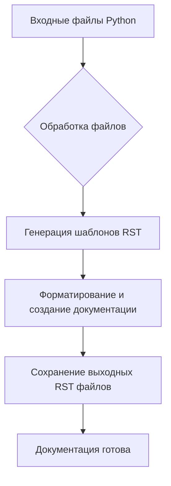

# ИНСТРУКЦИЯ ПО СОЗДАНИЮ ДОКУМЕНТАЦИИ НА RST

## <input code>

```
# INSTRUCTION

For each input Python file, create documentation in `rst` format for subsequent compilation with Sphinx. The documentation must meet the following requirements:

1. **Documentation Format**:
   - Use the `reStructuredText (rst)` standard.
   - Each file should begin with a header and a brief description of its contents.
   - For all classes and functions, use the following comment format:
     ```python
     def function(param: str, param1: Optional[str | dict | str] = None) -> dict | None:
         """
         Args:
             param (str): Description of the `param` parameter.
             param1 (Optional[str | dict | str], optional): Description of the `param1` parameter. Defaults to `None`.

         Returns:
             dict | None: Description of the return value. Returns a dictionary or `None`.

         Raises:
             SomeError: Description of the situation in which the `SomeError` exception is raised.
         """
     ```
   - Use `ex` instead of `e` in exception handling blocks.

2. **TOC Tree**:
   - Include sections in the documentation using `.. toctree::`.
   - The structure of the `index.rst` file should contain links to all module descriptions.

3. **Documentation Formatting**:
   - All class, function, and method headers should be documented using Sphinx directives (`autoclass`, `autofunction`).
   - Example:
     ```rst
     .. automodule:: module_name
         :members:
         :undoc-members:
         :show-inheritance:
     ```

4. **Section Headings**:
   - Use level 1 headers (`=`), level 2 headers (`-`), level 3 headers (`~`), and level 4 headers (`^`).

5. **Example File**:
   ```rst
   Module Name
   ===========\n

   .. automodule:: module_name
       :members:
       :undoc-members:
       :show-inheritance:

   Functions
   ---------\n

   .. autofunction:: module_name.function_name
   ```

Generate the corresponding documentation for each input Python file in `rst` format.
## Response format: `.md` (markdown)
# END OF INSTRUCTION
```

## <algorithm>

Эта инструкция описывает алгоритм для генерации документации RST для файлов Python.  Алгоритм не предполагает выполнения кода, а фокусируется на структуре процесса:

1. **Обработка входных файлов:**  Получение списка файлов Python.
2. **Генерация шаблонов:**  Для каждого файла создается соответствующий файл документации в формате RST.
3. **Форматирование**: Шаблоны RST должны содержать заголовки (уровней 1-4), ссылки на функции и классы, описания, а также `.. toctree::` для оглавления.
4. **Создание документации:**  Для каждого элемента кода (класс, функция, метод) создается раздел документации RST с использованием `autoclass`, `autofunction` и т.д.
5. **Сохранение выходных файлов:** RST файлы сохраняются.

**Пример:** Для файла `mymodule.py` создается `mymodule.rst` содержащий описание модуля, его функций и классов.


## <mermaid>



**Описание подключаемых зависимостей:**

Инструкция не описывает код, а лишь описывает алгоритм действий для генерации документации.  Нет зависимостей от конкретных библиотек Python.  Инструкция описывает требования и шаги для создания RST файлов, которые затем могут быть использованы Sphinx для построения документации.

## <explanation>

**Импорты:**

Инструкция не содержит импорта Python-модулей. Это инструкция, описывающая *как* генерировать документацию, а не сам код, который её генерирует.

**Классы:**

Инструкция описывает требования к структуре документации, не содержит кода самих классов.  Ожидается, что классы и функции Python будут описаны с помощью docstrings в соответствии с приведенными примерами.

**Функции:**

Инструкция описывает требования к формированию документации для функций Python (включая использование docstrings для описания параметров, возвращаемых значений и исключений), а не реализует их.

**Переменные:**

Инструкция не описывает использование переменных, так как она описывает процесс, а не конкретный код.

**Возможные ошибки/улучшения:**

Инструкция не содержит реализации, поэтому нет ошибок в исходном коде.  Для практической реализации понадобится инструмент, который анализирует файлы Python и генерирует RST файлы в соответствии с правилами.

**Цепочка взаимосвязей с другими частями проекта:**

Эта инструкция является руководством для создания документации. Результат этой инструкции — набор файлов RST, которые будут использоваться в другом процессе сборки документации (например, с помощью Sphinx).