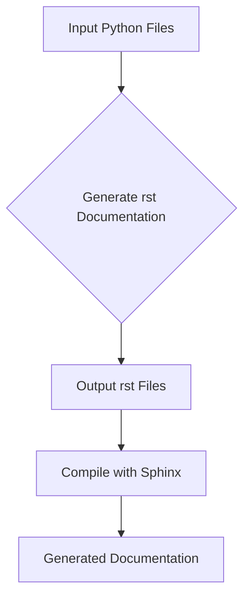

# ИНСТРУКЦИЯ по написанию документации в формате rst для Python-кода

## <input code>

```
# INSTRUCTION

For each input Python file, create documentation in `rst` format for subsequent compilation with Sphinx. The documentation must meet the following requirements:

1. **Documentation Format**:
   - Use the `reStructuredText (rst)` standard.
   - Each file should begin with a header and a brief description of its contents.
   - For all classes and functions, use the following comment format:
     ```python
     def function(param: str, param1: Optional[str | dict | str] = None) -> dict | None:
         """
         Args:
             param (str): Description of the `param` parameter.
             param1 (Optional[str | dict | str], optional): Description of the `param1` parameter. Defaults to `None`.

         Returns:
             dict | None: Description of the return value. Returns a dictionary or `None`.

         Raises:
             SomeError: Description of the situation in which the `SomeError` exception is raised.
         """
     ```
   - Use `ex` instead of `e` in exception handling blocks.

2. **TOC Tree**:
   - Include sections in the documentation using `.. toctree::`.
   - The structure of the `index.rst` file should contain links to all module descriptions.

3. **Documentation Formatting**:
   - All class, function, and method headers should be documented using Sphinx directives (`autoclass`, `autofunction`).
   - Example:
     ```rst
     .. automodule:: module_name
         :members:
         :undoc-members:
         :show-inheritance:
     ```

4. **Section Headings**:
   - Use level 1 headers (`=`), level 2 headers (`-`), level 3 headers (`~`), and level 4 headers (`^`).

5. **Example File**:
   ```rst
   Module Name
   ===========\n

   .. automodule:: module_name
       :members:
       :undoc-members:
       :show-inheritance:

   Functions
   ---------\n

   .. autofunction:: module_name.function_name
   ```

Generate the corresponding documentation for each input Python file in `rst` format.
## Response format: `.md` (markdown)
# END OF INSTRUCTION
```

## <algorithm>

Эта инструкция описывает алгоритм генерации документации в формате rst для Python-кода.  Алгоритм не включает логики выполнения Python-кода, а лишь описания, как нужно сформировать документацию.

1. **Обработка каждого Python файла:**  Программа принимает на вход список Python файлов.
2. **Генерация rst файла:** Для каждого Python файла генерируется соответствующий rst файл.
3. **Форматирование:**  Документация в rst файле должна соответствовать определенным шаблонам: заголовки, описание классов и функций, использование директивы `automodule`, `autofunction` и т.д.
4. **Структура:**  В файле `index.rst` создаётся структура, которая связывает rst файлы с модулями.
5. **Выход:**  Результат - список `rst` файлов, содержащих документацию.


**Пример:** Если входной файл `mymodule.py`, то результат - файл `mymodule.rst` с документацией.


## <mermaid>



**Объяснение диаграммы:**

* **Input Python Files:** Входные данные - это файлы на языке Python.
* **Generate rst Documentation:** Обработка происходит с помощью скрипта или инструмента, который создаёт rst документацию для каждого Python файла.
* **Output rst Files:** Результат - это файлы в формате rst, содержащие документацию для соответствующих Python модулей.
* **Compile with Sphinx:** Полученные файлы rst обрабатываются Sphinx, инструментом для создания документации.
* **Generated Documentation:** На выходе получается конечная документация (например, HTML).

Диаграмма отражает цепочку действий от исходного кода до конечной документации.  Сборки и её зависимостях  отражено не в полной мере.

## <explanation>

Эта инструкция задает формат документации для Python-кода, которая затем будет скомпилирована с помощью Sphinx.

**Импорты:**
Инструкция не содержит импортов, это описание процесса создания документации, а не код.  Импорты в реальном Python-коде, который следует документировать, будут зависеть от самого кода.

**Классы**:
Инструкция описывает формат документации для классов.  Она указывает, что нужно использовать директиву `autoclass` для автогенерации документации.

**Функции**:
Инструкция определяет, что нужно документировать функции с `Args`, `Returns`, `Raises` и примерами.

**Переменные**:
Инструкция не описывает конкретные переменные, она определяет структуру документации.  Переменные будут документироваться как часть классов или функций.

**Возможные ошибки или области для улучшений:**
Инструкция не содержит реализации, поэтому нет ошибок и улучшений в коде.  Она указывает на необходимость использования инструмента Sphinx для компиляции `rst` файлов в  документацию.   Недостаточно описания того, как будут обрабатываться сами Python файлы, как будет построена структура файлов.


**Цепочка взаимосвязей с другими частями проекта:**
Инструкция предполагает, что есть Python файлы, которые нужно документировать, и что существует инструмент Sphinx, который будет использован для компиляции сгенерированных `rst` файлов.  Эта инструкция -  часть большего процесса документирования и построения документации проекта.