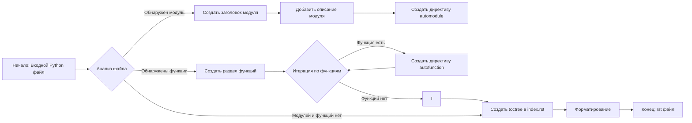
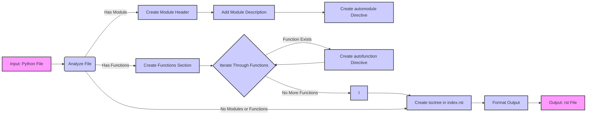

## <алгоритм>

1. **Входные данные:** На вход поступает Python файл.
2. **Анализ файла:**
   - Проверить наличие описания модуля, классов и функций.
3. **Генерация `rst` документации:**
   - **Заголовок модуля:** Создается заголовок первого уровня (например, `Module Name`).
   - **Описание модуля:** Добавляется краткое описание модуля.
   - **Директива `automodule`:** Создается директива `.. automodule::` для модуля с опциями `:members:`, `:undoc-members:` и `:show-inheritance:`.
   - **Раздел функций:** Создается заголовок второго уровня (например, `Functions`).
   - **Директивы `autofunction`:** Для каждой функции создается директива `.. autofunction::` для модуля.
   - **Форматирование комментариев:** Убедиться, что комментарии для функций и классов соответствуют заданному формату (параметры, возвращаемые значения, исключения).
   - **Обработка исключений:** Убедиться, что переменная исключения называется `ex`.
4. **Составление `toctree`:**
   - В `index.rst` файле должны быть добавлены ссылки на все сгенерированные файлы.
5. **Форматирование:**
   - Использовать заголовки разных уровней (`=`, `-`, `~`, `^`).
6. **Выходные данные:** Выводится `.rst` файл.

**Пример блок-схемы:**

## <mermaid>

**Описание зависимостей:**

*   **Input: Python File (A)**:  Представляет входной Python файл, который необходимо проанализировать для генерации документации.
*   **Analyze File (B)**:  Эта операция анализирует Python файл для обнаружения модулей, классов и функций. Зависит от входного файла.
*   **Create Module Header (C)**:  Создает заголовок первого уровня для модуля в формате rst. Зависит от результатов анализа файла.
*   **Add Module Description (D)**: Добавляет краткое описание модуля. Зависит от результатов анализа файла и создания заголовка.
*   **Create automodule Directive (E)**: Создает rst директиву `automodule` для документации модуля. Зависит от наличия модуля и его описания.
*   **Create Functions Section (F)**:  Создает раздел для функций. Зависит от обнаружения функций в файле.
*  **Iterate Through Functions (G)**: Проходит по каждой обнаруженной функции. Зависит от наличия раздела функций.
*   **Create autofunction Directive (H)**: Создает rst директиву `autofunction` для документации каждой функции. Зависит от обнаруженной функции.
*   **No More Functions (I)**: Проверяет, были ли обработаны все функции. Зависит от цикла итерации по функциям.
*  **Create toctree in index.rst (J)**: Создает структуру `toctree` в файле `index.rst` для включения документации в общее дерево. Зависит от результатов анализа файла и сгенерированных файлов.
*   **Format Output (K)**:  Форматирует выходные данные в соответствии с требованиями rst (заголовки, отступы, директивы). Зависит от всех предыдущих этапов.
*   **Output: rst File (L)**: Выходной файл rst. Зависит от этапов форматирования.

## <объяснение>

**Импорты:**

В данном примере кода нет явных импортов. Это связано с тем, что код описывает инструкцию для обработки файлов, а не является исполняемым кодом Python. Инструкция описывает логику создания документации и не требует использования сторонних библиотек Python.

**Классы:**

В предоставленной инструкции не описаны классы. Инструкция сфокусирована на том, как генерировать документацию в формате `rst`.

**Функции:**

В предоставленной инструкции не описаны конкретные функции. Она лишь устанавливает правила и форматы для автоматической генерации документации на основе Python-кода. Однако, подразумевается, что будут использоваться функции (или их аналог) для следующих действий:

*   **Чтение Python файла:** Функция для чтения содержимого Python файла.
*   **Анализ Python кода:** Функция для анализа структуры кода (модулей, классов, функций).
*   **Генерация rst кода:** Функция для генерации rst кода (заголовки, директивы `automodule` и `autofunction`).
*   **Форматирование комментариев:** Функция для проверки и, возможно, коррекции формата комментариев в Python коде.
*   **Создание `toctree`:** Функция для добавления ссылок на сгенерированные файлы в `index.rst`.

**Переменные:**

В предоставленной инструкции не используются явные переменные. Тем не менее, можно выделить переменные, которые будут использоваться в реализации:

*   `input_file`: Путь к Python файлу, который нужно обработать.
*   `module_name`: Имя модуля, извлеченное из Python файла.
*   `function_name`: Имя функции, извлеченное из Python файла.
*   `rst_output`: Содержание сгенерированного rst файла.
*   `index_rst_content`: Содержание файла `index.rst`.

**Объяснение:**

Эта инструкция описывает процесс автоматической генерации документации в формате reStructuredText (rst) для Python кода, чтобы в дальнейшем ее можно было скомпилировать с помощью Sphinx. Основные моменты:

1.  **Формат документации**: Инструкция определяет, что документация должна быть в формате rst и  должна включать заголовки, описания, `automodule` и `autofunction` директивы. Также она указывает на определенный формат документирования функций, включающий описание параметров, возвращаемого значения и возможных исключений.
2.  **Структура `toctree`**: Инструкция указывает на необходимость создания `toctree` в `index.rst` файле, который будет содержать ссылки на все сгенерированные файлы документации.
3.  **Форматирование**: Описываются уровни заголовков (1-4) и применение соответствующих директив Sphinx.

**Цепочка взаимосвязей с другими частями проекта:**

Данная инструкция является частью процесса генерации документации. Предполагается, что существует:

1.  **Парсер Python кода:** Который читает Python файлы и извлекает информацию о модулях, классах, функциях и их комментариях.
2.  **Генератор rst файлов:** Который использует информацию от парсера и генерирует rst файлы.
3.  **Компилятор Sphinx:** Который компилирует rst файлы в финальный формат документации (например, HTML).

**Потенциальные ошибки и области для улучшения:**

*   **Обработка ошибок парсинга:** Необходимо предусмотреть обработку ошибок при парсинге Python кода.
*   **Обработка различных типов комментариев:** Инструкция предполагает, что комментарии соответствуют определенному формату. Нужно учесть возможные отклонения.
*   **Обработка docstring классов:** В инструкции не указано, как обрабатывать docstring классов (аналогично функциям).
*   **Автоматическое обновление `toctree`:** Механизм для автоматического обновления `toctree` в `index.rst` при добавлении новых файлов.
*   **Более детальный разбор директив Sphinx:** Можно добавить информацию о других директивах Sphinx, которые могут быть полезны для документации.