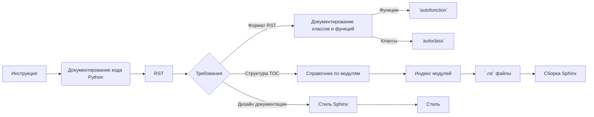

```MD
# Инструкция по написанию документации для кода Python в формате RST

## 1. <input code>

```plaintext
# הוראות
לכל קובץ Python קלט, צרו תיעוד בפורמט `rst` לצורך קומפילציה לאחר מכן עם Sphinx. התיעוד צריך לעמוד בדרישות הבאות:

1. **פורמט התיעוד**:
   - השתמשו בסטנדרט `reStructuredText (rst)`.
   - כל קובץ צריך להתחיל בכותרת ובתיאור קצר של התוכן שלו.
   - עבור כל המחלקות והפונקציות, השתמשו בפורמט ההערות הבא:
     ```python
     def function(param: str, param1: Optional[str | dict | str] = None) -> dict | None:
         """
         ארגומנטים:
             param (str): תיאור הפרמטר `param`.
             param1 (Optional[str | dict | str], optional): תיאור הפרמטר `param1`. ברירת המחדל היא `None`.

         ערך מוחזר:
             dict | None: תיאור הערך המוחזר. מחזיר מילון או `None`.

         יוצאים:
             SomeError: תיאור המצב שבו מתרחש החריג `SomeError`.
         """
     ```
   - השתמשו ב-`ex` במקום `e` בחסימות טיפול בחריגים.

2. **עץ תוכן (TOC)**:
   - כללו פרקים בתיעוד באמצעות `.. toctree::`.
   - מבנה הקובץ `index.rst` צריך לכלול קישורים לכל התיאורים של המודולים.

3. **עיצוב התיעוד**:
   - כל כותרות המחלקות, הפונקציות והשיטות צריכות להיות מתועדות באמצעות פקודות Sphinx (`autoclass`, `autofunction`).
   - דוגמה:
     ```rst
     .. automodule:: module_name
         :members:
         :undoc-members:
         :show-inheritance:
     ```

4. **כותרות פרקים**:
   - השתמשו בכותרות ברמה 1 (`=`), רמה 2 (`-`), רמה 3 (`~`) ורמה 4 (`^`).

5. **דוגמת קובץ**:
   ```rst
   שם המודול
   ===========\n
   .. automodule:: module_name
       :members:
       :undoc-members:
       :show-inheritance:

   פונקציות
   --------

   .. autofunction:: module_name.function_name
   ```

צור את התיעוד המתאים לכל קובץ Python קלט בפורמט `rst`.
# -------------------- סיום ההוראות -------------------------
```

## 2. <algorithm>

Алгоритм работы кода не определён, поскольку код представляет собой инструкцию по написанию кода, а не сам код.  Инструкция описывает, как следует документировать код Python, используя формат rst.  Блок-схема не применима.


## 3. <mermaid>



## 4. <explanation>

**Комментарии**:


Этот код — это *инструкция*, а не выполняемый код. Он описывает требования к структуре и формату документации Python-кода в формате reStructuredText (RST).  Документация необходима для последующей компиляции с помощью Sphinx.


**Структура инструкции**:

Инструкция содержит пункты, описывающие требования по форматированию кода и его документации:
* **Формат документации (RST):** Подробно описывает, как форматировать документацию в формате RST (например, как описывать функции, классы, параметры и т.д.)
* **Структура TOC:** описывает создание оглавления (TOC) с использованием `.. toctree::`.
* **Дизайн документации:** описывает использование стилей и методов документации с помощью Sphinx.
* **Пример файла:**  предоставляет пример файла `.rst` для демонстрации.

**Связь с другими частями проекта**:

Инструкция направлена на создание документации для *входных* файлов Python-кода. Взаимодействие с другими частями проекта (например, с самим Python-кодом) не указано. Цепочка взаимосвязей будет зависеть от того, как эта инструкция будет применена в конкретном проекте.  Для последующей обработки созданных `rst` файлов потребуется система сборки Sphinx.


**Возможные ошибки и улучшения**:

* Инструкция не содержит информации о способах обработки ошибок или исключений.
*  Инструкция не содержит информации о специфических требованиях к структуре проектов. Это может потребовать уточнения.


В целом, инструкция хорошо структурирована и понятна, но требует контекста использования в конкретном проекте.