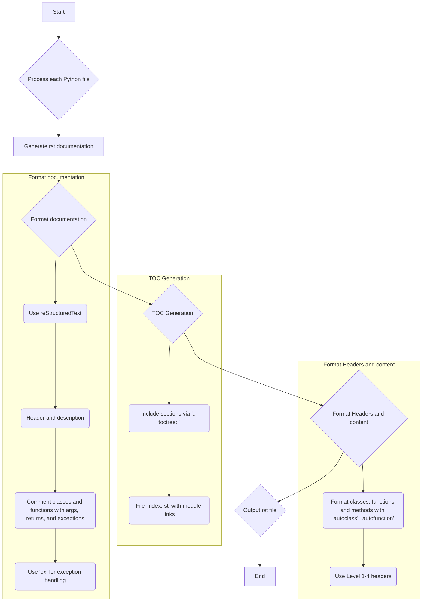

## ИНСТРУКЦИЯ:

Анализируйте предоставленный код подробно и объясните его функциональность. Ответ должен включать три раздела:

1.  **<алгоритм>**: Опишите рабочий процесс в виде пошаговой блок-схемы, включая примеры для каждого логического блока, и проиллюстрируйте поток данных между функциями, классами или методами.
2.  **<mermaid>**: Напишите код для диаграммы в формате `mermaid`, проанализируйте и объясните все зависимости, которые импортируются при создании диаграммы.
    **ВАЖНО!** Убедитесь, что все имена переменных, используемые в диаграмме `mermaid`, имеют осмысленные и описательные имена. Имена переменных вроде `A`, `B`, `C`, и т.д., не допускаются!

    **Дополнительно**: Если в коде есть импорт `import header`, добавьте блок `mermaid` flowchart, объясняющий `header.py`:
    ```mermaid
    flowchart TD
        Start --> Header[<code>header.py</code><br> Determine Project Root]

        Header --> import[Import Global Settings: <br><code>from src import gs</code>]
    ```

3.  **<объяснение>**: Предоставьте подробные объяснения:
    *   **Импорты**: Их назначение и взаимосвязь с другими пакетами `src.`.
    *   **Классы**: Их роль, атрибуты, методы и взаимодействие с другими компонентами проекта.
    *   **Функции**: Их аргументы, возвращаемые значения, назначение и примеры.
    *   **Переменные**: Их типы и использование.
    *   Выделите потенциальные ошибки или области для улучшения.

Дополнительно, постройте цепочку взаимосвязей с другими частями проекта (если применимо).

Это обеспечивает всесторонний и структурированный анализ кода.
## Формат ответа: `.md` (markdown)
**КОНЕЦ ИНСТРУКЦИИ**

## Анализ кода

### <алгоритм>

1.  **Начало**: Получаем на вход текст на иврите, содержащий инструкции по генерации документации в формате `rst`.
2.  **Форматирование документации**:
    *   Используется стандарт `reStructuredText (rst)`.
    *   Каждый файл начинается с заголовка и краткого описания.
    *   Для классов и функций используется определенный формат комментариев с описанием параметров, возвращаемых значений и исключений.
        *   Пример формата комментариев:
            ```python
            def function(param: str, param1: Optional[str | dict | str] = None) -> dict | None:
                """
                Аргументы:
                    param (str): Описание параметра `param`.
                    param1 (Optional[str | dict | str], optional): Описание параметра `param1`. Значение по умолчанию `None`.

                Возвращает:
                    dict | None: Описание возвращаемого значения. Возвращает словарь или `None`.

                Исключения:
                    SomeError: Описание ситуации, когда возникает исключение `SomeError`.
                """
            ```
    *   В блоках обработки исключений используется `ex` вместо `e`.
3.  **Генерация TOC**:
    *   Включаются разделы в документацию с помощью `.. toctree::`.
    *   Файл `index.rst` содержит ссылки на описания модулей.
4.  **Форматирование**:
    *   Заголовки классов, функций и методов оформляются с помощью команд Sphinx (`autoclass`, `autofunction`).
        *   Пример:
            ```rst
            .. automodule:: module_name
                :members:
                :undoc-members:
                :show-inheritance:
            ```
5.  **Заголовки разделов**:
    *   Используются заголовки разных уровней:
        *   Уровень 1 (`=`)
        *   Уровень 2 (`-`)
        *   Уровень 3 (`~`)
        *   Уровень 4 (`^`)
6.  **Пример документа**:
    ```rst
    Имя модуля
    ==========

    .. automodule:: module_name
        :members:
        :undoc-members:
        :show-inheritance:

    Функции
    --------

    .. autofunction:: module_name.function_name
    ```
7.  **Конец**: Вывод сгенерированной документации в формате `rst` для каждого входного Python файла.

### <mermaid>


**Объяснение:**
Диаграмма `mermaid` отображает процесс генерации документации в формате `rst` на основе предоставленных инструкций.

*   **Start**: Начало процесса.
*   **Process each Python file**: Проходимся по каждому файлу Python, который нужно документировать.
*   **Generate rst documentation**: Создание базовой rst структуры.
*   **Format documentation**: Включает шаги по использованию `reStructuredText`, добавлению заголовка и описания, форматированию комментариев и правильной обработки исключений.
*   **TOC Generation**: Генерация оглавления, используя директиву `toctree`.
*   **Format Headers and content**: Форматирование заголовков и контента, включая использование директив `autoclass` и `autofunction`.
*   **Output rst file**: Сохранение сгенерированной документации в файл с расширением `.rst`.
*   **End**: Завершение процесса.

### <объяснение>

**Общее описание:**
Представленный код описывает процесс создания документации в формате `reStructuredText` (rst) для Python файлов. Этот процесс включает форматирование комментариев, автоматическое добавление оглавления (TOC) и генерацию структуры документа с использованием команд Sphinx.

**Основные моменты:**

*   **Формат `rst`:** Документация генерируется в формате `reStructuredText`, который является стандартным для документации проектов Python.
*   **Формат комментариев:**
    *   Комментарии к функциям и классам должны включать:
        *   Описание аргументов (параметров) с указанием их типов и назначения.
        *   Описание возвращаемых значений с указанием их типов и назначения.
        *   Описание исключений, которые могут быть сгенерированы функцией.
    *   Использование `ex` в блоках `try...except` вместо `e`. Это может быть опечаткой или соглашением конкретного проекта.
*   **TOC (Table of Contents):** Оглавление создается с помощью директивы `.. toctree::`, которая позволяет структурировать документацию по разделам.
*   **Использование Sphinx:**
    *   Используются команды Sphinx `autoclass` и `autofunction` для автоматической генерации документации для классов и функций.
    *   Команда `automodule` позволяет документировать весь модуль, включая все его классы, функции и методы.
*   **Иерархия заголовков:** Используются заголовки разных уровней для структурирования документации.
*   **Пример документа:** Приведен пример использования `automodule` и `autofunction` для документирования модуля и его функций.

**Импорты:**
В данном фрагменте кода отсутствуют явные импорты, поскольку это описание процесса, а не программный код. Однако подразумевается, что в процессе генерации документации могут использоваться модули из пакета `src`, например, `header.py` если проект структурирован. Если это так то можно добавить блок `mermaid` как указано в инструкции.

**Классы:**
В явном виде классы не упоминаются, но подразумевается их наличие в python файлах для которых будет создаваться документация.

**Функции:**
В явном виде функции не упоминаются, но подразумевается их наличие в python файлах для которых будет создаваться документация.

**Переменные:**
В данном фрагменте кода переменные не используются.

**Потенциальные ошибки и области для улучшения:**

*   **Использование `ex`:** Замена `e` на `ex` может быть опечаткой и потенциально вызвать проблемы, если есть код, который ожидает использование переменной `e`.
*   **Отсутствие подробностей**: Инструкции не дают конкретных указаний, как обрабатывать docstrings внутри кода, если они уже существуют. Можно рассмотреть, как объединять эти инструкции с docstrings.
*   **Абстрактность:** Инструкции достаточно абстрактны и могут потребовать дополнительной конкретизации, например, как обрабатывать сложные иерархии пакетов или нестандартные комментарии.
*  **Обработка исключений:** Не рассмотрена более детальная обработка исключений, например, специфические проверки ошибок при генерации документации.

**Взаимосвязи с другими частями проекта:**

*   Очевидно, что эта инструкция является частью более широкой системы, например, автоматизированного процесса документирования проектов Python.
*   Предполагается, что есть механизм для получения на вход файлов Python, для которых будет создаваться документация.
*   Результатом работы этой инструкции является вывод документации, которая может быть использована для дальнейшей обработки (например, для публикации в виде HTML-страниц с помощью Sphinx).

**Общий вывод:**

Инструкции описывают процесс автоматической генерации документации для Python кода с использованием `reStructuredText` и Sphinx. Основная задача – преобразование кода в документацию, следуя заданным правилам форматирования и стандартам. Инструкции четкие, но требуют дополнительного контекста для полного понимания и реализации.