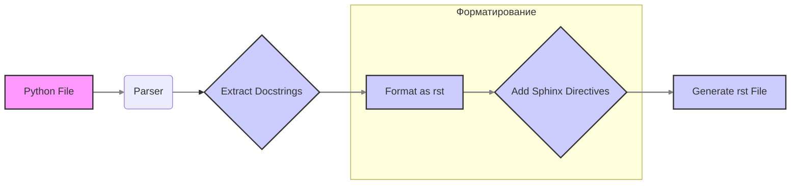

## Анализ кода:

### 1. <алгоритм>

**Описание процесса:**

Инструкция описывает процесс генерации документации в формате reStructuredText (`rst`) для Python кода. Цель состоит в автоматизации создания документации, готовой к компиляции с помощью Sphinx. 

**Блок-схема:**

1.  **Ввод**: Получение на вход Python файла.
2.  **Форматирование**: Создание `.rst` файла:
    *   Добавление заголовка первого уровня ( `=`).
    *   Добавление короткого описания файла.
    *   Форматирование описания классов, функций и методов с использованием:
        *   Закомментированных docstrings в формате:
            ```python
            def function(param: str, param1: Optional[str | dict | str] = None) -> dict | None:
                """
                Аргументы:
                    param (str): Описание параметра `param`.
                    param1 (Optional[str | dict | str], optional): Описание параметра `param1`. По умолчанию `None`.

                Возвращает:
                    dict | None: Описание возвращаемого значения. Возвращает словарь или `None`.

                Исключения:
                    SomeError: Описание ситуации, в которой возникает исключение `SomeError`.
                """
            ```
        *   Использование `ex` вместо `e` при обработке исключений.
    *   Создание дерева содержания (`TOC`) с помощью `.. toctree::`, включая ссылки на описания модулей в `index.rst`.
    *   Оформление документации с помощью команд Sphinx:
        *   `autoclass`, `autofunction` для документирования классов, функций и методов.
        *   `automodule` для импорта информации о модуле и его членах.
    *   Использование заголовков различных уровней:
        *   Уровень 1: `=`
        *   Уровень 2: `-`
        *   Уровень 3: `~`
        *   Уровень 4: `^`
3.  **Вывод**: Генерация `.rst` файла.

**Пример потока данных:**

*   Входные данные: Python файл (`.py`).
*   Процесс: Парсинг файла Python, извлечение docstrings, форматирование, добавление директив Sphinx.
*   Выходные данные:  `.rst` файл, содержащий документацию.

### 2. <mermaid>



**Объяснение зависимостей:**

*   **A[Python File]**: Представляет входной Python файл, который требуется документировать.
*   **B(Parser)**: Представляет этап парсинга Python файла. Парсер анализирует структуру кода для извлечения необходимой информации.
*   **C{Extract Docstrings}**: Представляет этап извлечения docstrings из кода. Docstrings - это комментарии в коде, которые используются для документации.
*   **D[Format as rst]**: Представляет этап форматирования извлеченных docstrings в формат reStructuredText. На этом этапе происходит преобразование текста в формат, который понимает Sphinx.
*   **E{Add Sphinx Directives}**: Представляет этап добавления директив Sphinx к rst файлу. Директивы Sphinx - это специальные команды, которые позволяют Sphinx автоматически генерировать документацию.
*   **F[Generate rst File]**: Представляет этап генерации итогового rst файла, готового для дальнейшей обработки Sphinx.

### 3. <объяснение>

**Импорты:**
   *   В предоставленном коде не указаны какие-либо импорты. Это связано с тем, что данный код является инструкцией, а не программой. На практике, если бы реализовывалась программа для генерации документации, потребовались бы импорты для работы с файловой системой, парсинга Python кода и генерации rst.

**Классы:**
   *   В инструкции не определены какие-либо классы. Инструкция описывает процесс, который может быть реализован с использованием функций, классов или иных подходов.

**Функции:**
   *   В инструкции не определены какие-либо функции. Инструкция описывает процесс, который может быть реализован с использованием функций, классов или иных подходов.

**Переменные:**
    *   В инструкции явно не используются переменные. Основная цель инструкции - предоставить четкие указания по процессу преобразования кода Python в rst.

**Дополнительные объяснения:**
   
   -  **Формат `rst`:**  `reStructuredText` — это текстовый формат для создания технической документации. Он понятен как для человека, так и для парсеров, таких как Sphinx. Использование `rst` обеспечивает гибкость и структурированность документов.
    
   -  **Директивы Sphinx:** Директивы, такие как `automodule`, `autoclass` и `autofunction`  автоматически извлекают информацию из Python кода, включая docstrings, что позволяет сократить объем ручной работы при создании документации.

   - **Заголовки:** Использование заголовков различных уровней (`=`, `-`, `~`, `^`) помогает организовать документацию и сделать ее более читаемой.

   - **Обработка исключений:**  Использование  `ex`  вместо  `e`  может быть связано с определенными стандартами или предпочтениями проекта.

**Потенциальные ошибки и улучшения:**

1. **Отсутствие обработки ошибок при парсинге:** Код инструкции не обрабатывает возможные ошибки при парсинге файлов Python.
2. **Отсутствие поддержки сложных случаев:** Код инструкции может не поддерживать все возможные конструкции языка Python (например, декораторы, вложенные классы, и т.д.) .
3. **Негибкость:** Код инструкции предполагает фиксированный формат вывода rst.  Необходимо предоставить возможность настройки, например, стилей, порядка директив, и т.д..

**Взаимосвязи с другими частями проекта:**
*   Этот код предназначен для интеграции в систему автоматической генерации документации. Он может быть частью более крупной системы, которая включает парсеры Python, утилиты для обработки файлов, и Sphinx.
*   Он может работать в паре с инструментами тестирования (например, с pytest) для автоматической генерации документации и ее проверки.