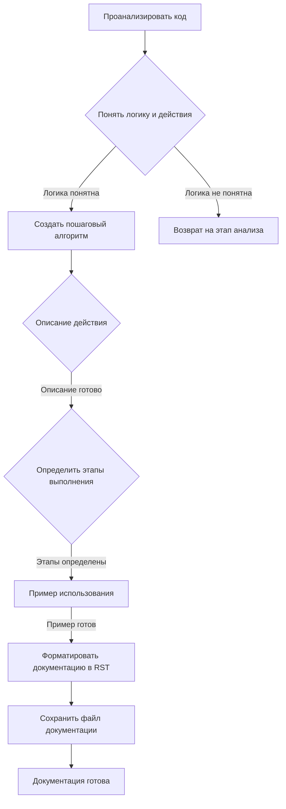
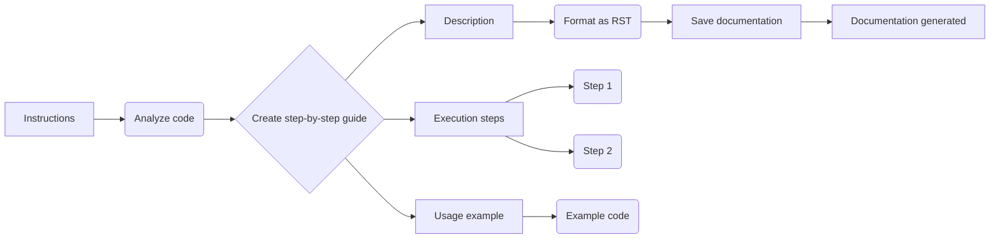

```MD
# Анализ кода - Инструкция по генерации документации

**1. <input code>**

```
**Instructions for Code Documentation Generation**

1. **Analyze the code**: Understand the logic and actions performed by the given code block.
  
2. **Create a step-by-step guide**:\n
    - **Description**: Explain what the code block does.\n
    - **Execution steps**: Outline the sequence of actions in the code.\n
    - **Usage example**: Provide a code example showing how to use this block in a project.

3. **Formatting**: Follow the structure in `reStructuredText (RST)`:

```rst
How to use this code block
=========================================================================================\n

Description
-------------------------
[Explain what the code does.]

Execution steps
-------------------------
1. [First step description.]
2. [Second step description.]
3. [Continue as necessary...]

Usage example
-------------------------
.. code-block:: python

    [Example usage code]
```

4. **Avoid vague terms** like "getting" or "doing." Be specific about what the code does, e.g., "checks," "validates," or "sends."
```

**2. <algorithm>**

Эта инструкция описывает алгоритм создания документации для кода.  Алгоритм не выполняет какой-либо конкретной задачи, а предоставляет шаги для создания документации.  Пошаговая блок-схема:



**Примеры:**

* **Проанализировать код:** Проверить, какие функции, классы и переменные используются в коде.
* **Создать пошаговый алгоритм:** Описать, что делает функция и в какой последовательности выполняются действия.
* **Пример использования:**  Отобразить в коде, как используется функция с примерами данных.

**Передача данных:** В данном случае данные передаются в виде описаний, этапов и примеров, которые накапливаются и формируют структуру документации.

**3. <mermaid>**



**Объяснение диаграммы:**

* `Instructions` - начальная точка, инструкция.
* `Analyze code`, `Create step-by-step guide`, `Description`, `Execution steps`, `Usage example` - этапы создания документации.
* `Format as RST`, `Save documentation` - шаги обработки полученной информации.
* `Step 1`, `Step 2`, `Example code` - компоненты, формирующие пример использования.


**4. <explanation>**

* **Импорты:**  В данном коде нет импортов, так как это инструкция, а не функциональный код.
* **Классы:** Нет классов.
* **Функции:** Нет функций.
* **Переменные:** Нет переменных.

Данный код представляет собой инструкцию для создания документации к другому коду.  Он не выполняет никаких действий сам по себе.  Он определяет процесс написания описания для кода, включая структуру документации (RST) и формат.

**Возможные ошибки/улучшения:**

* Инструкция может быть более подробной, описывая конкретные способы анализа кода, такие как использование дизассемблеров, отладчиков, или конкретные требования к структуре документации.


**Цепочка взаимосвязей:**

Инструкция предназначена для разработчиков, которые будут писать документацию к Python-коду.  Она описывает шаги, необходимые для написания документации для проектов, написанных на Python.