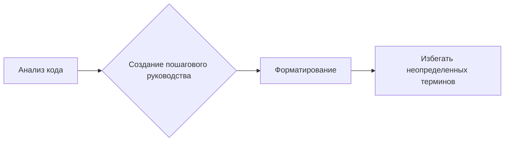

# Анализ кода: Инструкции по генерации документации

**1. <input code>**

```
**Instructions for Code Documentation Generation**

1. **Analyze the code**: Understand the logic and actions performed by the given code block.
  
2. **Create a step-by-step guide**:\n
    - **Description**: Explain what the code block does.\n
    - **Execution steps**: Outline the sequence of actions in the code.\n
    - **Usage example**: Provide a code example showing how to use this block in a project.

3. **Formatting**: Follow the structure in `reStructuredText (RST)`:\n

```rst
How to use this code block
=========================================================================================\n

Description
-------------------------
[Explain what the code does.]

Execution steps
-------------------------
1. [First step description.]
2. [Second step description.]
3. [Continue as necessary...]

Usage example
-------------------------
.. code-block:: python

    [Example usage code]
```

4. **Avoid vague terms** like "getting" or "doing." Be specific about what the code does, e.g., "checks," "validates," or "sends."

```

**2. <algorithm>**

Этот код представляет собой набор инструкций для написания документации к коду на Python.  Алгоритм работы состоит из следующих шагов:

1. **Анализ кода:** Проанализировать код и понять его логику.
2. **Создание пошагового руководства:**
   - Описание: Объяснить, что делает код.
   - Шаги выполнения: Описать последовательность действий в коде.
   - Пример использования: Предоставить пример, как использовать блок кода в проекте.
3. **Форматирование:** Следовать структуре `reStructuredText (RST)`.
4. **Избегать неопределенных терминов:** Используйте конкретные термины, например, "проверяет", "валидирует" или "отправляет".

**Пример:**

Вход: Блок кода для вычисления факториала.

Шаг 1: Анализ кода – определение операций, выполняемых функцией.
Шаг 2: Описание – «Функция вычисляет факториал целого числа».
Шаг 3: Шаги выполнения – «Принимает на вход целое число n. Вычисляет факториал от 1 до n».
Шаг 4: Пример использования – Код для использования функции.
Шаг 5: Форматирование – В соответствии с RST.

**Перемещение данных:**  Данные (код) не перемещаются между функциями или классами.  Код просто описывает *как* нужно создавать документацию.

**3. <mermaid>**



* **Анализ кода:**  Получает входной блок кода.
* **Создание пошагового руководства:** Получает результат анализа кода и генерирует описание, шаги и пример использования.
* **Форматирование:**  Принимает результат предыдущих шагов и форматирует его согласно спецификации RST.
* **Избегать неопределенных терминов:**  Осуществляет проверку результатов на соответствие требованиям к терминологии.

**4. <explanation>**

* **Импорты:** Нет импортов, код представляет собой набор инструкций.
* **Классы:**  Нет классов.
* **Функции:** Нет функций, код предоставляет шаблон для создания документации, а не для её выполнения.
* **Переменные:** Нет переменных, это более высокоуровневое описание процесса.
* **Возможные ошибки/улучшения:**  Инструкции слишком общие.  Необходимо учитывать разный тип кода (функции, классы и т.д.) и типы документации. Не хватает примера реализации этих инструкций на реальном коде. Документация должна быть понятна и эффективна для разработчика.  Уточнение типа входных данных, которые должны обрабатываться инструкциями.  Следует предложить шаблоны для различных случаев.


**Цепочка взаимосвязей с другими частями проекта:**

Этот фрагмент кода служит инструкцией для процесса документирования кода в проекте.  Он не взаимодействует напрямую с другими частями проекта, но является частью процесса разработки и поддерживает создание понятной и качественной документации, что в свою очередь влияет на весь проект.