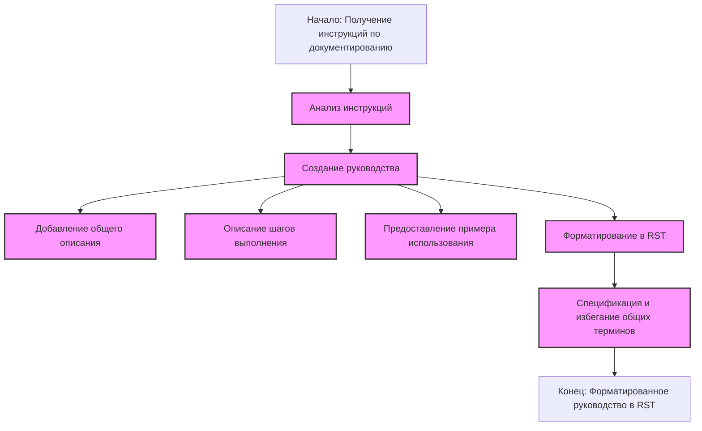

## ИНСТРУКЦИЯ:

**<алгоритм>**:

1.  **Начало**: Получаем текстовый блок, представляющий собой инструкцию по документированию кода.
2.  **Анализ**: Разбираем инструкцию, выявляя основные требования к процессу документирования.
3.  **Создание руководства**: Формируем пошаговое руководство на основе анализа:
    *   **Описание**: Добавляем общее объяснение, что должен делать код.
    *   **Шаги выполнения**: Описываем последовательность действий, как этот код должен работать.
    *   **Пример использования**: Приводим пример кода, как этот блок можно применить на практике.
4.  **Форматирование**: Представляем руководство в формате `reStructuredText (RST)`.
5.  **Спецификация**: Следим за тем, чтобы используемые термины были конкретными и избегали общих формулировок.
6.  **Конец**: Результатом является форматированное руководство в формате RST, готовое для использования.

**<mermaid>**:

**Объяснение:**

*   **Импорты**:
    *   В предоставленном коде импорты отсутствуют. Однако если бы они были, мы бы описали их назначение и связи с другими пакетами проекта. В данном случае, нет импортов, которые нужно было бы анализировать.
*   **Классы**:
    *   В коде нет классов, поэтому мы не можем описать их роли, атрибуты, методы и взаимодействие с другими компонентами проекта.
*   **Функции**:
    *   Функции в коде также отсутствуют, поэтому нечего описывать по аргументам, возвращаемым значениям и примерам.
*   **Переменные**:
    *   Переменных в явном виде в коде нет, поэтому мы не можем описать их типы и использование. Код по сути является набором инструкций, а не исполняемым кодом.

**Общее объяснение**:

Данный код представляет собой **мета-инструкцию** – то есть, инструкцию о том, как писать инструкции. Он описывает, как следует документировать кодовые блоки, предоставляя шаблон и требования для этого. Основная цель этого набора инструкций – стандартизировать и унифицировать процесс описания функциональности отдельных блоков кода.

**Пошагово процесс выполняется следующим образом:**

1.  Инструкция начинается с получения кода, который нужно документировать.
2.  Затем этот код анализируется, чтобы понять, что именно он делает.
3.  После этого формируется руководство, состоящее из трех частей:
    *   **Описание**: краткое объяснение предназначения кода.
    *   **Шаги выполнения**: последовательность действий кода.
    *   **Пример использования**: пример кода, показывающий, как использовать этот блок.
4.  Руководство форматируется в `reStructuredText (RST)`, популярном формате для технической документации.
5.  Инструкция подчеркивает важность избегания общих формулировок и призывает к использованию более конкретных терминов.

**Потенциальные ошибки и улучшения**:

*   **Общие термины**: инструкция сама по себе не является кодом и не выполняет никаких действий. Ошибка будет в случае, если разработчик, который следует данной инструкции, использует общие термины вроде "делает", "получает", и тд. Инструкция подчеркивает важность избегания подобных терминов, но это целиком зависит от человека.
*   **Отсутствие контекста**: инструкция предполагает, что пользователь уже знаком с `reStructuredText (RST)` . В противном случае, он может испытывать сложности при форматировании. Можно добавить ссылку на документацию RST.
*   **Масштабируемость**: В настоящее время нет механизма для автоматического анализа кода и генерации документации. Это требует ручного вмешательства и анализа. Для автоматизации можно было бы применить инструменты для парсинга кода и генерации документации, но это уже за рамками текущей инструкции.

**Взаимосвязь с другими частями проекта**:

Инструкция подразумевает, что она является частью большого проекта, в котором есть необходимость документирования различных блоков кода. Она направлена на стандартизацию этого процесса, обеспечивая единообразие в оформлении и стиле документации.

**Заключение**:

Этот набор инструкций обеспечивает четкое руководство для документирования кода, устанавливая определенную структуру и форматирование. Он способствует более понятному и унифицированному описанию функциональности различных блоков кода в проекте.