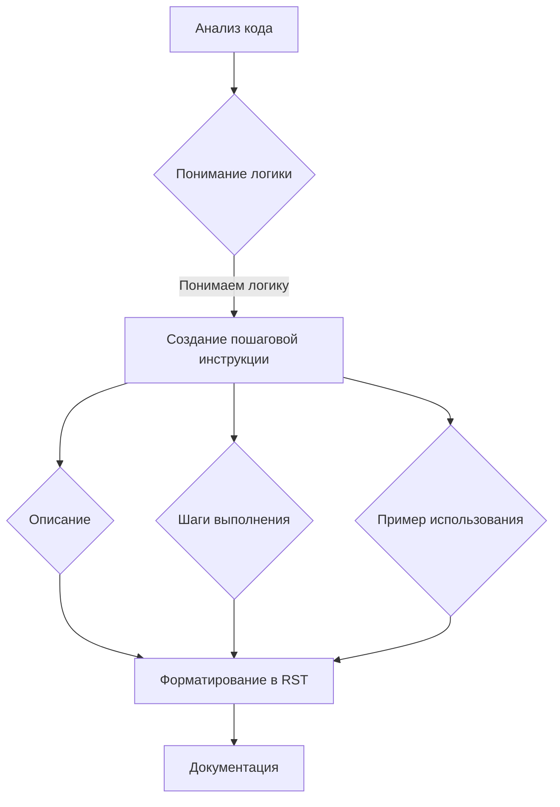

# Анализ кода - Инструкции для генерации документации

**1. <input code>**

```
**Инструкции для генерации документации к коду**

1. **Анализируй код**: Пойми логику и действия, выполняемые данным фрагментом кода.
  
2. **Создай пошаговую инструкцию**:
    - **Описание**: Объясни, что делает данный блок кода.
    - **Шаги выполнения**: Опиши последовательность действий в коде.
    - **Пример использования**: Приведи пример кода, как использовать данный фрагмент в проекте.

3. **Форматирование**: Следуй структуре в `reStructuredText (RST)`:

```rst
Как использовать этот блок кода
=========================================================================================\n\nОписание
-------------------------
[Объяснение, что делает код.]

Шаги выполнения
-------------------------
1. [Описание первого шага.]
2. [Описание второго шага.]
3. [Продолжай по необходимости...]

Пример использования
-------------------------
.. code-block:: python

    [Пример использования кода]
```

4. **Избегай расплывчатых терминов** вроде "получаем" или "делаем". Будь конкретным, что именно делает код, например: "проверяет", "валидирует" или "отправляет".
```

**2. <algorithm>**

Этот код представляет собой набор инструкций (или шагов) для написания документации к коду. Алгоритм работы выглядит следующим образом:

1. **Анализ кода:** Чтение и понимание логики.
2. **Создание пошаговой инструкции:**
    - Описание: Понимание цели и функции кода.
    - Шаги выполнения: Разбиение процесса на отдельные действия.
    - Пример использования:  Демонстрация практического применения.
3. **Форматирование в RST:** Структурирование документации по правилам RST.
4. **Избегание расплывчатости:** Уточнение и конкретизация действий.

**Пример:**

Если код выполняет валидацию данных, то шаги будут включать:
 - Проверка типа данных.
 - Проверка диапазона значений.
 - Проверка на наличие ошибок.

**Перемещение данных:** Данные, которые перемещаются, - это исходный код. Код анализируется и преобразуется в структурированную документацию.

**3. <mermaid>**



**4. <explanation>**

* **Импорты:** Нет импортов, это набор инструкций, не связанный напрямую с конкретным кодом или проектом.


* **Классы:** Нет классов. Код представляет собой набор инструкций, ориентированных на процесс написания документации.


* **Функции:** Нет функций в традиционном понимании. Это набор инструкций по формированию документации.


* **Переменные:** Нет переменных. Нет данных, которые бы хранились и изменялись в коде.


* **Возможные ошибки или области для улучшений:**

    * Не хватает контекста.  Инструкции не содержат информации о конкретном коде, к которому должны быть написаны. Для того, чтобы быть полезными, нужно указать фрагмент кода, которому соответствуют инструкции.
    * Не указано, где генерируется документация. Для её создания нужны инструментальные средства.
    * Нет привязки к какому-либо конкретному проекту.  Это скорее описание процесса написания документации, чем готовый код.

**Цепочка взаимосвязей с другими частями проекта:** Инструкции по созданию документации могут быть частью более широкого процесса документирования проекта. Они тесно связаны с задачами написания и анализа кода, с  инструментами контроля версий и системами управления документацией.