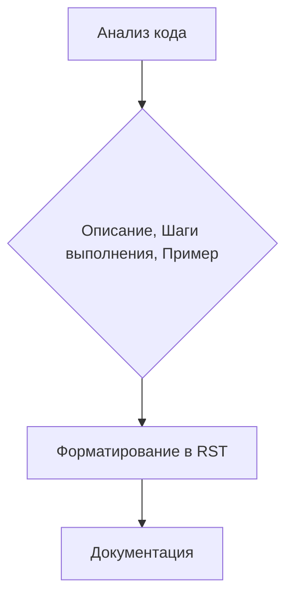

# Анализ кода: Инструкции для генерации документации

**1. <input code>**

```
**Инструкции для генерации документации к коду**

1. **Анализируй код**: Пойми логику и действия, выполняемые данным фрагментом кода.

2. **Создай пошаговую инструкцию**:
    - **Описание**: Объясни, что делает данный блок кода.
    - **Шаги выполнения**: Опиши последовательность действий в коде.
    - **Пример использования**: Приведи пример кода, как использовать данный фрагмент в проекте.

3. **Форматирование**: Следуй структуре в `reStructuredText (RST)`:

```rst
Как использовать этот блок кода
=========================================================================================\n\nОписание
-------------------------
[Объяснение, что делает код.]

Шаги выполнения
-------------------------
1. [Описание первого шага.]
2. [Описание второго шага.]
3. [Продолжай по необходимости...]

Пример использования
-------------------------
.. code-block:: python

    [Пример использования кода]
```

4. **Избегай расплывчатых терминов** вроде "получаем" или "делаем". Будь конкретным, что именно делает код, например: "проверяет", "валидирует" или "отправляет".
```

**2. <algorithm>**

Этот код представляет собой набор инструкций, описывающих шаги для создания документации к коду. Алгоритм работы заключается в следующем:

* **Шаг 1 (Анализ кода):** Проанализировать фрагмент кода, понять его логику и выполняемые действия. (Пример: Проверить, какие функции вызываются, какие переменные используются и т.д.)
* **Шаг 2 (Создание инструкции):** Сформулировать подробные инструкции, описывающие:
    * **Описание:** Что делает данный фрагмент кода?
    * **Шаги выполнения:** В каком порядке код выполняется?
    * **Пример использования:** Как применить этот код в программе?
* **Шаг 3 (Форматирование):** Используя формат `reStructuredText (RST)`, отформатировать созданные инструкции в определенном стиле, включающем заголовки, разделы и примеры.
* **Шаг 4 (Избегание расплывчатых терминов):** В инструкциях нужно использовать конкретные глаголы, например, "валидирует", "обрабатывает" вместо "получает" или "делает".


**Пример:**

Если входной код представляет собой функцию `calculate_area(length, width)` , то пошаговая инструкция может быть:
1. Принимает `length` и `width` в качестве аргументов.
2. Вычисляет площадь `area = length * width`.
3. Возвращает значение `area`.


**3. <mermaid>**



**4. <explanation>**

* **Импорты:** Этот код не содержит импортов, так как это набор инструкций, а не фрагмент кода для исполнения.
* **Классы:** Нет классов.
* **Функции:** Нет функций.
* **Переменные:**  Нет переменных.
* **Возможные ошибки/улучшения:**
    * Инструкции слишком общие. Необходимо предоставить примеры конкретных случаев для лучшего понимания, как использовать этот алгоритм на практике.
    * Не хватает уточнений по формату RST, например, какие метки использовать.


**Цепочка взаимосвязей:**

Этот код не связан непосредственно с конкретными частями проекта. Он описывает процесс, который может использоваться для генерации документации к *любому* фрагменту кода, независимо от его местоположения в проекте.