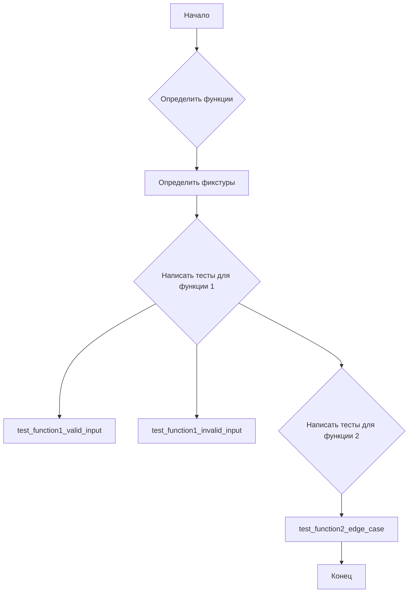

# Анализ кода для написания тестов pytest

## 1. <input code>

```python
# Prompt for Writing `pytest` Tests

# Write test cases for the following Python code using the `pytest` library.
# The tests should cover the main functions, methods, or classes to
# verify their correctness. Include edge cases and exception handling
# where appropriate.

# Requirements:
# 1. Use clear and descriptive test function names that indicate their
#    purpose.
# 2. Ensure all tests are isolated and independent of one another.
# 3. Consider various scenarios, including:
#    - Valid inputs.
#    - Invalid or unexpected inputs, where applicable.
#    - Edge or boundary cases.
# 4. Use `pytest.raises` for exception testing.
# 5. If fixtures are needed for the functions, define them separately.
# 6. Add comments explaining the logic of the test cases.

# Example structure for the tests:

import pytest

# Fixture definitions, if needed
@pytest.fixture
def example_data():
    """Provides test data for the function."""
    return {...}

# Tests for Function 1
def test_function1_valid_input():
    """Checks correct behavior with valid input."""
    ...

def test_function1_invalid_input():
    """Checks correct handling of invalid input."""
    ...

# Tests for Function 2
def test_function2_edge_case():
    """Checks behavior with edge cases."""
    ...
```


## 2. <algorithm>

Этот код предоставляет шаблон для написания тестов pytest.  Он не содержит конкретного алгоритма, так как сам по себе не является выполняемым кодом.  Он задаёт структуру и рекомендации для написания тестов.  Блок-схема для этого руководства по написанию тестов выглядела бы как пустой шаблон:



Тестовый код должен быть написан с использованием методов `pytest.raises` для проверки исключений, а также с помощью фикстур для подготовки данных.


## 3. <mermaid>

```mermaid
graph LR
    subgraph "pytest library"
        A[pytest] --> B(import);
    end
    subgraph "User code"
        C[function1] --> D(test_function1_valid_input);
        C --> E(test_function1_invalid_input);
        F[function2] --> G(test_function2_edge_case);
        H[example_data] -- fixture --> D, E, G;
    end
```

## 4. <explanation>

**Импорты**:

`import pytest`:  Импортирует библиотеку `pytest`, необходимую для написания тестов. Эта библиотека предоставляет функции и инструменты для создания и запуска тестов Python.  Она относится к внешнему пакету.

**Классы**:

Этот код не содержит объявлений классов.

**Функции**:

*   `example_data()`:  Это пример фикстуры, которая может быть использована для подготовки данных, необходимых для тестов. Она должна быть определена с помощью декоратора `@pytest.fixture`.  Внутри неё нужно будет определить примеры данных.
*   `test_function1_valid_input()`, `test_function1_invalid_input()`, `test_function2_edge_case()`:  Это примеры тестовых функций, предназначенные для проверки работоспособности функции 1 и функции 2. Они должны содержать утверждения (assertions) для проверки поведения функций.  Эти функции являются частью `pytest` фреймворка, но определяются внутри проекта.


**Переменные**:

В данном примере показаны тестовые функции, а не конкретные переменные.


**Возможные ошибки или области для улучшений**:

*   В примере отсутствует сам код функций `function1` и `function2`, что делает невозможным полноценный тест. Необходимо добавить этот код.
*   В примере нет конкретного способа обработки валидных и невалидных данных. В реальных тестов нужно определять, какие конкретно входные данные являются валидными/невалидными и как это должно влиять на поведение функции.
*   Пример не показывает, как использовать `pytest.raises` для проверки исключений.
*   Для тестов недостаточно лишь определения валидных данных. Важно проверять работу функции в граничных случаях, а также при невалидных входных данных, чтобы обеспечить надежность тестирования.


**Взаимосвязь с другими частями проекта**:

Этот шаблон демонстрирует взаимосвязь с предполагаемыми функциями и классами, которые должны быть протестированы.  В реальном коде тесты должны быть привязаны к конкретным функциям и классам из проекта.