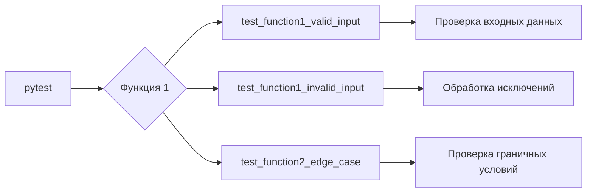

# Анализ кода: Инструкция по написанию тестов pytest

## 1. <input code>

```python
# Prompt for Writing `pytest` Tests

# Write test cases for the following Python code using the `pytest` library. The tests should cover the main functions, methods, or classes to verify their correctness. Include edge cases and exception handling where appropriate.

# Requirements:
# 1. Use clear and descriptive test function names that indicate their purpose.
# 2. Ensure all tests are isolated and independent of one another.
# 3. Consider various scenarios, including:
#    - Valid inputs.
#    - Invalid or unexpected inputs, where applicable.
#    - Edge or boundary cases.
# 4. Use `pytest.raises` for exception testing.
# 5. If fixtures are needed for the functions, define them separately.
# 6. Add comments explaining the logic of the test cases.

# Example structure for the tests:

import pytest

# Fixture definitions, if needed
@pytest.fixture
def example_data():
    """Provides test data for the function."""
    return {...}

# Tests for Function 1
def test_function1_valid_input():
    """Checks correct behavior with valid input."""
    ...

def test_function1_invalid_input():
    """Checks correct handling of invalid input."""
    ...

# Tests for Function 2
def test_function2_edge_case():
    """Checks behavior with edge cases."""
    ...
```

## 2. <algorithm>

Данный код представляет собой шаблон для написания тестов с использованием библиотеки `pytest`.  Алгоритм работы состоит из генерации тестов, проверяющих функциональность некоего кода (не предоставленного в данном примере).  Блок-схема не может быть построена, поскольку тестируемый код отсутствует.  Передача данных между функциями/классами/методами также не может быть проиллюстрирована.

## 3. <mermaid>



**Описание диаграммы:**

Диаграмма демонстрирует, как pytest (A) запускает тесты (B) для функций (C, D, E).  Далее, каждый тест проверяет разные аспекты тестируемого кода (F - валидные входные данные, G - обработка исключений, H - граничные случаи).  Подключаемая зависимость - библиотека `pytest`.  Взаимодействие с другими частями проекта не показано, так как код, требующий тестирования, отсутствует.


## 4. <explanation>

**Импорты:**

* `import pytest`: Импортирует библиотеку `pytest`, необходимую для написания и запуска автоматических тестов в Python.  Это основной импорт для pytest-тестов.


**Классы:**

Нет классов в предоставленном фрагменте.  В реальном тестируемом коде классы могли бы использоваться для тестирования объектов.

**Функции:**

* `@pytest.fixture`:  Это декоратор, указывающий на функцию, которая будет использоваться как фикстура.  Фикстуры обычно используются для подготовки данных или ресурсов, необходимых для тестируемых функций.  `example_data` – пример фикстуры, возвращающей данные для тестирования.

* `test_function1_valid_input`, `test_function1_invalid_input`, `test_function2_edge_case`: Это тестовые функции.  Они должны содержать утверждения (`assert`), которые проверяют поведение тестируемых функций.  Названия функций должны быть описательными.

**Переменные:**

Переменные внутри тестовых функций будут хранить данные, используемые для тестирования.  В примере фикстура `example_data` создаёт такие данные.  Конкретные переменные будут зависеть от кода, подлежащего тестированию.

**Возможные ошибки или области для улучшений:**

* Отсутствие тестируемого кода.  Код, подлежащий тестированию, не предоставили.  Без этого не возможно построить полные и точные тесты.

* Недостаток конкретики в тестах.  Пример показывает лишь структуру, но не содержит реальных утверждений.  Наличие конкретных данных, ожидаемых результатов и утверждений сделает тесты полезными.

* Не указаны типы возвращаемых значений.  Без информации о типе данных, возвращаемых функциями, сложно написать корректные тесты для обработки возможных исключений.


**Цепочка взаимосвязей с другими частями проекта:**

Невозможно определить взаимосвязь с другими частями проекта, так как не существует тестируемого кода.  Если тестируемый код из другого модуля или пакета, то тесты должны быть спроектированы так, чтобы взаимодействовать с этим кодом по необходимости.