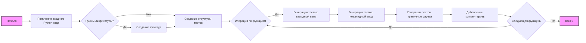

# Анализ кода для генерации `pytest` тестов

## <алгоритм>

1.  **Получение входного кода:**
    *   Инструкция получает Python код, для которого нужно написать тесты. Это может быть любая функция, класс или набор функций/классов.
    *   Пример: `def add(a, b): return a + b`
2.  **Генерация структуры тестов:**
    *   Создается базовая структура файла с тестами `pytest`.
    *   Импортируется библиотека `pytest`: `import pytest`
    *   Если необходимы фикстуры, добавляется заготовка:
        ```python
        @pytest.fixture
        def example_data():
           """Provides test data for the function."""
           return {...}
        ```
        Здесь `example_data` - имя фикстуры, `return {...}` - возвращаемые данные.
    *   Для каждой функции или метода из входного кода создается блок тестов.
    *   Для каждой функции создаются тесты для валидного ввода, невалидного ввода и граничных случаев.
        *   **Пример для валидного ввода:**
            ```python
            def test_add_valid_input():
                 """Checks correct behavior with valid input."""
                 result = add(2, 3)
                 assert result == 5
            ```
        *   **Пример для невалидного ввода (если применимо):**
            ```python
            def test_add_invalid_input():
                """Checks correct handling of invalid input."""
                with pytest.raises(TypeError):
                    add("a", 2)
            ```
        *   **Пример для граничных случаев:**
            ```python
            def test_add_edge_case():
                """Checks behavior with edge cases."""
                result = add(0, 0)
                assert result == 0
                result = add(1000000, -1000000)
                assert result == 0
            ```
3.  **Наполнение тестов:**
    *   Внутри каждой тестовой функции вызывается проверяемая функция/метод с подготовленными данными.
    *   Проверяется результат с помощью `assert`.
    *   Используется `pytest.raises` для проверки исключений.
4.  **Комментирование:**
    *   Добавляются комментарии для каждого теста, объясняющие его назначение.

## <mermaid>



**Анализ диаграммы:**

*   `A` (Начало) и `L` (Конец):  Обозначают начало и конец процесса.
*   `B` (Получение входного Python кода): На первом этапе, код который необходимо протестировать, передается в программу.
*   `C` (Нужны ли фикстуры?): Определяется, требуются ли фикстуры для тестовых данных.
*   `D` (Создание фикстур): Если фикстуры требуются, они создаются на данном этапе.
*  `E` (Создание структуры тестов): формируется основная структура для теста, включая импорт `pytest`.
*   `F` (Итерация по функциям):  Происходит итерация по каждой функции для генерации соответствующих тестов.
*   `G` (Генерация тестов: валидный ввод): Генерируются тесты для валидных входных данных.
*   `H` (Генерация тестов: невалидный ввод): Генерируются тесты для невалидных входных данных (где применимо).
*   `I` (Генерация тестов: граничные случаи): Генерируются тесты для граничных случаев.
*   `J` (Добавление комментариев):  Добавляются комментарии для понимания каждого теста.
*   `K` (Следующая функция?): Проверяется, есть ли еще функции для которых нужно создать тесты.

**Зависимости:**

*   Диаграмма не импортирует никакие модули, так как она описывает логику процесса генерации тестов.

## <объяснение>

**Описание процесса:**

Этот код генерирует тестовые функции для данного Python кода, используя библиотеку `pytest`. Он анализирует предоставленный код и создаёт структуру тестов, включая фикстуры, если они необходимы.
Далее он генерирует тесты для валидных, невалидных и граничных входных данных, с комментариями.

**Импорты:**

*   `import pytest`:
    *   Импортируется библиотека `pytest`, которая является основной для создания и запуска тестов.
    *   Используется для создания фикстур (`@pytest.fixture`), обработки исключений (`pytest.raises`), и для структурирования и запуска тестов.

**Классы:**

*   В данном коде классы не используются.

**Функции:**

*   `test_function1_valid_input()`, `test_function1_invalid_input()`, `test_function2_edge_case()`:
    *   Это примеры тестовых функций, которые должны быть сгенерированы.
    *   Их имена отражают проверяемое поведение.
    *   Внутри каждой такой функции будет вызов проверяемой функции/метода и проверка результата с помощью `assert`.
    *   `pytest.raises` используется для проверки исключений.
*   `example_data()`:
    *   Это пример фикстуры, которая может использоваться для предоставления тестовых данных.
    *   Она используется с декоратором `@pytest.fixture`.

**Переменные:**

*   Переменные, такие как `result` внутри тестовых функций, используются для хранения результатов вызова проверяемых функций и методов.

**Потенциальные ошибки и области для улучшения:**

*   **Генерация всех возможных кейсов:** Инструкция не охватывает все возможные типы тестов и не гарантирует полный охват кода тестами.
*   **Сложные структуры данных:** При сложных типах данных или  необходимо проработать генерацию данных для тестов.
*   **Зависимости между модулями:** Зависимости между различными частями проекта не обрабатываются.
*   **Покрытие кода:**  Нужно предусмотреть механизмы для измерения покрытия кода тестами.

**Взаимосвязь с другими частями проекта:**

*   Эта инструкция предназначена для работы с другими частями проекта, такими как парсер кода (для анализа предоставленного Python кода) и генератор кода (для создания фактического кода тестов).
*   Она может быть частью более крупного фреймворка для автоматизации тестирования.

Этот подробный анализ должен дать полное понимание цели, функциональности и структуры кода для генерации тестов `pytest`.