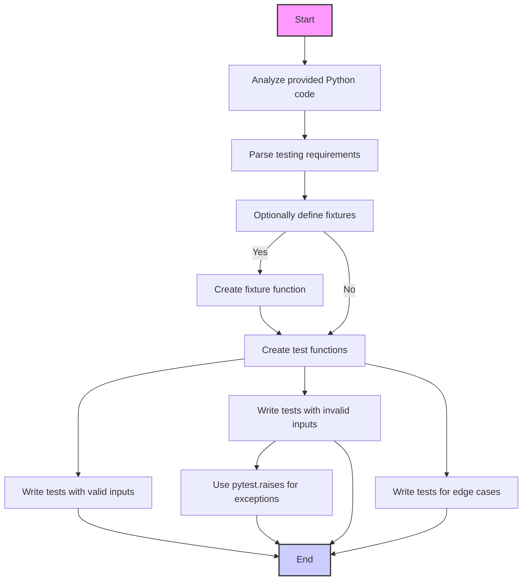

## ИНСТРУКЦИЯ:

### <алгоритм>
Инструкция предназначена для генерации тестовых случаев с использованием библиотеки `pytest` для Python. Она требует анализа предоставленного кода и создания набора тестов, охватывающих различные аспекты его работы.

**Пошаговая блок-схема:**

1. **Начало**: Получение Python-кода, для которого необходимо сгенерировать тесты. 
   *Пример: `def add(a, b): return a + b`*
2. **Разбор требований**: Анализ требований к тестам.
    *Пример:
     -  Использовать `pytest`.
     -  Тесты должны быть изолированными.
     -  Покрывать валидные, невалидные и граничные случаи.
     -  Использовать `pytest.raises` для тестирования исключений.*
3. **Определение фикстур (при необходимости)**: Определение фикстур, если они необходимы для предоставления тестовых данных.
    *Пример:
     ```python
        @pytest.fixture
        def example_data():
            return {'a': 1, 'b': 2}
     ```
    *Поток данных: Создание фикстуры. Фикстура будет использована тестами.*
4. **Написание тестовых функций**:
   - Для каждой функции, метода или класса в исходном коде создаются тестовые функции.
      *Пример: `def test_add_valid_input():`*
   - Внутри тестовых функций:
     -  Проверка с валидными входными данными.
        *Пример: `assert add(2, 3) == 5`*
     -  Проверка с невалидными входными данными (если применимо).
        *Пример: `with pytest.raises(TypeError): add("a", 1)`*
     -  Проверка с граничными случаями.
        *Пример: `assert add(0, 0) == 0`*
   *Поток данных: Выполнение теста с заданными данными и сравнение результата с ожидаемым. Если тест использует фикстуру, данные из фикстуры будут переданы в тест.*
5. **Завершение**: Создание полного набора тестов.

### <mermaid>


**Объяснение зависимостей:**

Диаграмма `mermaid` описывает процесс создания тестов на основе предоставленного кода.
- `Start`: Начало процесса.
- `AnalyzeCode`: Анализ предоставленного Python кода для понимания его функциональности.
- `ParseRequirements`: Разбор требований к тестам, например, использование `pytest`, обработка ошибок и краевые случаи.
- `OptionFixture`: Проверка, нужно ли использовать фикстуры для подготовки тестовых данных.
- `CreateFixture`: Функция для создания фикстуры.
- `CreateTestFunc`: Создание тестовых функций, включая тесты на валидные, невалидные и крайние случаи.
- `ValidInputTest`, `InvalidInputTest`, `EdgeCaseTest`, `ExceptionTest`: Различные типы тестов. `ExceptionTest` проверяет возникновение исключений.
- `End`: Завершение процесса.

### <объяснение>

**Общая цель:**

Инструкция описывает процесс создания unit-тестов с использованием библиотеки `pytest` для предоставленного Python кода. Это гарантирует, что код работает правильно и обрабатывает различные входные данные, включая невалидные и пограничные случаи.

**Импорты:**

В примерах, приведенных в инструкции, импортируется библиотека `pytest`.
- `pytest`: Используется для написания и запуска тестов. Она предоставляет удобные инструменты для создания фикстур, обработки исключений и выполнения тестовых функций.

**Классы:**

В представленной инструкции классы не используются, но могут быть задействованы, если они имеются в пользовательском коде, для которого пишутся тесты.

**Функции:**

- **Фикстуры:**  
   -  `@pytest.fixture` : Декоратор, используемый для создания фикстур. Фикстура - это функция, которая создает необходимые тестовые данные, например `example_data`. Возвращает тестовые данные для использования в тестах.
- **Тестовые функции:**
   - Имена начинаются с `test_`. Это стандартное соглашение `pytest`, позволяющее идентифицировать тесты.
   - Внутри тестовых функций: 
     -  Вызывается тестируемая функция, метод или класс.
     -  Используется `assert`, чтобы проверить, соответствует ли результат ожидаемому.
     -  Используется `pytest.raises`, чтобы проверить, что код вызывает ожидаемое исключение при неверных входных данных.

**Переменные:**

-   Переменные создаются внутри фикстур для хранения тестовых данных (например, `{'a': 1, 'b': 2}`).
-   Переменные также могут быть использованы для хранения результатов вызова функций в тестовых функциях.

**Потенциальные ошибки и области для улучшения:**

- **Недостаточное покрытие тестами:**
  -   Можно упустить сложные случаи или комбинации входных данных.
  -   Следует стремиться к 100% покрытию кода тестами.
- **Неправильные тесты:**
  -   Тесты могут быть некорректными, если они не покрывают все требования.
  -   Требуется тщательная проверка и разработка тестов для разных ситуаций.
- **Изменения в коде:**
  -   Если исходный код изменяется, необходимо обновлять тесты.

**Взаимосвязь с другими частями проекта:**

В данном случае основной задачей является тестирование. Тесты обеспечивают надежность кода, который затем будет использован в других частях проекта.