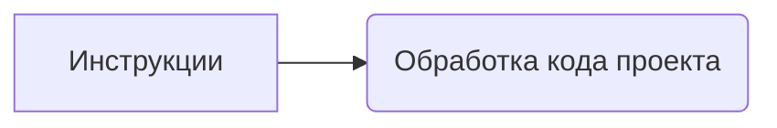

```MD
# Анализ кода

**1. <input code>**

```
Здесь находятся инструкции по обработке кода проекта моделью
```

**2. <algorithm>**

Код представляет собой строку текста, описывающую инструкции для обработки.  В данном случае, это описание задачи, выполняемой моделью, не содержащее алгоритма или кода в традиционном понимании.  Поэтому пошаговая блок-схема не применимо.  Отсутствует выполнение действий или логика.

**3. <mermaid>**



**Описание диаграммы:**

Диаграмма показывает единственную связь: "Инструкции" приводят к "Обработке кода проекта".  Это отражает общий смысл предоставленного текста, который описывает задачу.  Диаграмма не отображает внутреннюю логику самой обработки, поскольку ее нет.


**4. <explanation>**

**Импорты:**

Отсутствуют импорты, поэтому нет зависимостей от других пакетов, находящихся в `src`.

**Классы:**

Отсутствуют классы.

**Функции:**

Отсутствуют функции.

**Переменные:**

Отсутствуют переменные.

**Возможные ошибки или области для улучшений:**

Текст является комментарием или инструкцией, а не рабочим кодом.  Чтобы проанализировать и объяснить код, необходимо предоставить фрагмент действующего кода (с классами, функциями, переменными).

**Цепочка взаимосвязей с другими частями проекта:**

В данном случае невозможно установить взаимосвязь, поскольку текст не является кодом. Чтобы определить взаимосвязи, необходимо видеть код, который использует эти инструкции.

**Заключение:**

Предоставленный текст не содержит кода для анализа.  Необходимо предоставить действительный фрагмент кода, чтобы получить подробный анализ, включая алгоритм, диаграмму и объяснение.