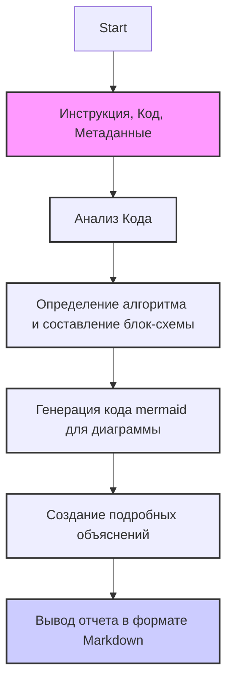

## АНАЛИЗ ИНСТРУКЦИЙ

### 1. <алгоритм>

Инструкция предназначена для анализа кода.  
   1. **Ввод**: Инструкция получает на вход фрагмент кода и метаданные.  
   2. **Анализ**: Инструкция анализирует код и определяет:  
      - Зависимости (импорты)  
      - Классы и их структуру (атрибуты, методы)  
      - Функции (аргументы, возвращаемые значения, назначение)  
      - Переменные (типы, использование)  
      - Общий алгоритм работы кода
   3. **Вывод**: Инструкция возвращает анализ в формате Markdown, который включает три раздела:
      - **<алгоритм>**: Описание алгоритма в виде пошаговой блок-схемы.  
      - **<mermaid>**: Диаграмма `mermaid` для визуализации структуры кода и зависимостей.
      - **<объяснение>**: Подробное описание кода, включая назначение импортов, классов, функций, переменных, а также потенциальные ошибки и области улучшения.

### 2. <mermaid>

**Объяснение `mermaid`:**

- **flowchart TD**:  Указывает, что это диаграмма потока данных, и поток идет сверху вниз (Top to Down).
- **Start**:  Начало процесса.
- **Input**:  Блок ввода, принимает инструкции, код и метаданные.
- **Analysis**:  Блок анализа, где происходит разбор кода.
- **Algorithm**:  Блок создания алгоритма и блок-схемы на основе анализа.
- **MermaidCode**: Блок генерации `mermaid` кода.
- **Explanations**: Блок, где создаются подробные объяснения кода.
- **Output**: Блок вывода результата в формате Markdown.
- `style`  - определяет стиль отображения блоков на схеме (цвет заливки, толщину обводки и т.д.)

**Зависимости**:

- Нет импортов из Python. Диаграмма показывает логический поток обработки кода. 

### 3. <объяснение>

**Импорты:**
  - В предоставленном коде нет импортов.  Инструкция работает с предоставленным кодом и  не использует дополнительные библиотеки.

**Классы:**
  - Инструкция сама по себе не является классом, это набор правил для обработки кода.

**Функции:**
  - Нет функций в инструкции. Но сам процесс можно рассматривать как последовательность вызовов функций.  
    - Функция `analyze_code` принимает код и возвращает анализ в виде Markdown.
    - Внутри `analyze_code` можно представить несколько других функций: 
       - `extract_algorithm()` генерирует блок-схему.
       - `generate_mermaid_diagram()` создает mermaid код.
       - `create_detailed_explanations()` генерирует подробные пояснения.
       - `format_output()` собирает результаты в Markdown.

**Переменные:**
   - Инструкция в основном использует входные данные (`input_code` , `instruction` и др.) и не использует явные переменные.

**Объяснения:**
  - Основная цель инструкции - это  преобразовать исходный код в удобочитаемый формат Markdown с четкой структурой, разделенной на три части.
    - Она использует **пошаговый алгоритм**, который позволяет детально понять логику работы кода.
    - **Диаграмма `mermaid`** визуализирует зависимости и структуру кода.
    - **Объяснения** предоставляют глубокое понимание каждого элемента кода.
  - Инструкция предназначена для обеспечения всестороннего анализа и упрощения понимания кода. 
  
**Потенциальные ошибки и области для улучшения:**
   - Сейчас инструкция не учитывает конкретный язык программирования кода. Возможно, в будущем нужно добавить поддержку конкретных языков.
   - Нужно добавить возможность учета контекста. Инструкция сейчас анализирует код изолированно.
   - Не реализован блок проверки корректности кода.
   
**Цепочка взаимосвязей с другими частями проекта:**
 - Инструкция, скорее всего,  является частью более крупной системы, где она используется для автоматического документирования или анализа кода.  
 - Ее выходные данные могут быть использованы в других модулях или как часть пользовательского интерфейса для отображения информации о коде.