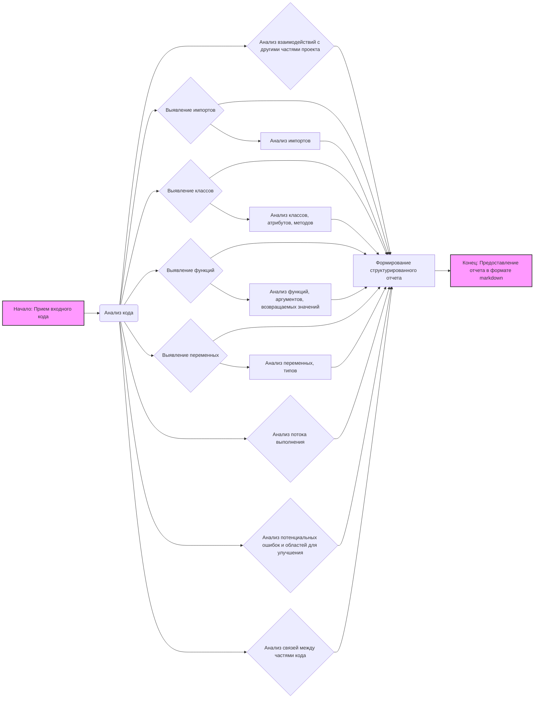

# Анализ инструкций по обработке кода

## <алгоритм>

Инструкции, представленные в файле `readme.md`, определяют процесс, которому должна следовать модель при анализе кода. Этот процесс можно представить в виде следующей пошаговой блок-схемы:

1.  **Прием входного кода:** Модель получает код на вход (например, код на Python, JavaScript и т.д.).
    *   Пример: `input_code = "def hello(name): print(f'Hello, {name}!')"`

2.  **Анализ кода:** Модель анализирует предоставленный код, выявляя:
    *   Импортируемые модули и их назначение.
    *   Определенные классы, их атрибуты и методы.
    *   Определенные функции, их аргументы и возвращаемые значения.
    *   Используемые переменные и их типы.
    *   Поток выполнения программы.
    *   Потенциальные ошибки или области для улучшения.
    *   Связи между различными частями кода.
    *   Взаимодействие с другими частями проекта (при наличии).

3.  **Формирование отчета:** Модель формирует структурированный отчет в формате markdown, включающий:
    *   Раздел **<алгоритм>**: Описание процесса анализа в виде блок-схемы, включая примеры и иллюстрации потока данных.
    *   Раздел **<mermaid>**: Код для диаграммы в формате mermaid, представляющий зависимости, с осмысленными именами переменных.
    *   Раздел **<объяснение>**: Подробное объяснение импортов, классов, функций, переменных и т.д., с учетом их ролей, атрибутов, методов и взаимодействия.

4.  **Предоставление отчета:** Модель предоставляет сформированный отчет в формате markdown.

## <mermaid>

**Описание диаграммы:**

Диаграмма `mermaid` визуализирует процесс анализа кода.

*   **Начало: Прием входного кода** - начальная точка, где модель получает входной код для анализа.
*   **Анализ кода** - основной этап, где проводится детальный разбор кода.
*   **Выявление импортов**, **Выявление классов**, **Выявление функций**, **Выявление переменных** -  подэтапы, выделенные для каждого из элементов кода.
*   **Анализ импортов**, **Анализ классов, атрибутов, методов**, **Анализ функций, аргументов, возвращаемых значений**, **Анализ переменных, типов** - шаги, которые выполняются для конкретных элементов кода.
*   **Анализ потока выполнения** - этап, где рассматривается порядок операций в коде.
*   **Анализ потенциальных ошибок и областей для улучшения** - проверка на предмет недочетов.
*   **Анализ связей между частями кода** - определение зависимостей между разными частями кода.
*  **Анализ взаимодействий с другими частями проекта** - изучение связей с другими модулями проекта.
*   **Формирование структурированного отчета** - объединение результатов анализа в структурированный отчет.
*   **Конец: Предоставление отчета в формате markdown** - заключительный этап, когда отчет предоставляется пользователю.

Все переменные в диаграмме имеют описательные имена, что облегчает понимание процесса.

## <объяснение>

Представленные инструкции определяют процесс анализа кода, который должна выполнять модель. Инструкции включают в себя ряд требований к структуре и содержанию отчета.

**Раздел <алгоритм>:**

Этот раздел предназначен для описания процесса анализа кода в виде пошаговой блок-схемы. Описание должно быть понятным и включать примеры для каждого логического блока, иллюстрируя поток данных. Это помогает визуализировать последовательность операций и понять, как различные части кода взаимодействуют друг с другом.

**Раздел <mermaid>:**

Этот раздел отвечает за визуальное представление зависимостей кода. Код `mermaid` должен быть корректным и понятным. Важно, чтобы все переменные в диаграмме имели осмысленные имена. Этот раздел помогает понять структуру кода и взаимосвязи между его компонентами.

**Раздел <объяснение>:**

Этот раздел включает детальное текстовое описание:

*   **Импорты:** Необходимо объяснить назначение импортируемых модулей, а также их связь с другими пакетами в рамках проекта. Это помогает понять зависимости и модульность кода.
*   **Классы:** Для каждого класса нужно описать его роль, атрибуты, методы и как он взаимодействует с другими компонентами. Это позволяет понять объектную модель кода.
*   **Функции:** Для каждой функции нужно описать ее аргументы, возвращаемые значения, назначение и предоставить примеры использования. Это помогает понять логику и функциональность отдельных частей кода.
*   **Переменные:** Необходимо указать типы переменных и их использование в коде. Это важно для понимания потока данных и их преобразований.
*   **Потенциальные ошибки и области для улучшения:** Модель должна указать на возможные проблемы в коде, а также на места, которые можно улучшить с точки зрения производительности, читаемости и других параметров. Это дает возможность совершенствовать код.
*   **Цепочка взаимосвязей с другими частями проекта:** Если код является частью более крупного проекта, нужно описать его связи с другими модулями. Это важно для понимания контекста и зависимостей внутри всего проекта.

**Общая структура отчета:**

Требование к структуре отчета, представленному в markdown формате, обеспечивает унифицированный подход к анализу кода. Это облегчает понимание отчетов и позволяет быстро находить нужную информацию.