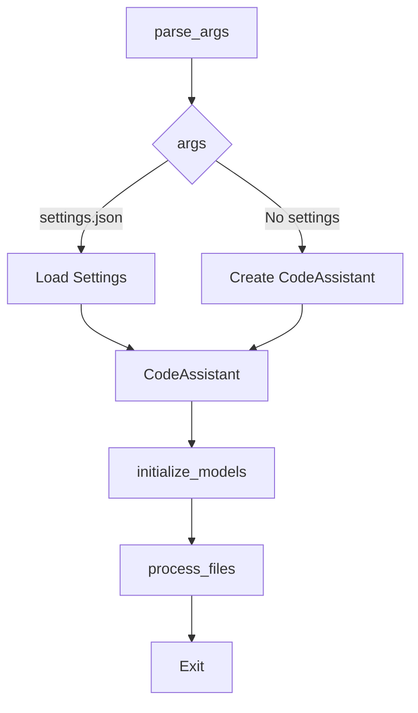

```MD
# <input code>

```python
## \file hypotez/src/endpoints/hypo69/code_assistant/main.py
# -*- coding: utf-8 -*-\
#! venv/Scripts/python.exe
#! venv/bin/python/python3.12

"""
.. module:: src.endpoints.hypo69.code_assistant 
	:platform: Windows, Unix
	:synopsis:


Примеры запуска:
1. Запуск с готовыми настройками:
    python main.py --settings settings.json

2. Запуск с указанием роли 'doc_writer', языка 'ru', моделей 'gemini' и 'openai', а также стартовых директорий:
    python main.py --role doc_writer --lang ru --models gemini openai --start_dirs /path/to/dir1 /path/to/dir2

3. Запуск с указанием роли 'code_checker', языка 'en' и только модели 'gemini', а также стартовой директории:
    python main.py --role code_checker --lang en --models gemini --start_dirs /path/to/dir

4. Запуск с указанием роли 'doc_writer', языка 'en' и только модели 'openai':
    python main.py --role doc_writer --lang en --models openai
"""
MODE = 'dev'

import argparse
import json
from pathlib import Path
from .assistant import CodeAssistant

def parse_args() -> dict:
    """Парсинг аргументов командной строки.

    Returns:
        dict: Словарь с параметрами запуска.
    """
    parser = argparse.ArgumentParser(description='Code Assistant CLI')

    parser.add_argument(
        '--settings',
        type=str,
        help='Путь к файлу настроек JSON.',
    )
    parser.add_argument(
        '--role',
        type=str,
        choices=['code_checker', 'code_analyzer', 'doc_writer', 'tests_creator'],
        help='Выбор роли ассистента.',
    )
    parser.add_argument(
        '--lang',
        type=str,
        choices=['ru', 'en'],
        default='en',
        help='Выбор языка.',
    )
    parser.add_argument(
        '--models',
        type=str,
        nargs='+',
        choices=['gemini', 'openai'],
        help='Список моделей для использования.',
    )
    parser.add_argument(
        '--start_dirs',
        type=str,
        nargs='+',
        help='Список стартовых директорий.',
    )

    return vars(parser.parse_args())


def main():
    """Главная функция запуска CodeAssistant с параметрами из командной строки или файла настроек."""
    print('Starting Code Assistant...')

    args = parse_args()

    # Если указан файл настроек, загружаем параметры из него
    if args.get('settings'):
        settings_path = Path(args['settings'])
        if settings_path.exists():
            with open(settings_path, 'r', encoding='utf-8') as file:
                settings = json.load(file)
            assistant = CodeAssistant(**settings)
        else:
            print(f'Файл настроек "{settings_path}" не найден.')
            return
    else:
        # Создаем экземпляр ассистента с параметрами из командной строки
        role = args.get('role')
        lang = args.get('lang', 'en')
        models = args.get('models', ['gemini'])
        start_dirs = [Path(d) for d in args.get('start_dirs', [])]

        assistant = CodeAssistant(role=role, lang=lang, model=models, start_dirs=start_dirs)

    # Инициализация и запуск обработки
    assistant.initialize_models()
    assistant.process_files()


if __name__ == '__main__':
    main()
```

# <algorithm>

**Шаг 1**: Парсинг аргументов командной строки (функция `parse_args`).

- Принимает аргументы командной строки с помощью `argparse`.
- Возвращает словарь `args` с параметрами (`--settings`, `--role`, `--lang`, `--models`, `--start_dirs`).
- Пример: `python main.py --settings settings.json --role doc_writer --lang ru --models gemini openai`.

**Шаг 2**: Обработка файла настроек (если указан) или параметров командной строки.

- Если задан `--settings`, то загружает настройки из файла `settings.json`.
- Иначе, использует переданные параметры командной строки.
- Пример: Если `settings.json` содержит `{role: 'doc_writer', lang: 'ru', ...}`, то `assistant` инициализируется с этими параметрами.

**Шаг 3**: Создание экземпляра `CodeAssistant`.

- Используя полученные аргументы, создается экземпляр класса `CodeAssistant` (из `src.endpoints.hypo69.code_assistant.assistant`).
- Данные из `args` передаются в конструктор `CodeAssistant` в виде аргументов (например, `role`, `lang`, `model`, `start_dirs`).

**Шаг 4**: Инициализация моделей (`assistant.initialize_models()`).

- Вызывается метод `initialize_models()` у созданного объекта `assistant` для инициализации подключений к выбранным моделям (например, `gemini` или `openai`).
- В зависимости от модели `assistant` взаимодействует с соответствующим API.

**Шаг 5**: Обработка файлов (`assistant.process_files()`).

- Вызывается метод `process_files()` у объекта `assistant`.
- Метод обрабатывает файлы в указанных директориях `start_dirs` в соответствии с заданной ролью (`role`) и языком (`lang`).
- Этот метод является центральным, `assistant` может использовать `initialize_models()` для запроса к моделям.


# <mermaid>



**Подключаемые зависимости:**

- `argparse`: Для парсинга аргументов командной строки.
- `json`: Для работы с файлами JSON.
- `pathlib`: Для работы с путями к файлам.
- `.assistant`: Подключает класс `CodeAssistant` из модуля `assistant.py`.
- `src.endpoints.hypo69.code_assistant.assistant`: Содержит логику обработки запросов к моделям (LLM).


# <explanation>

**Импорты:**

- `argparse`: Используется для парсинга аргументов командной строки.
- `json`: Используется для работы с JSON-файлами.
- `pathlib`: Обеспечивает удобный способ работы с файловыми путями.
- `.assistant`: Импортирует класс `CodeAssistant` из модуля `assistant.py`, который, вероятно, содержит логику взаимодействия с LLM (Large Language Models) – такими как `gemini` или `openai` для обработки кода.  Связь идет через `src.endpoints.hypo69.code_assistant`.

**Классы:**

- `CodeAssistant`: Этот класс (определен в `assistant.py`) отвечает за всю логику ассистента. Атрибуты класса, скорее всего, содержат информацию о модели, языке, задаче и т.д. Методы класса (такие как `initialize_models()`, `process_files()`) определяют, как ассистент взаимодействует с LLM.

**Функции:**

- `parse_args()`: Парсит аргументы командной строки, возвращая словарь с переданными параметрами.
- `main()`: Является основной функцией программы. Она парсит аргументы, создает экземпляр `CodeAssistant`, инициирует взаимодействие с LLM, и запускает обработку файлов.

**Переменные:**

- `MODE`: Переменная, содержащая значение `'dev'`. Вероятно, используется для выбора режима работы.
- `args`: Словарь, содержащий переданные аргументы командной строки или параметры из настроек.
- `settings_path`: Путь к файлу настроек.
- `settings`: Словарь, содержащий загруженные настройки из файла.
- `assistant`: Экземпляр класса `CodeAssistant`.

**Возможные ошибки и улучшения:**

- Необходимо проверить корректность пути к файлу настроек `settings.json` перед его загрузкой.
- В `process_files` нужно правильно обрабатывать возможные исключения, возникающие во время взаимодействия с LLM.
- Необходима строгая типизация в `assistant.py`.
- Документация для методов и классов `assistant.py` должна быть более исчерпывающей.
- Улучшение структуры кода с использованием паттернов проектирования (например, фабрика для создания экземпляров моделей) может привести к большей гибкости.

**Цепочка взаимосвязей:**

`main.py` запускает `CodeAssistant` из модуля `assistant.py`. Модуль `assistant.py` взаимодействует с LLM (например, `gemini` или `openai`), используя соответствующие API. Вероятно, существуют дополнительные модули, которые также взаимодействуют с `CodeAssistant` или LLM.  Общая архитектура выглядит как `main.py` -> `assistant.py` -> `LLM`.