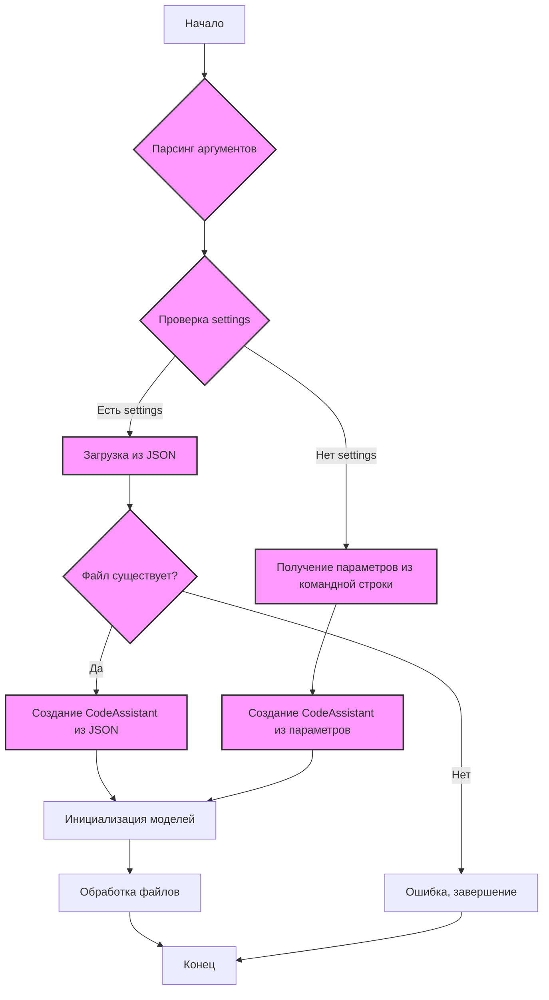

## <алгоритм>

1.  **Начало**:
    *   Программа запускается.
    *   Устанавливается глобальная переменная `MODE = 'dev'`.
2.  **Парсинг аргументов**:
    *   Вызывается функция `parse_args()`.
    *   Используется `argparse.ArgumentParser` для обработки аргументов командной строки.
    *   Аргументы:
        *   `--settings`: Путь к файлу настроек JSON.
        *   `--role`: Роль ассистента (`code_checker`, `code_analyzer`, `doc_writer`, `tests_creator`).
        *   `--lang`: Язык (`ru`, `en`, по умолчанию `en`).
        *   `--models`: Список моделей (`gemini`, `openai`).
        *   `--start_dirs`: Список стартовых директорий.
    *   Возвращается словарь `args` с параметрами.
    *   Пример: `args = {'settings': 'settings.json', 'role': 'doc_writer', 'lang': 'ru', 'models': ['gemini', 'openai'], 'start_dirs': ['/path/to/dir1', '/path/to/dir2']}`
3.  **Главная функция** `main()`:
    *   Выводит сообщение "Starting Code Assistant...".
    *   Вызывает `parse_args()` для получения аргументов командной строки.
    *   **Проверка наличия файла настроек**:
        *   Если аргумент `settings` указан (`args.get('settings')`):
            *   Создается объект `Path` для пути к файлу настроек.
            *   **Существование файла**: Если файл существует:
                *   Открывает и читает JSON-файл.
                *   Создает экземпляр класса `CodeAssistant` с параметрами из JSON.
                *   Пример: `assistant = CodeAssistant(role='doc_writer', lang='ru', model=['gemini', 'openai'], start_dirs=['/path/to/dir1', '/path/to/dir2'])`
            *   **Не существование файла**: Если файл не существует:
                *   Выводит сообщение об ошибке.
                *   Завершает выполнение.
        *   **Нет файла настроек**: Если аргумент `settings` не указан:
            *   Получает значения `role`, `lang`, `models`, `start_dirs` из аргументов командной строки (значения по умолчанию).
            *   Преобразует пути в объекты `Path`.
            *   Создает экземпляр класса `CodeAssistant` с параметрами из командной строки.
            *   Пример: `assistant = CodeAssistant(role='code_checker', lang='en', model=['gemini'], start_dirs=[Path('/path/to/dir')])`
    *   **Инициализация и обработка**:
        *   Вызывает метод `initialize_models()` у экземпляра `CodeAssistant`.
        *   Вызывает метод `process_files()` у экземпляра `CodeAssistant`.
4.  **Конец**:
    *   Программа завершается.

## <mermaid>

**Объяснение:**

*   **A (Начало)**: Начальная точка выполнения программы.
*   **B (Парсинг аргументов)**: Вызов функции `parse_args()` для обработки аргументов командной строки.
*   **C (Проверка settings)**: Проверка наличия аргумента `--settings`
*   **D (Загрузка из JSON)**: Загрузка настроек из JSON-файла, если путь к файлу указан.
*   **E (Файл существует?)**: Проверка существования файла настроек
*  **F (Создание CodeAssistant из JSON)**: Создание экземпляра класса `CodeAssistant` с параметрами из JSON.
*   **G (Ошибка, завершение)**: Завершение программы, если файл настроек не найден.
*   **H (Получение параметров из командной строки)**: Получение параметров из командной строки (роль, язык, модели, директории) если `--settings` не указан.
*   **I (Создание CodeAssistant из параметров)**: Создание экземпляра класса `CodeAssistant` с параметрами из командной строки.
*   **J (Инициализация моделей)**: Вызов метода `initialize_models()` у экземпляра `CodeAssistant`.
*   **K (Обработка файлов)**: Вызов метода `process_files()` у экземпляра `CodeAssistant`.
*   **L (Конец)**: Конечная точка выполнения программы.

**Зависимости:**
*   `argparse`: используется для парсинга аргументов командной строки.
*   `json`: используется для работы с файлами JSON (чтения).
*   `pathlib.Path`: используется для представления путей к файлам и директориям.
*   `.assistant.CodeAssistant`: собственный класс, который обрабатывает основную логику работы ассистента.

## <объяснение>

**Импорты:**

*   `argparse`: Этот модуль используется для создания интерфейса командной строки (CLI). Он позволяет парсить аргументы, переданные скрипту при запуске, и обрабатывать их. Это позволяет пользователю настраивать работу скрипта через командную строку.
*   `json`:  Этот модуль используется для работы с данными в формате JSON. В данном контексте он применяется для чтения файла настроек (`settings.json`).
*   `pathlib.Path`: Этот модуль предоставляет способ работы с файловыми путями в объектно-ориентированном стиле. `Path` позволяет создавать, проверять и манипулировать файловыми путями более удобным способом, чем использование обычных строк.
*   `from .assistant import CodeAssistant`: Импортирует класс `CodeAssistant` из модуля `assistant.py`, находящегося в том же каталоге. Это ключевой класс, который управляет логикой работы ассистента. Он отвечает за инициализацию моделей и обработку файлов.

**Классы:**

*   `CodeAssistant`: Этот класс, импортированный из `assistant.py`, является основным компонентом программы. Он инкапсулирует логику обработки файлов и использования моделей. Внутри него, вероятно, есть методы для инициализации моделей (`initialize_models`), и для обработки файлов  (`process_files`). Его взаимодействие с другими частями проекта не видно в текущем фрагменте кода, но он, скорее всего, взаимодействует с моделями (например, Gemini, OpenAI) и файловой системой.

**Функции:**

*   `parse_args() -> dict`:
    *   **Назначение**:  Эта функция создает парсер аргументов командной строки с помощью модуля `argparse`. Она определяет, какие аргументы ожидает программа, и возвращает словарь с их значениями.
    *   **Аргументы**: Нет явных аргументов у функции, но она взаимодействует с командной строкой.
    *   **Возвращаемое значение**: Словарь (dict) с параметрами запуска.
    *   **Пример**:  Вызов `parse_args()` с командной строкой `--role doc_writer --lang ru --models gemini openai --start_dirs /path/to/dir1 /path/to/dir2` вернёт словарь:
    `{'settings': None, 'role': 'doc_writer', 'lang': 'ru', 'models': ['gemini', 'openai'], 'start_dirs': ['/path/to/dir1', '/path/to/dir2']}`
*   `main()`:
    *   **Назначение**: Главная функция программы, которая управляет её выполнением. Она парсит аргументы, создает экземпляр класса `CodeAssistant` и запускает процесс обработки файлов.
    *   **Аргументы**: Нет аргументов.
    *   **Возвращаемое значение**: Нет явного возвращаемого значения (функция типа `void`).
    *   **Пример**: Если `args = {'settings': 'settings.json', 'role': 'doc_writer', 'lang': 'ru', 'models': ['gemini', 'openai'], 'start_dirs': ['/path/to/dir1', '/path/to/dir2']}`, то сначала загрузится `settings.json`, и если он есть, из него создастся `assistant`. Если нет, то создастся `assistant` с параметрами `role`, `lang`, `models`, `start_dirs`. После чего вызываются методы `initialize_models()` и `process_files()`.

**Переменные:**

*   `MODE`:  Глобальная переменная, установленная в `'dev'`. Судя по имени, может использоваться для определения режима работы (например, разработки или продакшена). Точное использование не видно в данном фрагменте кода.
*   `args`: Словарь, возвращаемый функцией `parse_args()`, содержит все аргументы командной строки.
*   `settings_path`: Экземпляр класса `Path`, представляющий путь к файлу настроек.
*   `settings`: Словарь, полученный из загруженного файла настроек.
*   `role`, `lang`, `models`, `start_dirs`: Переменные, получающие значения из аргументов командной строки (или из файла настроек), которые используются для инициализации `CodeAssistant`.
*   `assistant`: Экземпляр класса `CodeAssistant`, который является центральным объектом программы и выполняет все операции.

**Потенциальные ошибки и области для улучшения:**

*   **Отсутствие обработки ошибок**: В коде не хватает более детальной обработки ошибок, например, при чтении JSON файла или в методах класса `CodeAssistant`.
*   **Недостаточная валидация**: Данные, получаемые из командной строки и JSON файла, не проходят валидацию.
*   **Жестко заданный путь**: Переменная `MODE` и её применение не ясны.
*   **Отсутствует логирование**:  Не ведется логирование работы программы, что затрудняет отладку и анализ ошибок.
*   **Магические строки**: Присутсвуют магические строки `en` и `gemini`, которые должны быть вынесены в константы.
*   **Не используется TYPE HINT**:  В функциях `main` и `parse_args` не используется type hint, что затрудняет чтение кода.

**Цепочка взаимосвязей:**

1.  Программа начинается с вызова `main()`.
2.  `main()` вызывает `parse_args()` для обработки аргументов командной строки.
3.  В `main()` создается экземпляр класса `CodeAssistant` либо на основе параметров из JSON-файла, либо на основе параметров, переданных через командную строку.
4.  `main()` вызывает `initialize_models()` и `process_files()` у экземпляра `CodeAssistant`.
5.  `CodeAssistant` далее взаимодействует с другими частями проекта, такими как модели (например, Gemini, OpenAI) и файловая система.

**Дополнительные замечания:**

*   Код хорошо структурирован и разделен на функции.
*   Используются стандартные модули Python (`argparse`, `json`, `pathlib`).
*   Наличие docstrings позволяет понять назначение функций и классов.