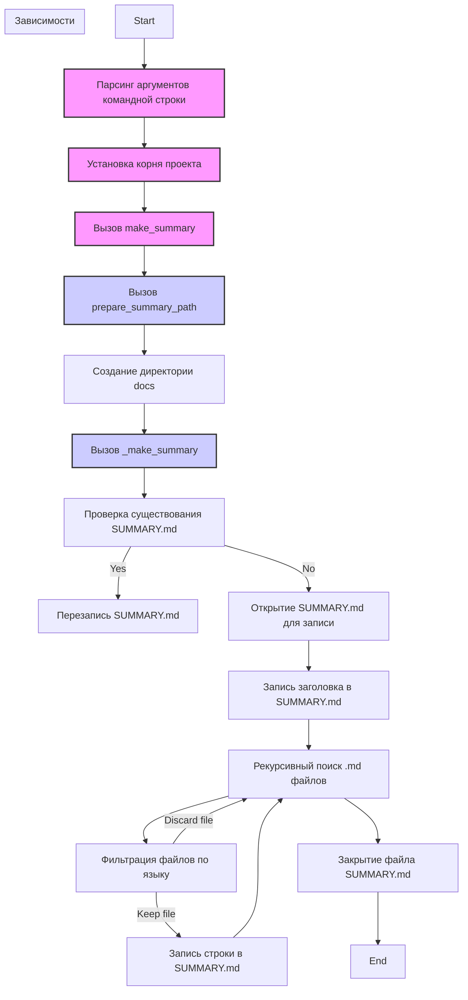
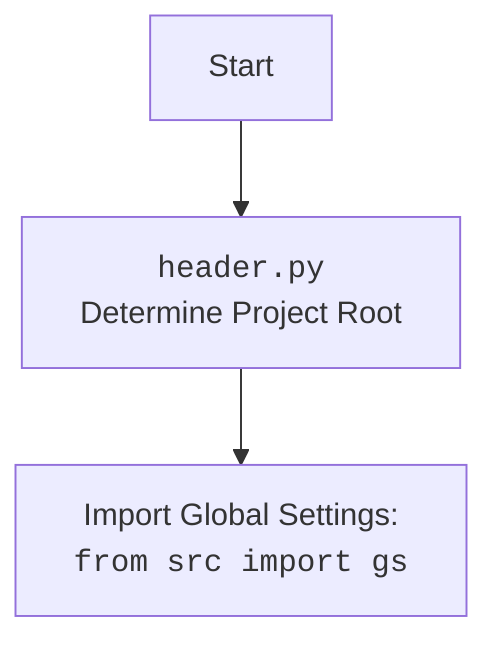

## ИНСТРУКЦИЯ:

Анализируй предоставленный код подробно и объясни его функциональность. Ответ должен включать три раздела:

1.  **<алгоритм>**: Опиши рабочий процесс в виде пошаговой блок-схемы, включая примеры для каждого логического блока, и проиллюстрируй поток данных между функциями, классами или методами.
2.  **<mermaid>**: Напиши код для диаграммы в формате `mermaid`, проанализируй и объясни все зависимости,
    которые импортируются при создании диаграммы.
    **ВАЖНО!** Убедитесь, что все имена переменных, используемые в диаграмме `mermaid`,
    имеют осмысленные и описательные имена. Имена переменных вроде `A`, `B`, `C`, и т.д., не допускаются!

    **Дополнительно**: Если в коде есть импорт `import header`, добавьте блок `mermaid` flowchart, объясняющий `header.py`:
    ```mermaid
    flowchart TD
        Start --> Header[<code>header.py</code><br> Determine Project Root]

        Header --> import[Import Global Settings: <br><code>from src import gs</code>]
    ```

3.  **<объяснение>**: Предоставьте подробные объяснения:
    -   **Импорты**: Их назначение и взаимосвязь с другими пакетами `src.`.
    -   **Классы**: Их роль, атрибуты, методы и взаимодействие с другими компонентами проекта.
    -   **Функции**: Их аргументы, возвращаемые значения, назначение и примеры.
    -   **Переменные**: Их типы и использование.
    -   Выделите потенциальные ошибки или области для улучшения.

Дополнительно, постройте цепочку взаимосвязей с другими частями проекта (если применимо).

Это обеспечивает всесторонний и структурированный анализ кода.
## Формат ответа: `.md` (markdown)
**КОНЕЦ ИНСТРУКЦИИ**

## <алгоритм>

**Блок-схема работы скрипта `make_summary.py`:**

1.  **Запуск скрипта:**
    -   Скрипт запускается из командной строки, принимая аргументы:
        -   `--lang` (опционально): язык фильтрации файлов (`ru` или `en`, по умолчанию `en`).
        -   `src_dir`: путь к исходной директории, где находятся `.md` файлы.
2.  **Инициализация:**
    -   Импортируются необходимые модули: `pathlib.Path`, `argparse`, `header`.
    -   Определяется корень проекта `PROJECT_ROOT` с помощью `header.__root__`.
    -   Пример: `PROJECT_ROOT` может быть `/path/to/your/project`
3.  **Обработка аргументов:**
    -   Аргументы командной строки обрабатываются с помощью `argparse`.
    -   Пример: Если вы запустите скрипт как `python make_summary.py --lang ru src/docs`, то `args.lang` будет `'ru'`, `args.src_dir` будет `'src/docs'`.
4.  **Формирование полного пути:**
    -   Формируется полный путь к исходной директории `src_dir`: `PROJECT_ROOT / args.src_dir`.
    -   Пример: `src_dir` может стать `/path/to/your/project/src/docs`.
5.  **Вызов функции `make_summary`:**
    -   Вызывается функция `make_summary(src_dir, args.lang)`.
    -   Входные данные:
        -   `docs_dir`: путь к исходной директории с `.md` файлами.
        -   `lang`: язык фильтрации файлов.
6.  **Функция `make_summary`:**
    -   Вызывает функцию `prepare_summary_path(docs_dir)` для получения пути к файлу `SUMMARY.md` в директории `docs`
    -   Создает директорию, если ее не существует, для файла SUMMARY.md: `summary_file.parent.mkdir(parents=True, exist_ok=True)`
    -   Вызывает функцию `_make_summary(docs_dir, summary_file, lang)`
7.  **Функция `_make_summary`:**
    -   Проверяет, существует ли файл `SUMMARY.md`. Если существует, выводит сообщение о перезаписи.
    -   Открывает файл `SUMMARY.md` для записи.
    -   Записывает в файл строку `# Summary` в начале файла.
    -   Рекурсивно обходит все файлы `.md` в каталоге `src_dir` (и его подкаталогах)
        -   Пропускает файлы с именем `SUMMARY.md`.
        -   Фильтрует файлы по языку (если `lang` равен `ru`, пропускаются файлы без суффикса `.ru.md`; если `lang` равен `en`, пропускаются файлы с суффиксом `.ru.md`).
            -   Пример: для `lang='ru'` будет обработан `example.ru.md`, но не `example.md`
            -   Пример: для `lang='en'` будет обработан `example.md`, но не `example.ru.md`
        -   Формирует относительный путь от родительской директории `src_dir` до текущего файла, и записывает строку в `SUMMARY.md` в формате ` - [имя файла](относительный путь)`.
        -   Пример:  `- [example](path/to/example.md)`
    -   Возвращает `True` при успешном завершении, иначе `False`.
8.  **Функция `prepare_summary_path`:**
    -   Формирует путь к `SUMMARY.md` заменяя `src` на `docs`: `PROJECT_ROOT / 'docs' / file_name`
    -   Пример: если `src_dir` это `/path/to/your/project/src/docs/`, а `file_name` это `SUMMARY.md`, то функция вернет `/path/to/your/project/docs/SUMMARY.md`
9.  **Завершение скрипта:**
    -   Скрипт завершает свою работу.

## <mermaid>





**Объяснение `mermaid` диаграммы:**

1.  **`flowchart TD`**: Объявляет тип диаграммы как блок-схему (flowchart) с направлением сверху вниз (TD - Top Down).
2.  **`Start[Start]`**: Начало процесса.
3.  **`ParseArgs[Парсинг аргументов командной строки]`**:  Этап обработки аргументов командной строки, где скрипт получает входные параметры, такие как `--lang` и путь к исходной директории `src_dir`.
4.  **`SetProjectRoot[Установка корня проекта]`**: Определение корневого пути проекта с помощью модуля `header`.
5.  **`MakeSummaryCall[Вызов make_summary]`**: Вызов функции `make_summary`, которая является основной функцией для создания файла `SUMMARY.md`.
6.  **`PrepareSummaryPathCall[Вызов prepare_summary_path]`**:  Вызов функции `prepare_summary_path`, которая подготавливает путь к файлу `SUMMARY.md`, заменяя `src` на `docs`.
7.  **`CreateDocsDir[Создание директории docs]`**: Создание директории, если ее не существует, где будет располагаться файл `SUMMARY.md`.
8.  **`MakeSummaryRecCall[Вызов _make_summary]`**: Вызов рекурсивной функции `_make_summary`, которая обрабатывает файлы и формирует содержимое `SUMMARY.md`.
9.  **`CheckSummaryFileExists[Проверка существования SUMMARY.md]`**: Проверка, существует ли уже файл `SUMMARY.md`.
10. **`OverwriteSummaryFile[Перезапись SUMMARY.md]`**: Если файл существует, он будет перезаписан.
11. **`OpenSummaryFile[Открытие SUMMARY.md для записи]`**: Открытие файла `SUMMARY.md` в режиме записи.
12. **`WriteSummaryHeader[Запись заголовка в SUMMARY.md]`**: Запись заголовка `# Summary` в начало файла.
13. **`RecursiveSearch[Рекурсивный поиск .md файлов]`**: Рекурсивный обход директории в поисках файлов с расширением `.md`.
14. **`FilterFiles[Фильтрация файлов по языку]`**: Фильтрация найденных файлов в зависимости от выбранного языка (например, `ru` или `en`).
15. **`WriteSummaryLine[Запись строки в SUMMARY.md]`**: Запись строки с названием файла и относительным путем в файл `SUMMARY.md`.
16. **`CloseSummaryFile[Закрытие файла SUMMARY.md]`**: Закрытие файла `SUMMARY.md`.
17. **`End[End]`**: Завершение процесса.

**Объяснение зависимостей `mermaid` диаграммы:**

Внутри блока `subgraph Зависимости` показаны функции, которые вызывают другие функции.

-   `ParseArgs`: Парсит аргументы командной строки и не зависит от других функций.
-   `SetProjectRoot`: Устанавливает корневой каталог проекта, используя модуль `header`.
-   `MakeSummaryCall`: Вызывает функцию `prepare_summary_path` и `_make_summary`.
-   `PrepareSummaryPathCall`: Вызывается внутри `make_summary` для подготовки пути к файлу SUMMARY.md.
-   `MakeSummaryRecCall`: Вызывается внутри `make_summary`, выполняет рекурсивный поиск файлов и формирует содержимое файла `SUMMARY.md`.

## <объяснение>

**Импорты:**

-   `from pathlib import Path`: Импортирует класс `Path` из модуля `pathlib`, который используется для работы с путями к файлам и директориям. Это современный и более удобный способ работы с путями по сравнению со строками.
-   `import argparse`: Импортирует модуль `argparse`, который используется для парсинга аргументов командной строки. Он позволяет удобно обрабатывать аргументы, переданные скрипту при запуске.
-   `import header`: Импортирует модуль `header`, который, как подразумевается, содержит общие настройки проекта и предоставляет корневой путь проекта через `header.__root__`. Это позволяет скрипту правильно определить, где находится корень проекта.

**Переменные:**

-   `PROJECT_ROOT`: Глобальная константа, которая хранит корневой путь проекта. Она определяется из модуля `header` и используется для формирования путей к файлам и директориям.
-   `args`: Объект, возвращаемый `argparse.parse_args()`, который содержит аргументы, переданные скрипту из командной строки, такие как `--lang` и `src_dir`.
-   `src_dir`: Переменная, которая хранит путь к исходной директории, где находятся `.md` файлы. Этот путь формируется из корневого пути проекта и пути, переданного как аргумент командной строки.
-    `summary_file`: Переменная, которая хранит путь к файлу `SUMMARY.md`, который будет сгенерирован.
-   `path`: Переменная, которая используется в цикле для итерации по найденным файлам.

**Функции:**

1.  **`make_summary(docs_dir: Path, lang: str = 'en') -> None`**:
    -   **Аргументы**:
        -   `docs_dir` (`Path`): Путь к директории с `.md` файлами.
        -   `lang` (`str`): Язык фильтрации (`ru` или `en`), по умолчанию `en`.
    -   **Возвращает**: `None`.
    -   **Назначение**: Основная функция, которая организует создание файла `SUMMARY.md`. Она вызывает `prepare_summary_path` для получения пути к файлу, а затем вызывает `_make_summary` для создания содержимого файла.
    -   **Пример**: Вызывается с аргументами `src_dir` и `args.lang`.

2.  **`_make_summary(src_dir: Path, summary_file: Path, lang: str = 'en') -> bool`**:
    -   **Аргументы**:
        -   `src_dir` (`Path`): Путь к исходной директории.
        -   `summary_file` (`Path`): Путь, где должен быть создан файл `SUMMARY.md`.
        -   `lang` (`str`): Язык фильтрации (`ru` или `en`), по умолчанию `en`.
    -   **Возвращает**: `bool`, `True` если файл создан успешно, `False` если произошла ошибка.
    -   **Назначение**: Рекурсивно обходит директорию `src_dir`, фильтрует файлы по языку и создает содержимое файла `SUMMARY.md`.
    -   **Пример**: Записывает в файл строки вида `- [имя файла](относительный путь)` для каждого найденного `.md` файла.

3.  **`prepare_summary_path(src_dir: Path, file_name: str = 'SUMMARY.md') -> Path`**:
    -   **Аргументы**:
        -   `src_dir` (`Path`): Исходный путь к директории `src`.
        -   `file_name` (`str`): Имя файла, который будет создан (`SUMMARY.md` по умолчанию).
    -   **Возвращает**: `Path`, новый путь к файлу.
    -   **Назначение**: Формирует путь к файлу `SUMMARY.md`, заменяя в пути `src` на `docs`.
    -   **Пример**: Если `src_dir` - `/path/to/your/project/src/docs`,  а  `file_name`  -  `SUMMARY.md`, то вернёт  `/path/to/your/project/docs/SUMMARY.md`.

**Классы:**

В данном коде нет определения собственных классов. Используются классы `Path` из модуля `pathlib` и класс `ArgumentParser` из модуля `argparse`.

-   `pathlib.Path`: Используется для работы с путями файлов и директорий.
-   `argparse.ArgumentParser`: Используется для создания парсера аргументов командной строки.

**Объяснение работы скрипта:**

Скрипт `make_summary.py` предназначен для создания файла `SUMMARY.md` для использования в `mdbook`. Он рекурсивно обходит директорию с `.md` файлами, фильтрует их по языку (если нужно) и записывает ссылки на них в файл `SUMMARY.md`. Это позволяет автоматически создавать структуру книги из markdown файлов.

1.  Скрипт начинается с импорта необходимых модулей и определения корневого пути проекта.
2.  Аргументы командной строки обрабатываются с помощью `argparse`.
3.  Функция `make_summary` является точкой входа для создания файла `SUMMARY.md`. Она вызывает `prepare_summary_path` для определения пути к файлу и `_make_summary` для фактического создания содержимого.
4.  Функция `_make_summary` рекурсивно обходит директорию, фильтрует файлы по языку и записывает строки в формате, который использует `mdbook` для создания меню навигации.
5.  Функция `prepare_summary_path` формирует путь для файла `SUMMARY.md`, заменяя `src` на `docs`.

**Потенциальные ошибки и области для улучшения:**

1.  **Обработка исключений:** В `_make_summary` есть общий блок `except Exception as ex:`, который перехватывает все исключения. Лучше перехватывать более конкретные исключения, например, `FileNotFoundError`, `PermissionError`, и т. д. для более детального логирования и обработки.
2.  **Языковые фильтры:** Логика фильтрации файлов по языку может быть усовершенствована. Сейчас проверяется только наличие суффикса `.ru.md`. Возможно, стоит сделать более гибкую систему фильтрации, например, с использованием регулярных выражений.
3.  **Тестирование:** Код не имеет тестов. Добавление unit тестов позволит гарантировать корректную работу скрипта при изменениях.
4.  **Конфигурация:**  Жестко заданные строки `'SUMMARY.md'`, `'src'`, `'docs'` можно вынести в конфигурационный файл для большей гибкости.
5.  **Логирование**: Вместо `print` следует использовать `logging` для более структурированного вывода сообщений.

**Взаимосвязь с другими частями проекта:**

-   Скрипт использует модуль `header`, который, вероятно, содержит общие настройки проекта, и глобальную переменную `PROJECT_ROOT`, определяемую в этом модуле. Это позволяет скрипту правильно формировать пути к файлам и директориям, независимо от того, где находится скрипт.
-   Скрипт создает файл `SUMMARY.md`, который используется инструментом `mdbook`.
-   Скрипт может использоваться в пайплайне сборки документации.

В целом, код выполняет поставленную задачу - создание файла `SUMMARY.md` для `mdbook`.  Для улучшения читаемости и надежности стоит добавить обработку конкретных исключений,  тесты и, возможно, конфигурацию.