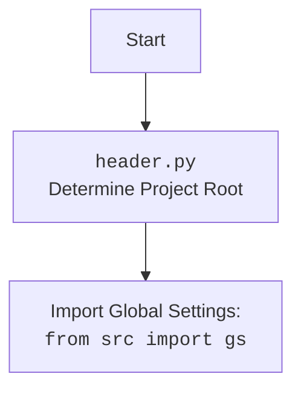

## ИНСТРУКЦИЯ:

Анализируй предоставленный код подробно и объясни его функциональность. Ответ должен включать три раздела:  

1.  **<алгоритм>**: Опиши рабочий процесс в виде пошаговой блок-схемы, включая примеры для каждого логического блока, и проиллюстрируй поток данных между функциями, классами или методами.  
2.  **<mermaid>**: Напиши код для диаграммы в формате `mermaid`, проанализируй и объясни все зависимости, 
    которые импортируются при создании диаграммы. 
    **ВАЖНО!** Убедитесь, что все имена переменных, используемые в диаграмме `mermaid`, 
    имеют осмысленные и описательные имена. Имена переменных вроде `A`, `B`, `C`, и т.д., не допускаются!  
    
    **Дополнительно**: Если в коде есть импорт `import header`, добавьте блок `mermaid` flowchart, объясняющий `header.py`:\
    ```mermaid
    flowchart TD
        Start --> Header[<code>header.py</code><br> Determine Project Root]
    
        Header --> import[Import Global Settings: <br><code>from src import gs</code>] 
    ```
3.  **<объяснение>**: Предоставьте подробные объяснения:  
    - **Импорты**: Их назначение и взаимосвязь с другими пакетами `src.`.  
    - **Классы**: Их роль, атрибуты, методы и взаимодействие с другими компонентами проекта.  
    - **Функции**: Их аргументы, возвращаемые значения, назначение и примеры.  
    - **Переменные**: Их типы и использование.  
    - Выделите потенциальные ошибки или области для улучшения.  

Дополнительно, постройте цепочку взаимосвязей с другими частями проекта (если применимо).  

Это обеспечивает всесторонний и структурированный анализ кода.
## Формат ответа: `.md` (markdown)
**КОНЕЦ ИНСТРУКЦИИ**

## <алгоритм>

1. **`if __name__ == '__main__':` (Точка входа):**
    *   **Пример:** Запускается скрипт из командной строки.
    *   **Действие:** Создается парсер аргументов командной строки с помощью `argparse.ArgumentParser`.
    *   **Поток данных:** Аргументы командной строки передаются в `parser.parse_args()`.

2.  **Парсинг аргументов командной строки:**
    *   **Пример:** Пользователь вводит `python make_summary.py -lang ru src/my_docs`
    *   **Действие:** Парсер обрабатывает аргументы `-lang` (язык) и `src_dir` (путь к исходной директории).
    *   **Поток данных:** Результаты парсинга сохраняются в объекте `args`.

3.  **Преобразование пути:**
    *   **Пример:** `args.src_dir` -  `my_docs`, `PROJECT_ROOT` - `/path/to/project`
    *   **Действие:** Путь к исходной директории объединяется с корневым путем проекта с помощью `/` оператора и преобразуется в `Path`-объект.
    *   **Поток данных:** Строковый путь `args.src_dir` преобразуется в `Path`-объект `src_dir`.

4.  **Вызов `make_summary`:**
    *   **Пример:** `src_dir` - `/path/to/project/my_docs`, `args.lang` - 'ru'.
    *   **Действие:** Функция `make_summary` вызывается с `src_dir` (путь к исходной директории) и `args.lang` (язык).
    *   **Поток данных:** `src_dir` и `lang` передаются в функцию `make_summary`.

5.  **`make_summary`:**
    *   **Действие:** Функция подготавливает путь для `SUMMARY.md` и вызывает функцию `_make_summary`.
    *   **Пример:** `docs_dir` - `/path/to/project/my_docs`
    *   **Поток данных:** Вызывает `prepare_summary_path`  и передаёт `docs_dir`,  `prepare_summary_path`  возвращает  `summary_file`. `docs_dir`, `summary_file`, `lang` передаются в функцию `_make_summary`.

6. **`prepare_summary_path`:**
    *   **Пример:** `src_dir` - `/path/to/project/my_docs`, `file_name` - `SUMMARY.md`.
    *   **Действие:** Создаёт путь к файлу `SUMMARY.md`, заменив часть пути на `docs`.
    *   **Поток данных:** Возвращает `Path`-объект `summary_file`.

7.  **`_make_summary`:**
    *   **Пример:** `src_dir` - `/path/to/project/my_docs`, `summary_file` - `/path/to/project/docs/SUMMARY.md`, `lang` - 'ru'.
    *   **Действие:** Рекурсивно обходит `src_dir`, фильтрует файлы по языку, формирует ссылки в `SUMMARY.md`.
    *   **Поток данных:** Записывает контент в `summary_file`.

8. **Обход каталога:**
   * **Пример:** `src_dir` содержит файлы `file1.md`, `file2.ru.md`, `file3.en.md`.
   * **Действие:** Используется `src_dir.rglob('*.md')` для поиска всех файлов `.md` во всех подкаталогах `src_dir`.
   * **Поток данных:**  Возвращает итерируемый объект содержащий найденные файлы.

9. **Фильтрация файлов:**
   * **Пример:** `lang` - 'ru', анализируется `file3.en.md`.
   * **Действие:** Пропускаются файлы, не соответствующие языку.
   * **Поток данных:** Файлы, не соответствующие языку, пропускаются и не попадают в `SUMMARY.md`.

10. **Запись в `SUMMARY.md`:**
    *   **Пример:** Для файла `/path/to/project/my_docs/subfolder/file2.ru.md` в файл `SUMMARY.md` записывается `- [file2](subfolder/file2.ru.md)`.
    *   **Действие:**  Формируется относительный путь к файлу и записывается в `SUMMARY.md` в формате markdown.
    *   **Поток данных:**  Строка в формате markdown добавляется в файл `SUMMARY.md`.

## <mermaid>
```mermaid
flowchart TD
    Start[Начало скрипта] --> ParseArgs[Парсинг аргументов командной строки]
    ParseArgs --> GetProjectRoot[Получение корневого пути проекта]
    GetProjectRoot -->  PrepareSrcPath[Подготовка пути к исходной директории]
    PrepareSrcPath --> MakeSummaryCall[Вызов make_summary]
    MakeSummaryCall --> PrepareSummaryPath[Вызов prepare_summary_path]
    PrepareSummaryPath --> CreateSummaryFile[Создание файла summary.md]
    CreateSummaryFile --> MakeSummaryStart[Начало _make_summary]
    MakeSummaryStart --> TraverseDir[Обход директории в поисках .md файлов]
    TraverseDir --> FilterFiles[Фильтрация .md файлов по языку]
    FilterFiles --> WriteToSummary[Запись ссылок в summary.md]
    WriteToSummary --> MakeSummaryEnd[Завершение _make_summary]
    MakeSummaryEnd --> End[Конец скрипта]
    
    classDef fileStyle fill:#f9f,stroke:#333,stroke-width:2px
    class PrepareSummaryPath, CreateSummaryFile fileStyle
```



**Объяснение диаграммы:**

*   **`Start`**: Начало выполнения скрипта.
*   **`ParseArgs`**: Парсинг аргументов командной строки, таких как путь к исходной директории (`src_dir`) и язык (`lang`).
*   **`GetProjectRoot`**: Получение корневого пути проекта из модуля `header`.
*   **`PrepareSrcPath`**: Подготовка полного пути к исходной директории, объединяя корневой путь проекта с путем, предоставленным пользователем.
*   **`MakeSummaryCall`**: Вызов функции `make_summary` с подготовленным путем и языком.
*   **`PrepareSummaryPath`**: Вызов функции `prepare_summary_path` для формирования пути к файлу `SUMMARY.md` в директории `docs`.
*  **`CreateSummaryFile`**: Создание директории для сохранения `summary.md`.
*   **`MakeSummaryStart`**: Начало выполнения функции `_make_summary`, отвечающей за создание файла `SUMMARY.md`.
*   **`TraverseDir`**: Рекурсивный обход директории в поисках всех `.md` файлов.
*   **`FilterFiles`**: Фильтрация файлов `.md` по языку, заданному пользователем (например, `ru` или `en`).
*   **`WriteToSummary`**: Запись отфильтрованных файлов в файл `SUMMARY.md` в формате markdown.
*  **`MakeSummaryEnd`**: Завершение работы функции `_make_summary`.
*   **`End`**: Завершение выполнения скрипта.

## <объяснение>

**Импорты:**

*   **`from pathlib import Path`**: Импортирует класс `Path` из модуля `pathlib` для работы с путями к файлам и директориям. Он предоставляет объектно-ориентированный способ управления путями, делая код более читаемым и кроссплатформенным.
*   **`import argparse`**: Импортирует модуль `argparse` для парсинга аргументов командной строки. Этот модуль позволяет определять ожидаемые аргументы и обрабатывать их значения.
*  **`import header`**: Импортирует модуль `header.py`, который, как предполагается, определяет корневой путь проекта. Этот модуль используется для определения абсолютного пути к директории проекта.

**Переменные:**

*   **`PROJECT_ROOT`**: `Path`. Корневой путь проекта, полученный из модуля `header` с использованием атрибута `__root__`. Используется для построения путей к директориям `src` и `docs`.

**Функции:**

1.  **`make_summary(docs_dir: Path, lang: str = 'en') -> None`**:
    *   **Аргументы:**
        *   `docs_dir` (`Path`): Путь к исходной директории, в которой находятся файлы `.md`.
        *   `lang` (`str`): Язык фильтрации файлов (`'ru'` или `'en'`). По умолчанию `'en'`.
    *   **Возвращаемое значение:** `None`.
    *   **Назначение:** Готовит путь к файлу `SUMMARY.md` и вызывает функцию `_make_summary` для его создания. Использует `prepare_summary_path` для получения пути к `SUMMARY.md` в директории `docs`, создавая её если необходимо.
    *   **Пример:**
        ```python
        docs_dir = Path('/path/to/src')
        make_summary(docs_dir, lang='ru')
        ```

2.  **`_make_summary(src_dir: Path, summary_file: Path, lang: str = 'en') -> bool`**:
    *   **Аргументы:**
        *   `src_dir` (`Path`): Путь к директории с исходными файлами `.md`.
        *   `summary_file` (`Path`): Путь к файлу `SUMMARY.md`, в котором будут созданы ссылки.
        *   `lang` (`str`): Язык фильтрации файлов (`'ru'` или `'en'`). По умолчанию `'en'`.
    *   **Возвращаемое значение:** `bool`. Возвращает `True`, если файл успешно создан, и `False` в случае ошибки.
    *   **Назначение:** Рекурсивно обходит директорию `src_dir`, фильтрует файлы `.md` по языку и записывает ссылки на них в файл `SUMMARY.md` в формате Markdown.
    *   **Пример:**
        ```python
        src_dir = Path('/path/to/src')
        summary_file = Path('/path/to/docs/SUMMARY.md')
        _make_summary(src_dir, summary_file, lang='en')
        ```

3.  **`prepare_summary_path(src_dir: Path, file_name: str = 'SUMMARY.md') -> Path`**:
    *   **Аргументы:**
        *   `src_dir` (`Path`): Путь к исходной директории `src`.
        *   `file_name` (`str`): Имя файла `SUMMARY.md`. По умолчанию `'SUMMARY.md'`.
    *   **Возвращаемое значение:** `Path`: Путь к файлу `SUMMARY.md`.
    *   **Назначение:** Формирует путь к файлу `SUMMARY.md` в директории `docs`. Заменяет в пути часть `src` на `docs`.
    *   **Пример:**
        ```python
        src_dir = Path('/path/to/project/src/my_docs')
        summary_path = prepare_summary_path(src_dir)  # returns Path('/path/to/project/docs/SUMMARY.md')
        ```

**Объяснение:**

*   **Цель:** Скрипт генерирует файл `SUMMARY.md`, который используется в `mdbook` для создания навигации по документации. Скрипт ищет все файлы `.md` в указанной директории (`src_dir`) и её поддиректориях, фильтрует их по языку (русский или английский) и создает ссылки на них в `SUMMARY.md`.
*   **Работа:**
    1.  Скрипт начинается с импорта необходимых модулей.
    2.  Используя `argparse`, скрипт парсит аргументы командной строки: язык (`-lang`) и путь к исходной директории (`src_dir`).
    3.  Получает корневой путь проекта из модуля `header` и формирует абсолютный путь к исходной директории.
    4.  Вызывает функцию `make_summary`, которая подготавливает путь к `SUMMARY.md` и вызывает `_make_summary` для его создания.
    5.  `_make_summary` рекурсивно обходит директорию, ищет `.md` файлы, фильтрует их и записывает ссылки в `SUMMARY.md`.
    6. `prepare_summary_path` формирует путь к файлу `SUMMARY.md` заменяя часть пути `src` на `docs` .
*   **Ключевые моменты:**
    *   Используется библиотека `pathlib` для работы с путями, что делает код более понятным и переносимым.
    *   Языковая фильтрация осуществляется на основе суффикса `.ru.md` в именах файлов.
    *   Файл `SUMMARY.md` создаётся в директории `docs`, которая может быть создана, если не существует.

**Возможные улучшения:**

*   **Обработка ошибок:** Можно добавить более детальную обработку ошибок, например, проверку на существование директории `src_dir`, прежде чем начать её обход.
*   **Универсальность:** Можно добавить возможность настраивать суффиксы для языковых файлов, чтобы сделать скрипт более универсальным.
*   **Логирование:** Добавить логирование действий скрипта для отладки.
*   **Абсолютные пути:** Сейчас создаются относительные ссылки.  Можно добавить возможность генерировать абсолютные ссылки, если это необходимо.
* **Проверка на наличие `header.py`:** Можно добавить проверку на наличие `header.py` и корректность его содержимого, чтобы предотвратить ошибки при запуске скрипта.
* **Тестирование:** Необходимо добавить модульные и интеграционные тесты.
*   **Форматирование:** Использовать `black` или `ruff` для автоматического форматирования кода.