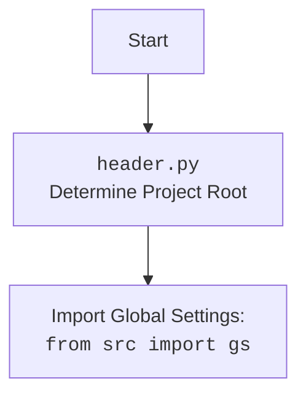

## АНАЛИЗ КОДА: `src/endpoints/hypo69/code_assistant/make_summary.py`

### 1. <алгоритм>

**Описание рабочего процесса:**

1. **Инициализация**:
   - Получение корневого пути проекта (`PROJECT_ROOT`) из модуля `header`.
   - Разбор аргументов командной строки, включая язык (`lang`, по умолчанию `en`) и путь к исходной директории (`src_dir`).

2. **`make_summary(docs_dir: Path, lang: str = 'en')`**:
   - Создание пути к файлу `SUMMARY.md` с помощью функции `prepare_summary_path`, где `docs_dir` - путь к каталогу `src` .
   - Создание родительских директорий для `summary.md`, если их не существует.
   - Вызов основной рекурсивной функции `_make_summary` для обхода директории `docs_dir` и создания файла `SUMMARY.md`.

3. **`_make_summary(src_dir: Path, summary_file: Path, lang: str = 'en')`**:
   - Проверка, существует ли уже файл `summary_file`. Если да, выводится предупреждение о перезаписи.
   - Открытие файла `summary_file` для записи.
   - Запись в файл `SUMMARY.md` строки `# Summary\n\n`
   - Рекурсивный обход всех файлов `.md` в каталоге `src_dir`.
   - Исключение файла `SUMMARY.md` из обработки.
   - Фильтрация файлов по языку:
     - Если `lang` равен `'ru'`, то пропускаются файлы, не оканчивающиеся на `.ru.md`.
     - Если `lang` равен `'en'`, то пропускаются файлы, оканчивающиеся на `.ru.md`.
   - Определение относительного пути к файлу относительно родительской директории каталога `src_dir` .
   - Запись в файл `SUMMARY.md` строки вида `- [имя_файла](относительный_путь)` для каждого найденного и отфильтрованного `.md` файла.
   - В случае ошибки выводится сообщение об ошибке и возвращается `False`.
   - Возврат `True` при успешном завершении.

4. **`prepare_summary_path(src_dir: Path, file_name: str = 'SUMMARY.md')`**:
   - Замена `src` на `docs` в пути, полученном из `src_dir`.
   - Формирование нового пути `new_dir`  к файлу `SUMMARY.md` на основе `PROJECT_ROOT`.
   - Возврат полного пути к файлу `SUMMARY.md`.

5. **Вызов функций**:
   - В блоке `if __name__ == '__main__'` происходит парсинг аргументов, формирование полного пути к `src_dir` и вызов `make_summary` с переданными параметрами.

**Примеры:**

- **Входные данные (аргументы командной строки):**
  - `--lang ru`
  - `src_dir "src/endpoints/hypo69"`
- **Путь к файлу `SUMMARY.md`**: `PROJECT_ROOT/docs/endpoints/hypo69/SUMMARY.md`
- **Пример содержимого `SUMMARY.md`**:
```md
# Summary

- [first_file](endpoints/hypo69/first_file.md)
- [second_file](endpoints/hypo69/second_file.ru.md)
```

**Блок-схема:**

```mermaid
flowchart TD
    Start[Начало] --> ParseArgs[Парсинг аргументов командной строки];
    ParseArgs --> GetProjectRoot[Получение PROJECT_ROOT из header.py];
    GetProjectRoot --> PrepareSummaryPath[Вызов prepare_summary_path];
    PrepareSummaryPath --> CreateDirs[Создание каталогов для файла SUMMARY.md];
    CreateDirs --> MakeSummary[Вызов _make_summary()];
    MakeSummary --> CheckSummaryFile[Проверка существования SUMMARY.md];
    CheckSummaryFile -- YES --> PrintWarning[Вывод предупреждения о перезаписи];
    CheckSummaryFile -- NO --> OpenSummaryFile[Открытие SUMMARY.md для записи];
    PrintWarning --> OpenSummaryFile;
    OpenSummaryFile --> WriteSummaryHeader[Запись заголовка # Summary];
    WriteSummaryHeader --> StartGlob[Рекурсивный поиск *.md файлов];
    StartGlob --> FilterFiles[Фильтрация файлов по языку];
    FilterFiles --> WriteToFile[Запись ссылки в SUMMARY.md];
    WriteToFile --> LoopEnd[Конец цикла поиска файлов];
    LoopEnd --> CloseSummaryFile[Закрытие SUMMARY.md];
    CloseSummaryFile --> End[Конец];
    FilterFiles -- File not match filter --> LoopEnd
    StartGlob -- No file *.md --> CloseSummaryFile;
    WriteToFile --> StartGlob
    MakeSummary -- Error --> ErrorHandler[Вывод сообщения об ошибке]
    ErrorHandler --> End
```

### 2. <mermaid>

```mermaid
flowchart TD
    Start[Начало] --> ImportModules[Импорт модулей: pathlib, argparse, header];
    ImportModules --> DefineConstants[Определение константы PROJECT_ROOT из header];
    DefineConstants --> DefineFunctions[Определение функций: make_summary, _make_summary, prepare_summary_path];
    DefineFunctions --> MainBlock[Блок if __name__ == '__main__'];
    MainBlock --> ParseArgs[Парсинг аргументов командной строки];
    ParseArgs --> CallMakeSummary[Вызов функции make_summary с аргументами];
    CallMakeSummary --> PreparePath[prepare_summary_path: Подготовка пути к SUMMARY.md];
    PreparePath --> CreateParentDirs[Создание родительских директорий];
     CreateParentDirs --> Call_make_summary[_make_summary: Создание и запись в SUMMARY.md];
    Call_make_summary --> CheckFileExists[Проверка, существует ли SUMMARY.md];
    CheckFileExists -- YES --> WriteSummaryFile[Запись в SUMMARY.md]
        CheckFileExists -- NO --> WriteSummaryFile;
    WriteSummaryFile --> RecursionStart[Рекурсивный обход *.md файлов];
    RecursionStart --> FilterLanguage[Фильтрация файлов по языку];
    FilterLanguage --> WriteLine[Запись ссылки в SUMMARY.md];
    WriteLine --> RecursionEnd[Конец рекурсивного обхода];
     RecursionEnd --> End[Конец];
        FilterLanguage -- File doesn't match filter --> RecursionEnd;
     RecursionStart -- No file *.md --> End;
    CallMakeSummary -- Exception --> ErrorHandler[Обработка ошибок]
   ErrorHandler --> End

    classDef importClass fill:#f9f,stroke:#333,stroke-width:2px
    class ImportModules, DefineConstants, DefineFunctions importClass
```



**Объяснение `mermaid` диаграммы:**

1. **`Start`**: Начало выполнения скрипта.
2.  **`ImportModules`**: Импортируются необходимые модули:
    -   `pathlib`: Для работы с путями в файловой системе.
    -   `argparse`: Для обработки аргументов командной строки.
    -   `header`: Пользовательский модуль для определения корневого пути проекта.
3.  **`DefineConstants`**: Определяется константа `PROJECT_ROOT`, используя результат вызова функции из `header.py`, которая определяет корневой путь проекта.
4. **`DefineFunctions`**: Определяются три основные функции: `make_summary`, `_make_summary`, и `prepare_summary_path`.
5. **`MainBlock`**: Блок `if __name__ == '__main__'` - начало исполнения скрипта.
6. **`ParseArgs`**: Разбор аргументов командной строки с использованием `argparse`.
7. **`CallMakeSummary`**: Вызов основной функции `make_summary` с переданными аргументами.
8.  **`PreparePath`**: Вызов функции `prepare_summary_path` для формирования пути к файлу `SUMMARY.md`.
9.  **`CreateParentDirs`**: Создание родительских каталогов для файла `SUMMARY.md`, если они не существуют.
10. **`Call_make_summary`**: Вызов функции `_make_summary` для обхода директории и создания содержимого `SUMMARY.md`.
11. **`CheckFileExists`**: Проверка, существует ли файл `SUMMARY.md`. Если файл существует, то выводится предупреждение.
12. **`WriteSummaryFile`**: Открытие файла `SUMMARY.md` и запись в него.
13. **`RecursionStart`**: Начало рекурсивного обхода всех файлов с расширением `.md` в заданной директории.
14. **`FilterLanguage`**: Фильтрация файлов в зависимости от выбранного языка (русский или английский).
15. **`WriteLine`**: Запись отфильтрованной строки в файл `SUMMARY.md`.
16. **`RecursionEnd`**: Конец рекурсивного обхода файлов.
17. **`End`**: Конец выполнения скрипта.
18. **`ErrorHandler`**: Вывод ошибки, если в процессе выполнения возникло исключение.

### 3. <объяснение>

**Импорты:**

-   `pathlib`:
    -   **Назначение:** Предоставляет удобный способ работы с путями в файловой системе в объектно-ориентированном стиле.
    -   **Взаимосвязь:** Используется для создания, манипулирования и проверки путей к файлам и директориям, заменяя более старый модуль `os.path`.
-   `argparse`:
    -   **Назначение:** Модуль для обработки аргументов командной строки, что позволяет скрипту принимать параметры при запуске.
    -   **Взаимосвязь:** Позволяет пользователю указывать директорию с исходными файлами (`src_dir`) и язык (`lang`) для фильтрации.
-   `header`:
    -   **Назначение:** Модуль, специфичный для данного проекта, который, судя по названию, содержит информацию о заголовках и корневом пути проекта.
    -   **Взаимосвязь:** Определяет корневую директорию проекта, что необходимо для формирования правильных путей к файлам. Внутри `header.py` импортируется `gs` (global settings), что позволяет определить корень проекта.

**Константы:**

-   `PROJECT_ROOT`:
    -   **Тип:** `pathlib.Path`
    -   **Использование:** Хранит корневой путь проекта, полученный из модуля `header`, используется для построения путей к файлам.

**Функции:**

-   `make_summary(docs_dir: Path, lang: str = 'en') -> None`:
    -   **Аргументы:**
        -   `docs_dir (Path)`: Путь к исходной директории с `.md` файлами.
        -   `lang (str)`: Язык для фильтрации файлов (по умолчанию `'en'`).
    -   **Возвращаемое значение:** `None` (функция не возвращает значения, производит побочные эффекты).
    -   **Назначение:** Основная функция, которая принимает путь к директории `src`, вызывает функцию для подготовки пути к файлу SUMMARY.md, и запускает процесс создания файла SUMMARY.md с помощью функции `_make_summary`.
    -   **Пример:** `make_summary(Path('/path/to/src'), 'ru')`
-   `_make_summary(src_dir: Path, summary_file: Path, lang: str = 'en') -> bool`:
    -   **Аргументы:**
        -   `src_dir (Path)`: Путь к директории с `.md` файлами.
        -   `summary_file (Path)`: Путь к файлу `SUMMARY.md`.
        -   `lang (str)`: Язык для фильтрации файлов (по умолчанию `'en'`).
    -   **Возвращаемое значение:** `bool` (успешное или неуспешное выполнение).
    -   **Назначение:** Рекурсивно обходит директорию `src_dir`, собирает все `.md` файлы, фильтрует их по языку и записывает соответствующие ссылки в файл `SUMMARY.md`.
    -    **Пример:** `_make_summary(Path('/path/to/src'), Path('/path/to/summary.md'), 'ru')`
-   `prepare_summary_path(src_dir: Path, file_name: str = 'SUMMARY.md') -> Path`:
    -   **Аргументы:**
        -   `src_dir (Path)`: Путь к исходной директории `src`.
        -   `file_name (str)`: Имя файла `SUMMARY.md` (по умолчанию).
    -   **Возвращаемое значение:** `Path` -  полный путь к файлу `SUMMARY.md`.
    -   **Назначение:** Формирует путь к файлу `SUMMARY.md`, заменяя `src` на `docs` и добавляя имя файла.
    -    **Пример:** `prepare_summary_path(Path('/path/to/src'))`

**Переменные:**

-   `docs_dir` (в `make_summary`): `pathlib.Path` - путь к директории, где находятся исходные файлы.
-   `summary_file` (в `make_summary` и `_make_summary`): `pathlib.Path` - путь к файлу `SUMMARY.md`.
-   `src_dir` (в `_make_summary` и `prepare_summary_path`): `pathlib.Path` - путь к директории с исходниками `.md`
-   `lang` (в `make_summary` и `_make_summary`): `str` - выбранный язык для фильтрации (ru/en).
-   `relative_path`: `pathlib.Path` - относительный путь к файлу относительно родительской директории `src_dir`
-   `parser`: `argparse.ArgumentParser` - объект для разбора аргументов командной строки.
-   `args`: `argparse.Namespace` - содержит значения аргументов, полученные при запуске скрипта.

**Потенциальные ошибки и улучшения:**

-   **Обработка ошибок:** В функции `_make_summary` есть общий блок `try-except` для обработки всех исключений, что не позволяет точно определить тип ошибки. Возможно, стоит добавить более специфичные блоки `except`.
-   **Логирование:** Вместо `print` можно использовать модуль `logging` для более гибкого логирования сообщений.
-   **Улучшение производительности**:  При больших объемах данных можно рассмотреть возможность многопоточной или асинхронной обработки.
-   **Тестирование:** Отсутствуют юнит-тесты, что является общим недостатком.
-   **Использование `os.path.join`**: В коде используются `/`  для создания путей. Лучше использовать `pathlib` или `os.path.join`, которые правильно обрабатывают разные операционные системы.
-   **Дублирование кода**: Код `if lang == 'ru' and not path.name.endswith('.ru.md'):`  и  `elif lang == 'en' and path.name.endswith('.ru.md'):` можно вынести в отдельную функцию, чтобы избежать дублирования.

**Цепочка взаимосвязей с другими частями проекта:**

1.  **`header.py`**: Модуль `header` является важной частью проекта, так как он определяет корневой путь, от которого зависят все остальные пути в проекте.

2.  **`src`**:  Данный скрипт является частью `src`, т.е. исходного кода проекта.

3.  **`docs`**: Файл `SUMMARY.md`, создаваемый данным скриптом, предназначен для использования в документации проекта, а именно в `mdbook`.  Директория `docs` должна использоваться как корень проекта `mdbook`

4.  **`mdbook`**: Этот инструмент используется для создания статической документации из `Markdown` файлов и использует файл `SUMMARY.md` для формирования меню.

Этот модуль является важным для автоматизации процесса генерации документации, позволяя поддерживать `SUMMARY.md` в актуальном состоянии при добавлении или изменении `Markdown` файлов.