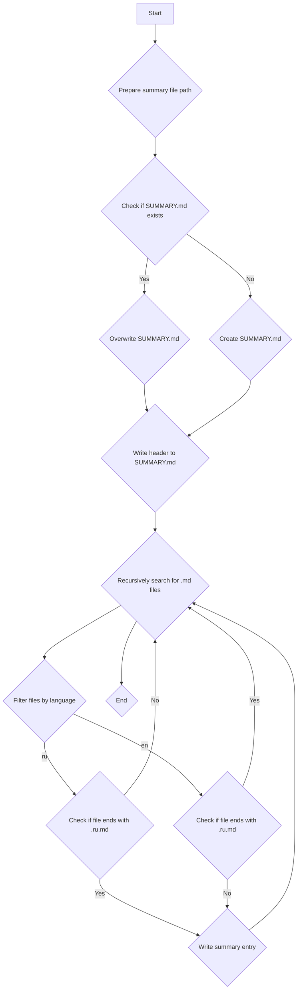

## <алгоритм>

1.  **`make_summary(docs_dir: Path, lang: str = 'en')`**:
    *   Принимает путь к директории с документацией (`docs_dir`) и язык (`lang`) в качестве аргументов.
    *   Вызывает `prepare_summary_path(docs_dir)` для определения пути к файлу `SUMMARY.md`.
    *   Создает родительские директории для `summary_file`, если они не существуют.
    *   Вызывает `_make_summary(docs_dir, summary_file, lang)` для рекурсивного обхода директории и создания содержимого файла `SUMMARY.md`.
        ```python
        summary_file = prepare_summary_path(docs_dir)
        summary_file.parent.mkdir(parents=True, exist_ok=True)
        _make_summary(docs_dir, summary_file, lang)
        ```

2.  **`prepare_summary_path(src_dir: Path, file_name: str = 'SUMMARY.md') -> Path`**:
    *   Принимает путь к исходной директории (`src_dir`) и имя файла (`file_name`) в качестве аргументов.
    *   Формирует новый путь, заменяя часть пути, содержащую `src`, на `docs`.
    *   Возвращает новый путь к файлу `SUMMARY.md`.
        ```python
        new_dir = PROJECT_ROOT / 'docs'
        summary_file = new_dir / file_name
        return summary_file
        ```

3.  **`_make_summary(src_dir: Path, summary_file: Path, lang: str = 'en') -> bool`**:
    *   Принимает путь к исходной директории (`src_dir`), путь к файлу `SUMMARY.md` (`summary_file`) и язык (`lang`) в качестве аргументов.
    *   Проверяет существование файла `SUMMARY.md` и, если он существует, выводит сообщение о перезаписи.
    *   Открывает файл `SUMMARY.md` для записи.
    *   Записывает заголовок `# Summary\n\n` в файл.
    *   Рекурсивно обходит директорию `src_dir` в поисках файлов с расширением `.md`.
    *   Фильтрует файлы по языку: если `lang == 'ru'`, пропускает файлы, не заканчивающиеся на `.ru.md`; если `lang == 'en'`, пропускает файлы, заканчивающиеся на `.ru.md`.
    *   Формирует относительный путь к файлу относительно родительской директории `src_dir`.
    *   Записывает строку в формате `- [{path.stem}]({relative_path.as_posix()})\n` для каждого файла в `SUMMARY.md`.
    *   Возвращает `True` в случае успешного создания файла, `False` в случае ошибки.
        ```python
        with summary_file.open('w', encoding='utf-8') as summary:
            summary.write('# Summary\n\n')

            for path in sorted(src_dir.rglob('*.md')):
                if path.name == 'SUMMARY.md':
                    continue

                if lang == 'ru' and not path.name.endswith('.ru.md'):
                    continue
                elif lang == 'en' and path.name.endswith('.ru.md'):
                    continue

                relative_path = path.relative_to(src_dir.parent)
                summary.write(f'- [{path.stem}]({relative_path.as_posix()})\n')
        return True
        ```

## <mermaid>



**Объяснение зависимостей:**

*   `pathlib`: Используется для работы с путями к файлам и директориям в операционной системе. Модуль предоставляет классы для представления путей, что позволяет удобно манипулировать путями, создавать, проверять существование и выполнять другие операции с файлами и директориями.
*   `argparse`: Используется для разбора аргументов командной строки. Это позволяет передавать параметры скрипту при его запуске из командной строки, такие как язык фильтрации и путь к директории с исходниками.
*   `header`: Импортируется модуль `header`, который определяет корневой путь проекта. Этот модуль используется для получения абсолютного пути к директории проекта, чтобы правильно формировать пути к файлам и директориям.


## <объяснение>

**Импорты:**

*   `pathlib`: Используется для работы с путями к файлам и директориям.
*   `argparse`: Используется для обработки аргументов командной строки.
*   `header`:  Определяет корневой путь проекта.

**Переменные:**

*   `PROJECT_ROOT`: Корневой путь проекта, определяется в модуле `header`.

**Функции:**

*   `make_summary(docs_dir: Path, lang: str = 'en') -> None`:
    *   Аргументы:
        *   `docs_dir` (Path): Путь к исходной директории 'src'.
        *   `lang` (str): Язык фильтрации файлов. Возможные значения: 'ru' или 'en'.
    *   Назначение: Создает файл `SUMMARY.md`, рекурсивно обходя папку.

*   `_make_summary(src_dir: Path, summary_file: Path, lang: str = 'en') -> bool`:
    *   Аргументы:
        *   `src_dir` (Path): Путь к папке с исходниками .md.
        *   `summary_file` (Path): Путь для сохранения файла SUMMARY.md.
        *   `lang` (str): Язык фильтрации файлов. Возможные значения: 'ru' или 'en'.
    *   Назначение: Рекурсивно обходит папку и создает файл `SUMMARY.md` с главами на основе `.md` файлов.

*   `prepare_summary_path(src_dir: Path, file_name: str = 'SUMMARY.md') -> Path`:
    *   Аргументы:
        *   `src_dir` (Path): Исходный путь с 'src'.
        *   `file_name` (str): Имя файла, который нужно создать. По умолчанию 'SUMMARY.md'.
    *   Назначение: Формирует путь к файлу, заменяя часть пути 'src' на 'docs' и добавляя имя файла.

**Потенциальные ошибки и области для улучшения:**

*   Обработка исключений в `_make_summary` просто выводит сообщение об ошибке. Возможно, стоит добавить логирование ошибки с использованием модуля `logger` из `src.logger.logger`.
*   Отсутствует проверка на существование директории `src_dir` в функции `make_summary`. Если директория не существует, возникнет исключение, которое не обрабатывается.
*   Сообщение о перезаписи файла `SUMMARY.md` выводится в stdout, что не является лучшей практикой. Желательно использовать логирование.

**Взаимосвязь с другими частями проекта:**

*   Модуль использует `header` для определения корневого пути проекта, что позволяет ему быть независимым от текущей рабочей директории.
*   `make_summary` является частью подсистемы для создания документации на основе файлов `.md`.