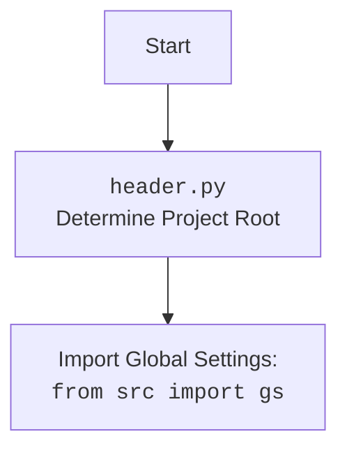

## <алгоритм>

1. **Начало**: Скрипт запускается с аргументами командной строки: языком (`lang`) и путем к исходной директории (`src`).
   *Пример:* `python make_summary.py -lang ru src`

2. **Определение корня проекта**: Используется функция `header.get_project_root()` для определения абсолютного пути к корню проекта.

3. **Подготовка путей**:
    * Путь к исходной директории (`src`) преобразуется в абсолютный путь относительно корня проекта.
    * Определяется путь к выходному файлу `SUMMARY.md` в директории `docs`.

4. **Обход директории**:
    * Функция `os.walk()` рекурсивно обходит исходную директорию (`src`).
    * Для каждой найденной директории и файла:
        * Проверяется, является ли файл файлом `.md`.
        * Если файл `.md`, его путь преобразуется в относительный путь от корня проекта.
        * Применяется языковая фильтрация:
            *  Если `lang` = `ru`, то включаются только файлы `.ru.md`.
            *  Если `lang` = `en`, то исключаются файлы `.ru.md`.
        * Если файл проходит фильтрацию, его имя и путь добавляются в список `entries`.

5. **Генерация `SUMMARY.md`**:
    * Открывается файл `SUMMARY.md` в режиме записи.
    * Записывается заголовок `# Summary`.
    * Для каждого файла в списке `entries` генерируется строка оглавления в формате `- [имя_файла](относительный_путь)` и записывается в `SUMMARY.md`.

6. **Завершение**: Файл `SUMMARY.md` создан в директории `docs` и скрипт завершает работу.
   *Пример:* Если `entries` содержит `['file1.md', 'src/nested/file2.ru.md']`, то в `SUMMARY.md` будет:
    ```markdown
    # Summary

    - [file1](file1.md)
    - [file2](src/nested/file2.ru.md)
    ```

## <mermaid>
```mermaid
flowchart TD
    Start[Начало] --> GetProjectRoot[Определение корня проекта];
    GetProjectRoot --> PreparePaths[Подготовка путей (src, output)];
    PreparePaths --> WalkDir[Рекурсивный обход директории src];
    WalkDir -- "Для каждого файла .md" --> CheckLanguage[Проверка языка];
    CheckLanguage -- "Язык ru" --> IncludeRu[Включить .ru.md];
    CheckLanguage -- "Язык en" --> ExcludeRu[Исключить .ru.md];
    IncludeRu -- "Файл подходит" --> AddEntry[Добавить в entries];
    ExcludeRu -- "Файл подходит" --> AddEntry
    CheckLanguage -- "Файл не .md" --> WalkDir
    AddEntry --> WalkDir
    WalkDir -- "Обход завершен" --> CreateSummaryFile[Создание SUMMARY.md];
    CreateSummaryFile --> WriteHeader[Запись заголовка # Summary];
    WriteHeader --> WriteEntries[Запись оглавления из entries];
    WriteEntries --> End[Конец];
```



**Объяснение `mermaid`:**
- `Start`: Начало скрипта.
- `GetProjectRoot`: Функция `header.get_project_root()` определяет корень проекта.
- `PreparePaths`: Подготовка абсолютных путей к исходной директории и выходному файлу.
- `WalkDir`: Рекурсивный обход директории, заданной аргументом командной строки `src`.
- `CheckLanguage`: Проверка соответствия имени файла и установленного языка (`ru` или `en`).
- `IncludeRu`: Включение файлов с суффиксом `.ru.md` при выбранном языке `ru`.
- `ExcludeRu`: Исключение файлов с суффиксом `.ru.md` при выбранном языке `en`.
- `AddEntry`: Добавление пути к файлу в список `entries` для последующей обработки.
- `CreateSummaryFile`: Создание файла `SUMMARY.md`.
- `WriteHeader`: Запись заголовка "# Summary" в начало файла.
- `WriteEntries`: Запись списка файлов из `entries` в формате оглавления.
- `End`: Конец скрипта.

## <объяснение>

### Импорты

- **`os`**:
    - **Назначение**: Модуль `os` используется для взаимодействия с операционной системой.
    - **Взаимосвязь с другими пакетами**: В данном случае, используется для работы с путями (`os.path`) и рекурсивного обхода директорий (`os.walk`). Не зависит от других пакетов `src`.
- **`argparse`**:
    - **Назначение**: Модуль `argparse` используется для обработки аргументов командной строки.
    - **Взаимосвязь с другими пакетами**: Не зависит от других пакетов `src`.
- **`src.header`**:
    - **Назначение**: Модуль `header` используется для получения корневого каталога проекта и загрузки глобальных настроек.
    - **Взаимосвязь с другими пакетами**: Зависит от корневого проекта и должен находиться в той же или дочерней директории.
    - `header.get_project_root()` используется для определения абсолютного пути к корню проекта.

### Классы

- В коде нет классов.

### Функции

- **`main()`**:
    - **Аргументы**: Нет явных аргументов, использует результаты `argparse`.
    - **Возвращаемое значение**: Нет.
    - **Назначение**: Основная функция скрипта.
    - **Пример**: Запускает весь процесс генерации `SUMMARY.md`, начиная с обработки аргументов командной строки, обхода директорий, фильтрации файлов и генерации `SUMMARY.md`.

### Переменные

- **`parser`**: Объект `argparse.ArgumentParser` для разбора аргументов командной строки.
- **`args`**: Объект, содержащий разобранные аргументы командной строки, доступные через атрибуты, например, `args.lang` и `args.src`.
- **`lang`**: Строка, принимающая значения `ru` или `en`, указывающая на язык для фильтрации файлов.
- **`source_dir`**: Строка, содержащая путь к исходной директории, где расположены `.md` файлы.
- **`project_root`**: Строка, содержащая абсолютный путь к корню проекта.
- **`output_file`**: Строка, содержащая абсолютный путь к файлу `SUMMARY.md` в директории `docs`.
- **`entries`**: Список, содержащий пути ко всем `.md` файлам, которые прошли фильтрацию.

### Потенциальные ошибки и области для улучшения

1.  **Отсутствие обработки ошибок ввода**: Скрипт не проверяет наличие директории `src` или правильность значения аргумента `-lang`. Это можно улучшить, добавив проверки с помощью `os.path.exists()` и валидацию аргументов.
2.  **Жестко заданный путь `docs`**: Путь `docs` может быть вынесен в конфигурационный файл или аргумент командной строки для гибкости.
3.  **Отсутствие обработки исключений**: Код не обрабатывает исключения, например, ошибки записи в файл. Это может привести к аварийному завершению скрипта. Рекомендуется обернуть работу с файлами в блок `try-except`.
4.  **Проверка наличия файла**: Можно добавить проверку перед записью, есть ли уже файл `SUMMARY.md` в `docs` и предложить перезаписать или переименовать.

### Взаимосвязи с другими частями проекта

1.  **`header.py`**:  Модуль `make_summary.py` зависит от `header.py` для определения корня проекта и загрузки глобальных настроек, что обеспечивает целостность работы в рамках проекта. Эта зависимость необходима для правильного определения путей и, следовательно, для корректной генерации `SUMMARY.md`.
2.  **`src/`**:  Директория `src/` является входной точкой для скрипта, так как в ней расположены исходные `.md` файлы.
3.  **`docs/`**: Директория `docs/` является выходной точкой, так как в ней создается файл `SUMMARY.md`.

**Дополнительно:**

- Скрипт не зависит от каких-либо баз данных, веб-сервисов или специфических фреймворков. Его задача - генерация `SUMMARY.md`, которая затем используется инструментами для компиляции документации (например, `mdbook`).