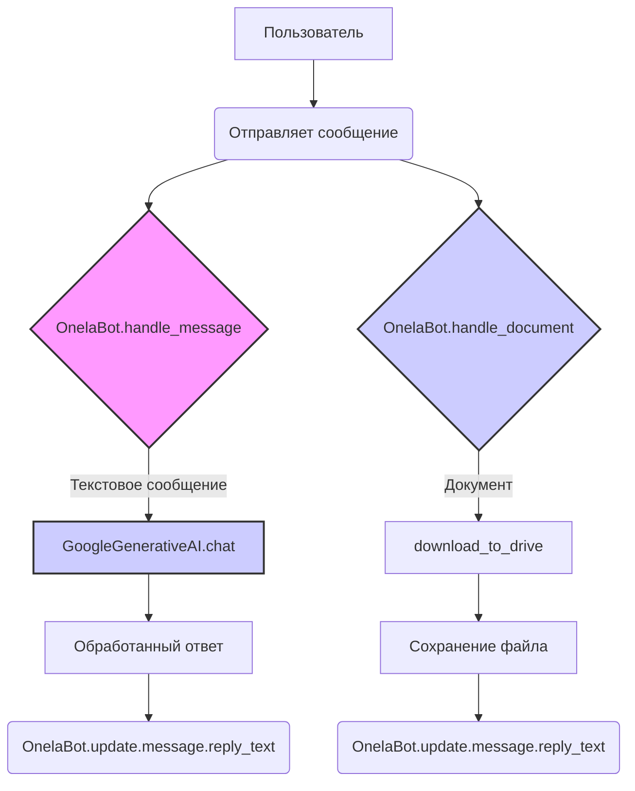

```MD
# <input code>

```python
## \file /src/endpoints/hypo69/code_assistant/onela_bot.py
# -*- coding: utf-8 -*-\
#! venv/Scripts/python.exe
#! venv/bin/python/python3.12

"""
module: src.endpoints.hypo69.code_assistant.onela_bot
	:platform: Windows, Unix
	:synopsis: Модуль диалога с моделью ассистента программиста через чат телеграм. 

Модуль для взаимодействия с моделью ассистента программиста через чат Telegram
=========================================================================================

Модуль содержит класс :class:`OnelaBot`, который используется для обработки текстовых сообщений и документов.
"""
MODE = 'dev'
import header
import asyncio
from pathlib import Path
from typing import List, Optional, Dict
from types import SimpleNamespace
from telegram import Update
from telegram.ext import Application, CommandHandler, MessageHandler, filters, CallbackContext

from src import gs
from src.ai.openai import OpenAIModel
from src.ai.gemini import GoogleGenerativeAI
from src.bots.telegram import TelegramBot
from src.logger import logger


class OnelaBot(TelegramBot):
    """Взаимодействие с моделью ассистента программиста."""

    model: GoogleGenerativeAI = GoogleGenerativeAI(
        api_key = gs.credentials.gemini.onela,
        generation_config = {'response_mime_type': 'text/plain'}
    )

    def __init__(self) -> None:
        """
        Инициализация объекта OnelaBot.
        """
        super().__init__(gs.credentials.telegram.onela_bot)

    async def handle_message(self, update: Update, context: CallbackContext) -> None:
        """
        Обработка текстовых сообщений.

        Args:
            update (Update): Данные обновления Telegram.
            context (CallbackContext): Контекст выполнения.
        """
        q: str = update.message.text
        user_id: int = update.effective_user.id
        try:
            # Получение ответа от модели
            answer: str = await self.model.chat(q)
            await update.message.reply_text(answer)
        except Exception as ex:
            logger.error('Ошибка обработки текстового сообщения: ', ex)
            ...

    async def handle_document(self, update: Update, context: CallbackContext) -> None:
        """
        Обработка загруженных документов.

        Args:
            update (Update): Данные обновления Telegram.
            context (CallbackContext): Контекст выполнения.
        """
        try:
            file = await update.message.document.get_file()
            tmp_file_path: Path = await file.download_to_drive()  # Сохранение файла локально
            answer: str = await update.message.reply_text(file)
            update.message.reply_text(answer)
        except Exception as ex:
            logger.error('Ошибка обработки документа: ', ex)
            ...


if __name__ == '__main__':
    bot = OnelaBot()
    asyncio.run(bot.application.run_polling())

```

# <algorithm>

**Шаг 1:** Импорт необходимых библиотек.  
  - `asyncio`: для асинхронного выполнения.
  - `pathlib`: для работы с путями к файлам.
  - `typing`: для типизации переменных.
  - `telegram` и `telegram.ext`: для взаимодействия с Telegram API.
  - `src.gs`, `src.ai.openai`, `src.ai.gemini`, `src.bots.telegram`, `src.logger`:  для доступа к функциям и классам из других модулей проекта.

**Шаг 2:** Определение класса `OnelaBot`, наследующего от `TelegramBot`.
  - `model`: экземпляр класса `GoogleGenerativeAI` для работы с моделью.
  - `__init__`: инициализирует родительский класс `TelegramBot` с данными подключения.

**Шаг 3:** Обработка сообщений (текстовых и документов).
  - `handle_message`: принимает текстовое сообщение, отправляет его модели, получает ответ и отправляет его в Telegram.
    - Пример: Пользователь вводит "Напишите код на Python...". Модель генерирует код, бот отправляет код пользователю.
  - `handle_document`: обрабатывает загруженные документы, сохраняет их на локальном диске и отвечает сообщением в Telegram.
    - Пример: Пользователь отправляет файл с кодом. Бот сохраняет файл, ничего не обрабатывает (нужно доделать), просто отправляет ответ.

**Шаг 4:** Запуск бота.
  - `if __name__ == '__main__':`: создает экземпляр `OnelaBot` и запускает asyncio цикл для обработки сообщений.

# <mermaid>



# <explanation>

**Импорты:**
- `header`: вероятно, содержит конфигурацию или вспомогательные функции для проекта.
- `asyncio`: используется для асинхронного выполнения кода, что важно для обработки Telegram сообщений.
- `pathlib`: позволяет работать с файловыми путями в удобной и переносимой форме.
- `typing`: предоставляет типы данных, что улучшает читаемость и безопасность кода.
- `telegram`: библиотека для работы с Telegram API.
- `telegram.ext`: расширяет возможности `telegram`, содержит классы для создания Telegram ботов.
- `src.gs`: содержит данные о подключении к Google сервисам.
- `src.ai.openai`: вероятно, содержит класс для работы с моделью OpenAI.
- `src.ai.gemini`: содержит класс для работы с моделью Gemini.
- `src.bots.telegram`: вероятно, содержит базовый класс для Telegram ботов.
- `src.logger`: предоставляет инструменты для логирования.


**Классы:**
- `OnelaBot`: наследуется от `TelegramBot` и представляет собой бота, взаимодействующего с моделью ассистента программиста.
    - `model`: атрибут, содержащий экземпляр класса `GoogleGenerativeAI`, используемый для запросов к модели.
    - `__init__`: метод инициализации, использует данные подключения из `gs.credentials.telegram.onela_bot`.
    - `handle_message`: обрабатывает текстовые сообщения, отправляя их модели и отправляя ответ.
    - `handle_document`: обрабатывает загруженные документы.

**Функции:**
- `handle_message`: принимает `update` и `context`, обрабатывает текстовое сообщение и отправляет ответ.
- `handle_document`: принимает `update` и `context`, обрабатывает загруженный документ, сохраняет его и отправляет ответ.

**Переменные:**
- `MODE`: строковая переменная, скорее всего, используется для определения режима работы (например, "dev", "prod").
- `q`: переменная, содержащая текстовое сообщение пользователя.
- `user_id`: переменная, содержащая идентификатор пользователя.
- `answer`: переменная, содержащая ответ модели.
- `file`: переменная, содержащая информацию о загруженном файле.
- `tmp_file_path`: переменная, содержащая временный путь к загруженному файлу.

**Возможные ошибки и улучшения:**
- Отсутствует обработка ошибок при загрузке файла. Необходимо добавить проверку и логирование, чтобы бот не падал при проблемах с файлом.
- Неясно, как обрабатываются ошибки в методе `handle_document`.
- Не описано взаимодействие с остальными частями проекта. Необходимо дополнить описание того, как класс `OnelaBot` использует другие классы и данные из других файлов проекта.  Например, как определяется `gs.credentials.gemini.onela` и `gs.credentials.telegram.onela_bot`.


**Цепочка взаимосвязей:**
Пользователь взаимодействует с ботом через Telegram.  `OnelaBot` получает данные о сообщениях и документах от Telegram библиотеки.  `OnelaBot` использует `GoogleGenerativeAI` для работы с моделью.  Подключение к модели через `GoogleGenerativeAI` зависит от параметров, таких как `gs.credentials.gemini.onela`.  Данные об авторизации могут быть загружены из файла конфигурации, что указывает на зависимость от механизмов конфигурации проекта.