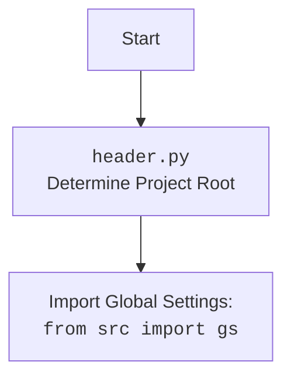

## АНАЛИЗ КОДА: `src/endpoints/hypo69/code_assistant/onela_bot.py`

### <алгоритм>

1. **Инициализация `OnelaBot`**:
   - Создается экземпляр класса `OnelaBot`.
   - Инициализируется родительский класс `TelegramBot`, передавая токен бота из `gs.credentials.telegram.onela_bot`.
   - Инициализируется модель `GoogleGenerativeAI` с ключом API из `gs.credentials.gemini.onela` и настройками генерации ответа.

   *Пример:*
   ```
   # Инициализация OnelaBot
   bot = OnelaBot()
   ```

2. **`handle_message`**:
   - Получает текстовое сообщение `q` от пользователя из `update.message.text`.
   - Получает `user_id` от пользователя из `update.effective_user.id`.
   - Вызывает метод `self.model.chat(q)` для получения ответа от языковой модели.
   - Отправляет ответ пользователю, используя `update.message.reply_text(answer)`.
   - Обрабатывает ошибки, выводя их в лог.

   *Пример:*
   ```
   # Пользователь отправил сообщение "Привет"
   # update.message.text = "Привет"
   # self.model.chat("Привет") вернет "Здравствуйте!"
   # Ответ "Здравствуйте!" отправлен пользователю
   ```

3. **`handle_document`**:
   - Получает информацию о загруженном документе из `update.message.document`.
   - Скачивает файл на локальный диск с помощью `file.download_to_drive()`, сохраняя путь в `tmp_file_path`.
   - Отправляет пользователю сообщение с информацией о файле.
   - Обрабатывает ошибки, выводя их в лог.

   *Пример:*
   ```
   # Пользователь загрузил файл document.pdf
   # file = update.message.document
   # file.download_to_drive() вернет Path('temp/document.pdf')
   # сообщение отправлено пользователю c информацией о файле 
   ```

4. **Запуск бота**:
   - Создается экземпляр `OnelaBot`.
   - Запускается асинхронный цикл обработки обновлений `bot.application.run_polling()`.

   *Пример:*
    ```
    # Создается экземпляр OnelaBot
    bot = OnelaBot()
    # Запускается асинхронный цикл обработки
    asyncio.run(bot.application.run_polling())
    ```

### <mermaid>

```mermaid
flowchart TD
    subgraph OnelaBot
        Start(Start) --> Init[__init__()]
        Init --> CreateModel[model: GoogleGenerativeAI]
        CreateModel --> InitTelegram[super().__init__()]
        InitTelegram --> MessageHandler[handle_message()]
        InitTelegram --> DocumentHandler[handle_document()]
        MessageHandler --> GetMessage[q = update.message.text]
        GetMessage --> GetUserId[user_id = update.effective_user.id]
        GetUserId --> ChatModel[answer = self.model.chat(q)]
        ChatModel --> ReplyMessage[update.message.reply_text(answer)]
        ReplyMessage --> EndMessageHandler(End handle_message)

        DocumentHandler --> GetFile[file = await update.message.document.get_file()]
        GetFile --> DownloadFile[tmp_file_path = await file.download_to_drive()]
         DownloadFile --> ReplyFileInfo[answer = await update.message.reply_text(file)]
        ReplyFileInfo --> ReplyMessageDoc[update.message.reply_text(answer)]
        ReplyMessageDoc --> EndDocumentHandler(End handle_document)
        
        EndMessageHandler --> End(End)
        EndDocumentHandler --> End
    end
    
    subgraph main
       StartMain(Start) --> CreateBot[bot = OnelaBot()]
       CreateBot --> RunPolling[asyncio.run(bot.application.run_polling())]
       RunPolling --> EndMain(End) 
    end    
    
    Start --> StartMain
    EndMain --> End
```



### <объяснение>

#### Импорты:

-   `header`: Этот модуль, предположительно, определяет корень проекта и используется для настройки переменных окружения.
-   `asyncio`: Модуль для асинхронного программирования, используется для запуска `Telegram` бота и обработки сообщений.
-   `pathlib.Path`: Модуль для работы с файловыми путями в объектно-ориентированном стиле.
-   `typing`: Модуль для аннотации типов, используется для определения типов переменных (например `List`, `Optional`, `Dict`).
-   `types.SimpleNamespace`: Используется для создания простых объектов с атрибутами.
-   `telegram`: Пакет для работы с Telegram API, включает классы `Update`, `Application`, `CommandHandler`, `MessageHandler`, `filters`, `CallbackContext`.
-   `src.gs`: Глобальные настройки проекта, предположительно, содержит API ключи и токены, `gs.credentials.gemini.onela`,  `gs.credentials.telegram.onela_bot`.
-   `src.ai.openai.OpenAIModel`: Класс для взаимодействия с моделью OpenAI (не используется напрямую в этом коде, но импортируется).
-   `src.ai.gemini.GoogleGenerativeAI`: Класс для взаимодействия с моделью Gemini.
-   `src.endpoints.bots.telegram.TelegramBot`: Базовый класс для создания Telegram ботов.
-   `src.logger.logger`: Модуль для логирования, используется для отладки и мониторинга.

#### Класс `OnelaBot`:

-   **Роль:** Класс `OnelaBot` является наследником `TelegramBot` и предназначен для обработки сообщений и документов, отправляемых пользователями в чат телеграм. Он использует модель `GoogleGenerativeAI` для генерации ответов на текстовые запросы.
-   **Атрибуты:**
    -   `model: GoogleGenerativeAI`: Экземпляр класса `GoogleGenerativeAI`, используемый для генерации ответов.
-   **Методы:**
    -   `__init__(self)`: Конструктор класса, инициализирует объект, вызывая конструктор родительского класса и создавая экземпляр модели `GoogleGenerativeAI`.
    -   `handle_message(self, update: Update, context: CallbackContext)`: Асинхронный метод для обработки текстовых сообщений от пользователя. Извлекает текст сообщения, отправляет его в `GoogleGenerativeAI`, получает ответ и отправляет его пользователю.
    -   `handle_document(self, update: Update, context: CallbackContext)`: Асинхронный метод для обработки загруженных пользователем документов. Сохраняет документ на диск, формирует ответ о файле, и отправляет его пользователю.

#### Функции:

-   `if __name__ == '__main__':`: Основная точка входа для запуска бота. Создает экземпляр `OnelaBot` и запускает асинхронный цикл обработки обновлений.

#### Переменные:

-   `q: str`: Текст сообщения от пользователя в функции `handle_message`.
-   `user_id: int`: Идентификатор пользователя в функции `handle_message`.
-    `answer: str`: Ответ от языковой модели в функциях `handle_message` и `handle_document`.
-   `file`: Объект файла от пользователя в функции `handle_document`.
-   `tmp_file_path: Path`: Путь к локально сохраненному файлу в функции `handle_document`.
- `bot: OnelaBot`: Экземпляр класса `OnelaBot`.

#### Потенциальные ошибки и области для улучшения:

1. **Обработка ошибок**: В блоках `try...except` используется `...` для пропуска исключений, что может скрыть важные проблемы. Нужно добавить обработку исключений и логирование ошибок.
2. **Безопасность**: API ключи хранятся в `gs.credentials`. Рекомендуется использовать более безопасные методы, например, переменные окружения.
3. **Обработка документов**: В данный момент код только скачивает и отправляет информацию о файле. Не хватает функциональности обработки загруженных документов, например, извлечения текста из pdf.
4. **Разделение ответственности**: Можно разнести логику обработки сообщений и работы с моделью в отдельные классы или методы для улучшения читаемости и тестируемости.

#### Взаимосвязи с другими частями проекта:

-   **`header.py`**: Определяет корень проекта и загружает глобальные настройки `src.gs`.
-   **`src.gs`**: Хранит глобальные настройки, включая API ключи и токены.
-   **`src.ai.gemini.GoogleGenerativeAI`**: Предоставляет интерфейс для взаимодействия с моделью Gemini.
-   **`src.endpoints.bots.telegram.TelegramBot`**: Базовый класс для создания Telegram ботов.
-   **`src.logger.logger`**:  Используется для логирования событий и ошибок.

Этот код является частью более крупной системы, которая предназначена для создания ассистента программиста на основе телеграм-бота.