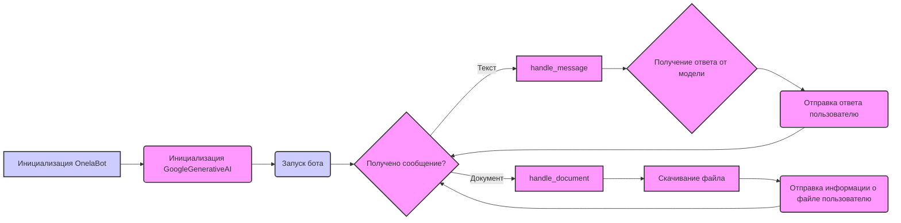

## <алгоритм>

1. **Инициализация `OnelaBot`**:
   - Создается экземпляр класса `OnelaBot`.
   - В конструкторе `__init__` вызывается конструктор родительского класса `TelegramBot`, передавая учетные данные Telegram бота из `gs.credentials.telegram.onela_bot`.
   - Инициализируется модель `GoogleGenerativeAI` с ключом API из `gs.credentials.gemini.onela` и конфигурацией `{'response_mime_type': 'text/plain'}`.

2. **Запуск бота**:
   - Вызывается `asyncio.run(bot.application.run_polling())`, чтобы запустить бота и начать прослушивание обновлений от Telegram.

3. **Обработка текстовых сообщений (`handle_message`)**:
   - Когда бот получает текстовое сообщение, вызывается метод `handle_message`.
   - Из объекта `update` извлекается текст сообщения `q` и идентификатор пользователя `user_id`.
   - Вызывается метод `chat` модели `GoogleGenerativeAI`, чтобы получить ответ `answer` на сообщение `q`.
   - Полученный ответ отправляется обратно пользователю с помощью `update.message.reply_text(answer)`.
   - В случае ошибки, логируется сообщение об ошибке с помощью `logger.error`.

4. **Обработка документов (`handle_document`)**:
   - Когда бот получает документ, вызывается метод `handle_document`.
   - Из объекта `update` извлекается информация о файле с помощью `update.message.document.get_file()`.
   - Файл скачивается на диск с помощью `file.download_to_drive()` и сохраняется в `tmp_file_path`.
   - Информация о файле `file` отправляется пользователю с помощью `update.message.reply_text(file)`.
   - Ответ пользователя не используется для отправки.
   - В случае ошибки, логируется сообщение об ошибке с помощью `logger.error`.
  
**Пример для `handle_message`**:

*   **Ввод**: Пользователь отправляет сообщение "Привет!".
*   **Обработка**: `handle_message` извлекает текст "Привет!", отправляет его в модель `GoogleGenerativeAI`, которая возвращает ответ "Здравствуйте!".
*   **Вывод**: Бот отправляет пользователю сообщение "Здравствуйте!".

**Пример для `handle_document`**:
    
*   **Ввод**: Пользователь загружает файл "document.txt".
*   **Обработка**: `handle_document` получает информацию о файле, скачивает его локально, отправляет пользователю данные файла.
*   **Вывод**: Бот отправляет пользователю сообщение с данными файла "document.txt".

## <mermaid>

**Объяснение зависимостей `mermaid`:**

-   **`A` - Инициализация `OnelaBot`**: Начальная точка, где создается экземпляр класса `OnelaBot`.
-   **`B` - Инициализация `GoogleGenerativeAI`**: Здесь происходит инициализация модели `GoogleGenerativeAI` с использованием API-ключа и конфигурации.
-   **`C` - Запуск бота**: Здесь запускается основной цикл бота, ожидающий обновлений.
-   **`D` - Получено сообщение?**: Решение, получен ли ботом текст или документ.
-   **`E` - `handle_message`**: Функция, обрабатывающая текстовые сообщения.
-   **`F` - `handle_document`**: Функция, обрабатывающая загруженные документы.
-    **`G` - Получение ответа от модели**: Модель `GoogleGenerativeAI` генерирует ответ на сообщение пользователя.
-   **`H` - Отправка ответа пользователю**: Бот отправляет сгенерированный ответ пользователю.
-   **`I` - Скачивание файла**: Локальное сохранение полученного документа.
-   **`J` - Отправка информации о файле пользователю**: Бот отправляет информацию о файле пользователю.

## <объяснение>

**Импорты:**

-   `header`: Заголовочный файл, его назначение неясно без контекста, но, вероятно, содержит общую информацию или настройки.
-   `asyncio`:  Библиотека для написания конкурентного кода с использованием синтаксиса async/await. Необходима для асинхронных операций, таких как работа с сетью и телеграм-ботом.
-   `pathlib.Path`:  Модуль для представления путей к файлам в удобном виде. Используется для управления файловыми путями.
-   `typing.List, Optional, Dict`: Модуль для статической типизации данных, используется для аннотаций типов, делая код более читаемым и понятным.
-   `types.SimpleNamespace`:  Модуль для создания простых объектов, атрибуты которых доступны через точку.
-   `telegram.Update`: Класс для представления обновлений от Telegram. Используется для получения данных о входящих сообщениях, документах и т.д.
-   `telegram.ext.Application, CommandHandler, MessageHandler, filters, CallbackContext`:  Модули из библиотеки `python-telegram-bot`, используемые для управления ботом, обработки команд, сообщений и контекстов.
-   `src.gs`: Пакет, который, вероятно, содержит глобальные настройки и учетные данные, такие как API-ключи. Используется для доступа к `gs.credentials.gemini.onela` и `gs.credentials.telegram.onela_bot`.
-   `src.ai.openai.OpenAIModel`: Класс для взаимодействия с моделями OpenAI, в этом коде не используется, но импортируется.
-   `src.ai.gemini.GoogleGenerativeAI`: Класс для взаимодействия с моделями Google Gemini, используется для создания модели `self.model`.
-   `src.endpoints.bots.telegram.TelegramBot`: Базовый класс для телеграм-ботов, от которого наследуется `OnelaBot`.
-   `src.logger.logger`:  Модуль для логирования, используется для записи ошибок и отладочных сообщений.

**Классы:**

-   **`OnelaBot(TelegramBot)`**:
    -   **Роль**: Класс, реализующий логику Telegram-бота для взаимодействия с моделью ассистента программиста.
    -   **Атрибуты**:
        -   `model: GoogleGenerativeAI`: Экземпляр модели `GoogleGenerativeAI`, используемый для получения ответов на сообщения.
    -   **Методы**:
        -   `__init__(self) -> None`: Конструктор класса, инициализирует базовый класс `TelegramBot` и модель `GoogleGenerativeAI`.
        -   `async def handle_message(self, update: Update, context: CallbackContext) -> None`: Обрабатывает текстовые сообщения, отправляя их в модель и возвращая ответ пользователю.
        -   `async def handle_document(self, update: Update, context: CallbackContext) -> None`: Обрабатывает загруженные документы, скачивая их и отправляя информацию о файле пользователю.

**Функции:**

-   `async def handle_message(self, update: Update, context: CallbackContext) -> None`:
    -   **Аргументы**:
        -   `update: Update`: Объект обновления Telegram, содержащий информацию о входящем сообщении.
        -   `context: CallbackContext`: Контекст выполнения, предоставляемый библиотекой `python-telegram-bot`.
    -   **Возвращаемое значение**: `None`.
    -   **Назначение**: Обрабатывает текстовые сообщения, отправляет их в модель `GoogleGenerativeAI` и отправляет ответ пользователю.
    -   **Пример**: Пользователь отправляет сообщение "Как дела?", метод получает сообщение, отправляет в модель, получает ответ "У меня всё хорошо!", отправляет ответ пользователю.
-   `async def handle_document(self, update: Update, context: CallbackContext) -> None`:
    -   **Аргументы**:
        -   `update: Update`: Объект обновления Telegram, содержащий информацию о загруженном документе.
        -   `context: CallbackContext`: Контекст выполнения.
    -   **Возвращаемое значение**: `None`.
    -   **Назначение**: Обрабатывает загруженные документы, скачивает их и отправляет информацию о файле пользователю.
    -    **Пример**: Пользователь загружает файл "document.txt", метод скачивает файл, отправляет пользователю сообщение с информацией о файле.

**Переменные:**

-   `MODE: str = 'dev'`:  Глобальная переменная, указывающая режим работы (здесь – режим разработки).
-   `bot: OnelaBot`: Экземпляр класса `OnelaBot`.

**Потенциальные ошибки и области для улучшения:**

-   **Обработка ошибок**: В методах `handle_message` и `handle_document` используется общий блок `except Exception as ex`, что может затруднить отладку. Лучше использовать более специфичные исключения.
-    **Обработка ошибок**  в `handle_document`, пользователь получает информацию о файле, но не получает ответ на вопрос из файла.
-   **Обработка документов**: После скачивания файла он не обрабатывается.
-   **Логирование**: Логирование ошибок должно быть более информативным.
-   **Отсутствие обработки контекста**: Контекст выполнения `context` не используется, что может быть важно для некоторых сценариев.

**Цепочка взаимосвязей:**

1.  `OnelaBot` наследуется от `TelegramBot`, что обеспечивает базовую функциональность телеграм-бота.
2.  `OnelaBot` использует `GoogleGenerativeAI` для обработки текстовых сообщений.
3.  `GoogleGenerativeAI` использует API Google для получения ответов.
4.  `src.gs` обеспечивает доступ к учетным данным и API-ключам.
5.  `src.logger.logger` обеспечивает логирование событий и ошибок.
6.  `asyncio` используется для асинхронного выполнения кода.
7.  `pathlib.Path` используется для управления файловыми путями.
8.  `telegram` и `telegram.ext` используются для интеграции с Telegram API.

Этот анализ обеспечивает полное понимание структуры, логики и взаимосвязей представленного кода.