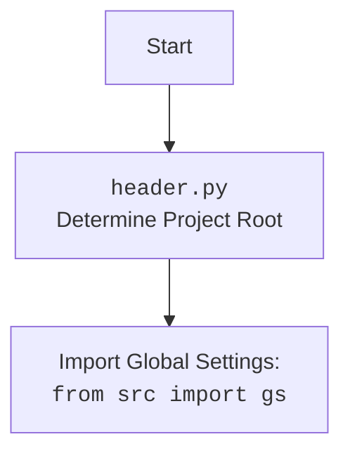

## АНАЛИЗ КОДА: `src/endpoints/hypo69/code_assistant/onela_bot.py`

### <алгоритм>

1. **Инициализация:**
   - Создаётся экземпляр класса `OnelaBot`.
   - При инициализации:
     - Вызывается конструктор родительского класса `TelegramBot`, передавая токен телеграм бота.
     - Инициализируется модель `GoogleGenerativeAI` с ключом API из `gs.credentials.gemini.onela`.
        ```
         Example:
             OnelaBot() -> TelegramBot(token) -> GoogleGenerativeAI(api_key, config)
        ```

2. **Обработка текстового сообщения `handle_message`:**
   - При получении текстового сообщения от пользователя:
     - Извлекается текст сообщения (`q`) и ID пользователя (`user_id`) из объекта `update`.
       ```
         Example:
             update.message.text = "Привет, как дела?"
             update.effective_user.id = 12345
             q = "Привет, как дела?"
             user_id = 12345
        ```
     - Вызывается метод `chat` модели `GoogleGenerativeAI` для получения ответа (`answer`).
        ```
         Example:
             self.model.chat(q) = "У меня всё хорошо, спасибо!"
             answer = "У меня всё хорошо, спасибо!"
        ```
     - Ответ (`answer`) отправляется пользователю через `update.message.reply_text`.
        ```
         Example:
             send_message(user_id, "У меня всё хорошо, спасибо!")
        ```
     - Если возникает ошибка, она логируется через `logger.error`.

3. **Обработка документа `handle_document`:**
   - При получении документа от пользователя:
     - Извлекается информация о файле через `update.message.document.get_file()`.
     - Файл скачивается локально с помощью `file.download_to_drive()`.
     - Отправляется информация о файле  и путь к файлу через `update.message.reply_text`.
        ```
         Example:
            file = await update.message.document.get_file()
            tmp_file_path: Path = await file.download_to_drive()
            answer: str = await update.message.reply_text(file)
             update.message.reply_text(answer)
        ```
     -  Если возникает ошибка, она логируется через `logger.error`.

4. **Запуск бота:**
   - В блоке `if __name__ == '__main__':` создаётся экземпляр `OnelaBot`.
   - Запускается асинхронный цикл `asyncio.run` для работы бота в режиме polling.
      ```
         Example:
            OnelaBot() -> bot.application.run_polling()
      ```
### <mermaid>
```mermaid
flowchart TD
    subgraph OnelaBot
        A[__init__()] --> B[TelegramBot.__init__(token)]
        B --> C[GoogleGenerativeAI(api_key, config)]
        C --> D[handle_message(update, context)]
        D --> E[update.message.text]
        E --> F[model.chat(q)]
        F --> G[update.message.reply_text(answer)]
        D --> H{Ошибка?}
        H -- Да --> I[logger.error(ex)]
        D --> J[handle_document(update, context)]
        J --> K[update.message.document.get_file()]
        K --> L[file.download_to_drive()]
        L --> M[update.message.reply_text(file)]
        M --> N[update.message.reply_text(answer)]
        J --> O{Ошибка?}
        O -- Да --> P[logger.error(ex)]
    end
    Q[if __name__ == '__main__'] --> R[OnelaBot()]
    R --> S[asyncio.run(bot.application.run_polling())]
    classDef styleFill fill:#f9f,stroke:#333,stroke-width:2px
    style A,B,C,D,E,F,G,H,I,J,K,L,M,N,O,P,Q,R,S styleFill
```

### <объяснение>

**Импорты:**

- `import header`: Используется для определения корневой директории проекта и импорта глобальных настроек. Подробности в блоке mermaid.
- `import asyncio`: Используется для асинхронного программирования, необходимого для работы бота.
- `from pathlib import Path`:  Используется для работы с путями к файлам и директориям.
- `from typing import List, Optional, Dict`: Используется для аннотации типов данных, делая код более читаемым и предотвращая ошибки.
- `from types import SimpleNamespace`: Используется для создания объектов, которые можно использовать для хранения данных с атрибутами.
- `from telegram import Update`: Импортируется класс `Update` для обработки обновлений от Telegram.
- `from telegram.ext import Application, CommandHandler, MessageHandler, filters, CallbackContext`: Импортируются классы и функции из библиотеки `python-telegram-bot`, необходимые для создания и управления Telegram-ботом.
- `from src import gs`: Импортируются глобальные настройки проекта, включая токен бота и ключи API.
- `from src.ai.openai import OpenAIModel`: Импортируется класс `OpenAIModel` для взаимодействия с моделями OpenAI (в коде не используется).
- `from src.ai.gemini import GoogleGenerativeAI`: Импортируется класс `GoogleGenerativeAI` для взаимодействия с моделями Google Gemini.
- `from src.endpoints.bots.telegram import TelegramBot`: Импортируется базовый класс `TelegramBot` для создания телеграм-ботов.
- `from src.logger.logger import logger`: Импортируется объект `logger` для логирования событий и ошибок.

**Класс `OnelaBot`:**

- **Назначение:** Класс `OnelaBot` представляет собой телеграм-бота, который взаимодействует с языковой моделью Google Gemini для обработки текстовых сообщений и загруженных документов.
- **Атрибуты:**
    - `model`: Экземпляр класса `GoogleGenerativeAI`, используется для взаимодействия с языковой моделью Gemini. Инициализируется с API ключом, полученным из `gs.credentials.gemini.onela`
- **Методы:**
    - `__init__(self)`: Конструктор класса, инициализирует родительский класс `TelegramBot` и задаёт модель `GoogleGenerativeAI`.
    - `handle_message(self, update: Update, context: CallbackContext)`: Асинхронный метод для обработки текстовых сообщений. Извлекает текст сообщения из `update`, отправляет его в модель `GoogleGenerativeAI` и возвращает ответ пользователю.
    - `handle_document(self, update: Update, context: CallbackContext)`: Асинхронный метод для обработки загруженных документов. Скачивает файл, отправляет путь к файлу пользователю.

**Функции:**

- `__main__`:
    - Создаёт экземпляр класса `OnelaBot`.
    - Запускает асинхронный цикл для работы бота в режиме polling.

**Переменные:**

- `q`: Строка, содержащая текст сообщения пользователя.
- `user_id`: Целое число, представляющее ID пользователя в Telegram.
- `answer`: Строка, содержащая ответ от языковой модели или информацию о файле.
- `file`: Объект, представляющий загруженный файл.
- `tmp_file_path`: Объект `Path`, представляющий путь к загруженному файлу.
- `bot`: Экземпляр класса `OnelaBot`.

**Потенциальные ошибки и области для улучшения:**

- **Обработка ошибок:**
  - Сейчас ошибки обрабатываются в блоках `try...except` с помощью логирования.
  - Стоит добавить более детальную обработку ошибок, например, уведомление пользователя об ошибке.
- **Обработка документов:**
  - В текущем варианте только отправляется путь к файлу.  Необходимо расширить функциональность для обработки содержимого файла (текстовый анализ, анализ кода).
- **Безопасность:**
  - API-ключи и токены хранятся в глобальных настройках, что может быть небезопасно.  Рассмотреть использование переменных среды или других более безопасных способов хранения.
- **Масштабируемость:**
  - Код может быть оптимизирован для работы с большим количеством пользователей и сообщений, например, с использованием асинхронных очередей.

**Взаимосвязи с другими частями проекта:**

- **`src.gs`**: Модуль глобальных настроек. Откуда берутся токены и API-ключи.
- **`src.ai.gemini`**: Модуль, предоставляющий интерфейс для взаимодействия с моделью Google Gemini.
- **`src.endpoints.bots.telegram`**: Модуль, предоставляющий базовый класс для телеграм-ботов.
- **`src.logger.logger`**: Модуль логирования событий и ошибок.

**Дополнительно:**
- Код может быть расширен для обработки команд, например, `/start`, `/help`.
- Можно добавить поддержку разных типов запросов от пользователя.
- Можно интегрировать код с другими сервисами и API.