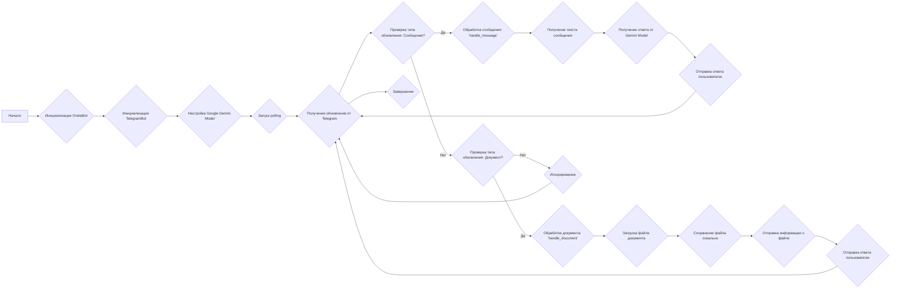
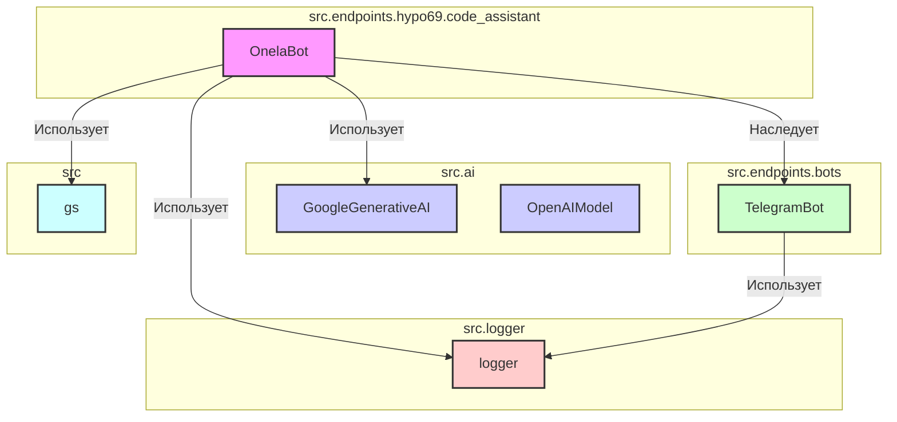
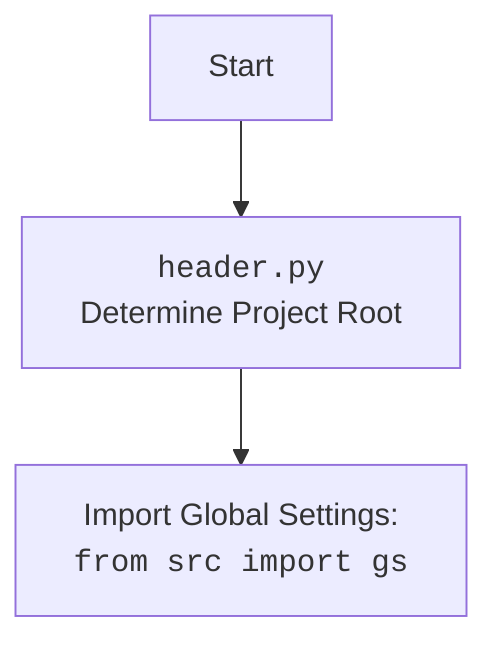

## Анализ кода `onela_bot.py`

### 1. <алгоритм>

**Блок-схема работы `OnelaBot`:**

**Примеры:**

*   **Инициализация:** При создании `OnelaBot`, инициализируется `TelegramBot`, и `GoogleGenerativeAI` модель с ключом API из `gs.credentials.gemini.onela`.
*   **Обработка сообщения:** Если пользователь отправляет сообщение, текст сообщения извлекается, передается модели Gemini, а полученный ответ отправляется обратно пользователю.
*   **Обработка документа:** Если пользователь отправляет документ, файл скачивается локально, информация о файле отправляется, а затем  пользователю отправляется сообщение.

### 2. <mermaid>

**Объяснение `mermaid`:**

*   `OnelaBot` (A) располагается в модуле `src.endpoints.hypo69.code_assistant` и наследует функциональность от `TelegramBot` (D), находящегося в модуле `src.endpoints.bots`.
*   `OnelaBot` использует `GoogleGenerativeAI` (B) из модуля `src.ai` для обработки запросов к модели.
*   `OnelaBot` также взаимодействует с `logger` (E) из `src.logger` для ведения журнала и использует глобальные настройки из `gs` (F) из `src`.
*   `TelegramBot` использует `logger`, `gs`.
*   `GoogleGenerativeAI` (B) и `OpenAIModel` (C) - это классы из `src.ai` которые используются для реализации работы с моделями.
*   Стили используются для выделения блоков.

### 3. <объяснение>

**Импорты:**

*   `header`: Используется для определения корневой директории проекта, что позволяет корректно импортировать другие модули, такие как `src.gs`.
*   `asyncio`: Модуль для поддержки асинхронного программирования.
*   `pathlib.Path`: Работа с путями файловой системы.
*   `typing.List`, `typing.Optional`, `typing.Dict`: Типизация для переменных.
*   `types.SimpleNamespace`:  Создание простого пространства имен.
*    `telegram.Update`, `telegram.ext.Application`, `telegram.ext.CommandHandler`, `telegram.ext.MessageHandler`, `telegram.ext.filters`, `telegram.ext.CallbackContext`: Библиотека `python-telegram-bot`, используемая для создания Telegram ботов.
*    `src.gs`: Глобальные настройки проекта, включающие учетные данные, настройки API и т.д.
*   `src.ai.openai.OpenAIModel`: Класс для взаимодействия с моделями OpenAI. **Не используется** в данном коде, но импортирован.
*   `src.ai.gemini.GoogleGenerativeAI`: Класс для взаимодействия с моделями Gemini от Google.
*   `src.endpoints.bots.telegram.TelegramBot`: Базовый класс для создания Telegram-ботов.
*   `src.logger.logger`: Модуль для логирования.

**Классы:**

*   `OnelaBot(TelegramBot)`:
    *   **Роль:** Основной класс, реализующий логику бота. Наследует функциональность `TelegramBot` и добавляет свою логику.
    *   **Атрибуты:**
        *   `model`: Экземпляр `GoogleGenerativeAI`, используемый для обработки запросов.
    *   **Методы:**
        *   `__init__(self)`: Инициализирует бота, вызывая конструктор родительского класса `TelegramBot` с токеном.
        *   `handle_message(self, update: Update, context: CallbackContext)`: Обрабатывает входящие текстовые сообщения, получает ответ от модели Gemini и отправляет его пользователю.
        *   `handle_document(self, update: Update, context: CallbackContext)`: Обрабатывает загруженные документы, сохраняя их временно локально.

**Функции:**

*   `handle_message(self, update: Update, context: CallbackContext)`:
    *   **Аргументы:**
        *   `update`: Данные обновления от Telegram.
        *   `context`: Контекст для выполнения обработчика.
    *   **Возвращаемое значение**: `None`.
    *   **Назначение**: Извлекает текст сообщения от пользователя, передает его модели, получает ответ и отправляет его обратно пользователю.
*   `handle_document(self, update: Update, context: CallbackContext)`:
    *   **Аргументы:**
        *   `update`: Данные обновления от Telegram.
        *   `context`: Контекст для выполнения обработчика.
    *   **Возвращаемое значение**: `None`.
    *   **Назначение**: Обрабатывает документы, загруженные пользователем, скачивает их локально, отправляет информацию о файле и ответа пользователю.

**Переменные:**

*   `bot`: Экземпляр `OnelaBot`.
*   `q` (str): Текст сообщения пользователя.
*   `user_id` (int): Идентификатор пользователя Telegram.
*   `answer` (str): Ответ от модели Gemini.
*   `tmp_file_path` (`Path`): Временный путь к файлу на диске.
*   `file`: объект файла Telegram.

**Потенциальные ошибки и области для улучшения:**

*   **Обработка ошибок:** В `handle_message` и `handle_document` есть общий блок `try...except`, который просто логирует ошибку и игнорирует ее. Необходима более детальная обработка ошибок (например, отправка сообщения пользователю об ошибке).
*   **Обработка документов:** В настоящее время обработка документов заключается только в их скачивании и отправке информации о файле. Требуется добавление функциональности для обработки содержимого документа с помощью модели.
*    **Импорт `OpenAIModel`**:  В коде импортируется `src.ai.openai.OpenAIModel`, но не используется. Этот импорт стоит удалить, если он не нужен.
*   **Безопасность**: Следует учитывать вопросы безопасности при скачивании файлов (например, проверка типа файлов).
*   **Асинхронность**: Код активно использует асинхронные функции (`async`/`await`), что является хорошей практикой для обработки нескольких запросов.
*   **Логирование**: Используется `logger` для логирования ошибок, что полезно для отладки.

**Взаимосвязь с другими частями проекта:**

*   `OnelaBot` зависит от `src.ai` для обработки запросов к моделям (Gemini).
*   Использует `src.endpoints.bots.telegram.TelegramBot` как базовый класс.
*   Использует `src.logger` для логирования.
*   Зависит от `src.gs` для получения настроек, таких как токены и ключи API.
*   Этот модуль служит как один из вариантов взаимодействия с ассистентом программиста, в то время как другие части проекта могут предоставлять различные функциональные возможности.