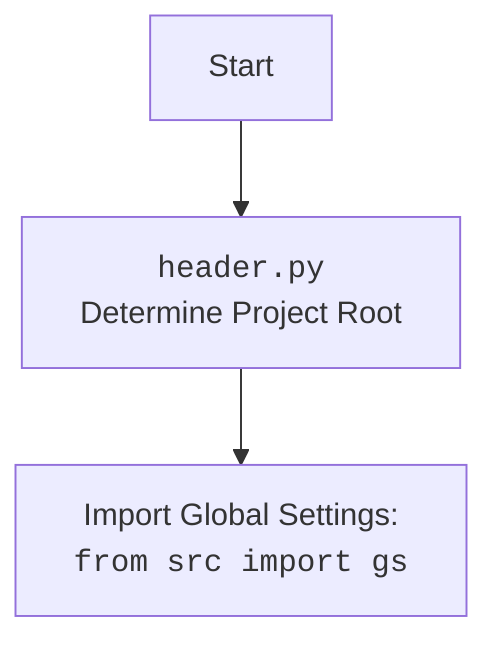

## Анализ кода `pdf2html.py`

### 1. <алгоритм>

**Блок-схема:**

```mermaid
graph TD
    A[Начало] --> B(Импорт модулей: `header`, `gs` из `src`, `PDFUtils` из `src.utils.pdf`);
    B --> C{Определение функции `pdf2html(pdf_file, html_file)`};
    C --> D{Вызов `PDFUtils.pdf_to_html(pdf_file, html_file)` для конвертации PDF в HTML};
    D --> E{Определение путей к PDF и HTML файлам: `pdf_file`, `html_file`};
    E --> F{Вызов функции `pdf2html(pdf_file, html_file)`};
    F --> G[Конец];
    
    style B fill:#f9f,stroke:#333,stroke-width:2px
    style C fill:#ccf,stroke:#333,stroke-width:2px
    style D fill:#aaf,stroke:#333,stroke-width:2px
    style E fill:#afa,stroke:#333,stroke-width:2px
    style F fill:#faa,stroke:#333,stroke-width:2px
```

**Примеры:**

- **Импорт модулей:**
  - Импортируется `header` для определения корневой директории проекта.
  - Импортируется `gs` (глобальные настройки) из пакета `src` для доступа к общим настройкам.
  - Импортируется `PDFUtils` из пакета `src.utils.pdf` для выполнения конвертации PDF в HTML.
- **`pdf2html(pdf_file, html_file)`:**
  - **Аргументы:**
    - `pdf_file`: путь к PDF файлу.
    - `html_file`: путь к HTML файлу.
  - **Действие:**
    - Вызывает метод `pdf_to_html` класса `PDFUtils`, передавая пути к PDF и HTML файлам для конвертации.
- **Определение путей к файлам:**
    - `pdf_file` устанавливается как путь к файлу `101_BASIC_Computer_Games_Mar75.pdf` внутри папки `assets/materials` в корневой директории проекта, полученной через `gs.path.root`.
    - `html_file` устанавливается как путь к файлу `101_BASIC_Computer_Games_Mar75.html` в той же папке.
- **Вызов функции `pdf2html`:**
    - Вызывается функция `pdf2html` с ранее определенными путями к PDF и HTML файлам, инициируя процесс конвертации.

### 2. <mermaid>

```mermaid
flowchart TD
    Start --> ImportModules[Импорт модулей: `header`, `gs`, `PDFUtils`];
    ImportModules --> DefinePdf2Html[Определение функции `pdf2html(pdf_file, html_file)`];
    DefinePdf2Html --> CallPdfUtils[Вызов `PDFUtils.pdf_to_html(pdf_file, html_file)`];
    CallPdfUtils --> DefineFilePaths[Определение путей: `pdf_file`, `html_file`];
    DefineFilePaths --> CallPdf2HtmlFunc[Вызов `pdf2html(pdf_file, html_file)`];
    CallPdf2HtmlFunc --> End[Конец];
    
    style ImportModules fill:#f9f,stroke:#333,stroke-width:2px
    style DefinePdf2Html fill:#ccf,stroke:#333,stroke-width:2px
    style CallPdfUtils fill:#aaf,stroke:#333,stroke-width:2px
    style DefineFilePaths fill:#afa,stroke:#333,stroke-width:2px
    style CallPdf2HtmlFunc fill:#faa,stroke:#333,stroke-width:2px
```


**Зависимости `mermaid`:**
-   **`header`**: Используется для определения корневой директории проекта, что необходимо для формирования корректных путей к файлам.
-   **`gs`**: Представляет глобальные настройки, включая `gs.path.root`, который используется для получения корневого пути проекта.
-   **`PDFUtils`**: Класс, содержащий метод `pdf_to_html` для конвертации PDF в HTML.

### 3. <объяснение>

**Импорты:**

-   `import header`: Импортирует модуль `header.py`. Этот модуль отвечает за определение корневой директории проекта. Он необходим для формирования корректных путей к ресурсам, находящимся в папках проекта. Взаимосвязан с остальными частями проекта через определение общей корневой директории.
-   `from src import gs`: Импортирует глобальные настройки `gs` из пакета `src`. Эти настройки могут включать в себя различные параметры, используемые в проекте, включая корневой путь проекта `gs.path.root`.  `gs` необходим для доступа к общим параметрам, которые могут быть использованы в разных частях проекта.
-   `from src.utils.pdf import PDFUtils`: Импортирует класс `PDFUtils` из модуля `pdf` в пакете `src.utils`. Этот класс, предположительно, содержит утилиты для работы с PDF файлами, включая метод `pdf_to_html`, который выполняет конвертацию PDF в HTML.

**Классы:**

-   `PDFUtils`:
    -   **Роль**: Предоставляет функциональность для работы с PDF файлами, в данном случае, конвертацию PDF в HTML.
    -   **Методы**:
        -   `pdf_to_html(pdf_file, html_file)`: Статический метод, принимающий пути к PDF и HTML файлам, и выполняющий конвертацию.

**Функции:**

-   `pdf2html(pdf_file, html_file)`:
    -   **Аргументы**:
        -   `pdf_file`: Строка, представляющая путь к PDF файлу.
        -   `html_file`: Строка, представляющая путь к HTML файлу, в который будет сохранен результат.
    -   **Возвращаемое значение**:  `None`. Функция производит конвертацию PDF файла в HTML,  не возвращая явного значения.
    -   **Назначение**: Вызывает метод `pdf_to_html` из класса `PDFUtils`, для конвертации PDF в HTML.
    -   **Пример**: `pdf2html('/path/to/input.pdf', '/path/to/output.html')`

**Переменные:**

-   `pdf_file`: Строка, представляющая путь к входному PDF файлу. Получает путь через доступ к корневой директории `gs.path.root`.
-   `html_file`: Строка, представляющая путь к выходному HTML файлу.  Получает путь через доступ к корневой директории `gs.path.root`.

**Потенциальные ошибки или области для улучшения:**

-   **Обработка ошибок:** В коде отсутствует обработка возможных исключений, которые могут возникнуть при конвертации PDF в HTML. Например, если файл PDF поврежден или не может быть прочитан.
-   **Конфигурация путей:**  Пути к файлам жестко заданы в коде. Возможно, имеет смысл вынести их в конфигурационный файл или сделать настраиваемыми через аргументы командной строки.
-   **Логирование:** Отсутствует логирование действий, что затрудняет отслеживание процесса конвертации и выявление проблем.
-   **Проверка файлов:** Не происходит проверки существования входного файла `pdf_file` и возможности записи в выходной файл `html_file`.
-   **Зависимости:** Код напрямую зависит от существования класса `PDFUtils` и его метода `pdf_to_html`. Если реализация этого метода изменится, потребуется корректировка кода.

**Цепочка взаимосвязей:**

1.  `header.py` определяет корневую директорию проекта.
2.  `gs` импортируется из `src` и содержит общие настройки проекта, включая корневой путь `gs.path.root`.
3.  `pdf2html.py` использует `header` и `gs` для определения путей к файлам.
4.  `pdf2html.py` вызывает метод `pdf_to_html` из класса `PDFUtils` (из `src.utils.pdf`) для выполнения конвертации PDF в HTML.
5.  `pdf2html.py` является частью endpoints, вероятно, вызывается через HTTP endpoint.