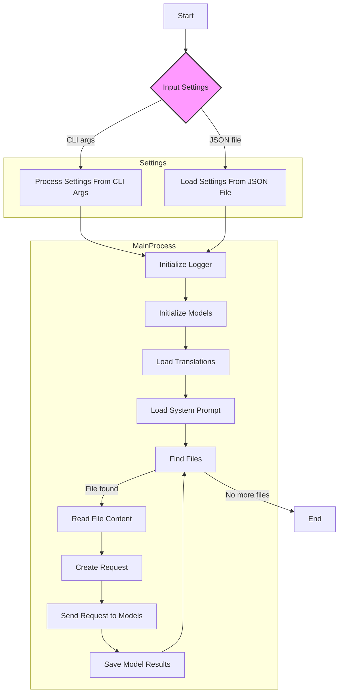
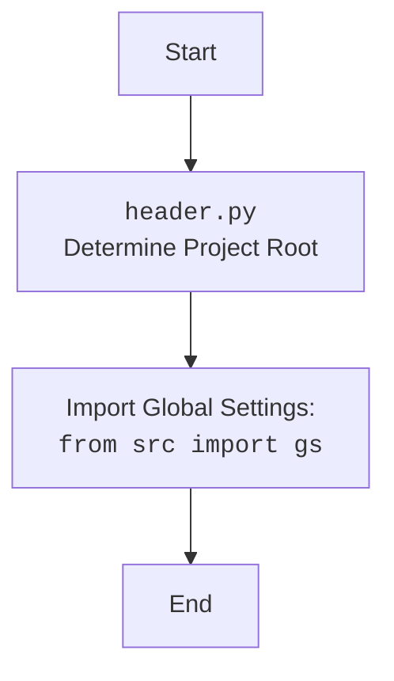

## АНАЛИЗ КОДА: `Code Assistant`

### <алгоритм>

1.  **Начало:**
    *   Принимаются аргументы командной строки или настройки из JSON-файла.
    *   Определяются:
        *   `role` (роль модели, например, `doc_writer`, `code_checker`).
        *   `lang` (язык, например, `ru`, `en`).
        *   `models` (список моделей, например, `gemini`, `openai`).
        *   `start_dirs` (список директорий для обработки).
        *   Исключения (`exclude_file_patterns`, `exclude_dirs`, `exclude_files`).

2.  **Инициализация:**
    *   Инициализируется логгер для записи событий.
    *   Инициализируются выбранные модели (Gemini, OpenAI) с использованием API ключей.
    *   Загружаются переводы для указанного языка (`lang`).
    *   Загружается системный промпт для указанной роли (`role`) из директории `src/ai/prompts/developer/`.

3.  **Поиск файлов:**
    *   Рекурсивно обходятся все `start_dirs`.
    *   Ищутся файлы с расширениями `.py` и `README.MD`.
    *   Файлы, соответствующие `exclude_file_patterns`, `exclude_dirs` или `exclude_files`, игнорируются.
    *   **Пример**: Если `start_dirs` содержит `/project/src`, будут найдены все `.py` и `README.MD` файлы в этой директории и её поддиректориях. Исключаются `/project/src/test/test.py` если `/test` в `exclude_dirs`

4.  **Обработка файлов:**
    *   Для каждого найденного файла:
        *   Читается содержимое файла.
        *   Формируется запрос к модели на основе системного промпта и содержимого файла.
        *   Запрос отправляется в каждую из указанных моделей (`models`).
        *   **Пример**:  Файл `example.py` будет отправлен в Gemini и OpenAI с промптом `doc_writer_en.md`, если выбрана роль `doc_writer` и `lang=en`.

5.  **Сохранение результатов:**
    *   Для каждого полученного ответа модели:
        *   Создается директория для сохранения результатов, например: `docs/raw_rst_from_<model>/<lang>/`.
        *   Ответ модели сохраняется в файл с тем же именем, что и исходный файл, в новой директории.
        *   **Пример**: Ответ модели Gemini для `example.py` будет сохранен в `docs/raw_rst_from_gemini/en/example.py`.

6.  **Завершение:**
    *   Логируется информация о завершении обработки.

### <mermaid>

**Объяснение `mermaid`:**

1.  **`Start`**: Начало процесса.
2.  **`InputSettings`**: Принимает настройки либо из аргументов командной строки, либо из JSON-файла.
3.  **`ProcessSettings`**: Обрабатывает настройки из аргументов командной строки.
4.  **`LoadSettings`**: Загружает настройки из JSON-файла.
5.  **`InitLogger`**: Инициализирует логгер для записи событий.
6.  **`InitModels`**: Инициализирует указанные модели (Gemini, OpenAI) с использованием API ключей.
7.  **`LoadTranslations`**: Загружает переводы для указанного языка.
8.  **`LoadPrompt`**: Загружает системный промпт для выбранной роли.
9.  **`FindFiles`**: Поиск файлов с расширением `.py` и `README.MD` в указанных директориях.
10. **`ReadFile`**: Читает содержимое найденного файла.
11. **`CreateRequest`**: Создает запрос к моделям, используя содержимое файла и системный промпт.
12. **`SendToModel`**: Отправляет сформированный запрос к каждой из выбранных моделей.
13. **`SaveResults`**: Сохраняет полученные от модели ответы в соответствующие директории.
14. **`End`**: Конец процесса.

**Дополнительно: `header.py`**

### <объяснение>

#### Импорты:

*   Модуль не содержит явных импортов, но он взаимодействует с различными частями проекта `src`, включая:
    *   `src.ai.prompts.developer`: Загрузка промптов для моделей.
    *   `src.utils.logger`: Логирование работы скрипта.
    *   `src.config.settings`: Настройки проекта.
    *   `src.ai.models`: Инициализация и взаимодействие с моделями Gemini и OpenAI.
    *   `src.utils.translations`: Загрузка переводов для мультиязычности.

#### Классы:

*   В предоставленном фрагменте кода нет явных классов.

#### Функции:

*   Код использует множество функций, таких как:
    *   Функции для чтения файлов.
    *   Функции для обработки командной строки и JSON настроек.
    *   Функции для инициализации моделей.
    *   Функции для формирования запросов и отправки их моделям.
    *   Функции для сохранения ответов моделей.
    *   Функции для логирования событий.
    *   Функции для фильтрации файлов по условиям исключений.

#### Переменные:

*   `role`: Строка, определяющая роль модели (например, `doc_writer`, `code_checker`).
*   `lang`: Строка, определяющая язык (например, `ru`, `en`).
*   `models`: Список строк, определяющий модели (например, `gemini`, `openai`).
*   `start_dirs`: Список строк, определяющий директории для обработки.
*   `exclude_file_patterns`: Список регулярных выражений для исключения файлов.
*   `exclude_dirs`: Список директорий для исключения.
*   `exclude_files`: Список файлов для исключения.
*   API ключи для Gemini и OpenAI.
*   Промпты для моделей.

#### Цепочка взаимосвязей:

1.  **Командная строка / JSON конфигурация**  → **`code_assistant.py`**: Параметры, определяющие поведение скрипта.
2.  **`code_assistant.py`**  → **`src.ai.prompts.developer`**: Загрузка соответствующих промптов для выбранной роли.
3.  **`code_assistant.py`**  → **`src.ai.models`**: Инициализация и взаимодействие с моделями Gemini и OpenAI.
4.  **`code_assistant.py`**  → **`src.utils.logger`**: Логирование хода выполнения скрипта.
5.  **`code_assistant.py`**  → **`src.utils.translations`**: Загрузка переводов для поддержки мультиязычности.
6.  **`code_assistant.py`**  → **Файловая система**: Поиск файлов, чтение содержимого, сохранение результатов.
7. **`code_assistant.py`** → **`src.config.settings`**: Загрузка и использование глобальных настроек проекта.

#### Потенциальные ошибки и улучшения:

*   **Обработка ошибок**: Код может быть улучшен за счет более детальной обработки ошибок, таких как:
    *   Ошибки загрузки файлов.
    *   Ошибки API моделей.
    *   Ошибки сохранения результатов.
*   **Параллелизация**: Обработка файлов может быть распараллелена для повышения производительности.
*   **Кэширование**: Результаты ответов моделей могут быть кэшированы для уменьшения количества запросов.
*   **Конфигурация**: Все параметры конфигурации должны быть вынесены в отдельный конфигурационный файл, для легкого управления и обновления.

Этот анализ предоставляет подробное описание работы модуля `Code Assistant`, включая его функциональность, поток данных, зависимости и области для улучшения.