# Анализ модуля `Code Assistant`

## 1. <алгоритм>

### Общая логика работы:

1.  **Инициализация**:
    *   Скрипт запускается с параметрами командной строки, которые могут включать путь к JSON-файлу настроек, роль, язык, список моделей и стартовые директории.
    *   Если указан файл настроек, параметры загружаются из него, иначе используются параметры командной строки.
2.  **Подготовка к обработке**:
    *   Определяется набор файлов для обработки, исключая файлы и директории, указанные в настройках.
    *   Загружаются промпты из директории `src/ai/prompts/developer/`, соответствующие выбранной роли и языку.
3.  **Обработка файлов**:
    *   Для каждого найденного файла:
        *   Читается содержимое файла.
        *   Формируется запрос для модели, включающий содержимое файла и загруженный промпт.
        *   Отправляется запрос к каждой указанной модели (Gemini, OpenAI).
        *   Полученные ответы от каждой модели сохраняются в соответствующие директории (например, `docs/raw_rst_from_<model>/<lang>/`).
4.  **Завершение**:
    *   Логируется информация о завершении обработки файлов.

### Блок-схема обработки файла:

```
graph TD
    A[Начало] --> B{Найти файлы};
    B --> C{Для каждого файла};
    C -- Да --> D[Прочитать содержимое файла];
    D --> E[Сформировать запрос с промптом];
    E --> F{Для каждой модели};
    F -- Да --> G[Отправить запрос модели];
    G --> H[Сохранить ответ модели];
    H --> F;
    F -- Нет --> C;
    C -- Нет --> I[Завершение];
```

### Примеры:

*   **Инициализация**: `python code_assistant.py --role doc_writer --lang ru --models gemini openai --start_dirs /path/to/dir1 /path/to/dir2` или `python code_assistant.py --settings settings.json`.
*   **Подготовка к обработке**:  Происходит поиск файлов, например, `file.py` и `README.md` в `/path/to/dir1` и `/path/to/dir2`.
*   **Обработка файлов**: Содержимое `file.py` отправляется в модели `gemini` и `openai` с промптом для роли `doc_writer` на русском языке. Ответы сохраняются в соответствующих директориях.

```mermaid
flowchart TD
    subgraph CodeAssistant
        Start(Начало) --> ParseArgs[Разбор параметров командной строки]
        ParseArgs --> LoadSettings{Загрузить настройки из JSON?}
        LoadSettings -- Да --> LoadSettingsFromFile[Загрузить настройки из файла]
        LoadSettings -- Нет --> UseCliArgs[Использовать параметры командной строки]
        LoadSettingsFromFile --> PrepareFiles[Подготовка списка файлов для обработки]
        UseCliArgs --> PrepareFiles
        PrepareFiles --> LoadPrompts[Загрузить промпты]
        LoadPrompts --> ProcessFiles{Для каждого файла}
        ProcessFiles -- Да --> ReadFile[Прочитать содержимое файла]
        ReadFile --> CreateRequest[Сформировать запрос]
        CreateRequest --> ProcessModels{Для каждой модели}
         ProcessModels -- Да --> SendRequest[Отправить запрос модели]
        SendRequest --> SaveResponse[Сохранить ответ]
        SaveResponse --> ProcessModels
        ProcessModels -- Нет --> ProcessFiles
        ProcessFiles -- Нет --> End(Конец)
    end
    style Start fill:#f9f,stroke:#333,stroke-width:2px
    style End fill:#f9f,stroke:#333,stroke-width:2px
```

## 2. <mermaid>



### Объяснение `mermaid`:

*   **`CodeAssistant`**: Основной контейнер, представляющий рабочий процесс скрипта `code_assistant.py`.
*   **`Start`**: Начало процесса.
*   **`ParseArgs`**: Разбирает аргументы командной строки.
*   **`LoadSettings`**: Проверяет, нужно ли загружать настройки из JSON-файла.
*   **`LoadSettingsFromFile`**: Загружает настройки из JSON-файла.
*   **`UseCliArgs`**: Использует аргументы командной строки для настроек.
*   **`PrepareFiles`**: Подготавливает список файлов для обработки на основе переданных директорий и настроек исключений.
*   **`LoadPrompts`**: Загружает промпты из файлов, соответствующих выбранной роли и языку.
*   **`ProcessFiles`**: Цикл для обработки каждого файла.
*   **`ReadFile`**: Читает содержимое текущего файла.
*   **`CreateRequest`**: Формирует запрос на основе содержимого файла и загруженного промпта.
*   **`ProcessModels`**: Цикл для обработки запроса каждой указанной моделью.
*   **`SendRequest`**: Отправляет запрос в выбранную модель (Gemini или OpenAI).
*   **`SaveResponse`**: Сохраняет полученный ответ модели в соответствующую директорию.
*   **`End`**: Конец процесса.

### Зависимости:

В коде диаграммы отсутствуют импорты, но в контексте кода:

1.  **argparse**: Используется для разбора аргументов командной строки.
2.  **json**: Используется для работы с JSON-файлами настроек.
3.  **os**, **glob**: Используются для работы с файловой системой и поиска файлов.
4.  **src.ai.prompts**: Используется для загрузки промптов для моделей.
5. **src.utils.logger**: Используется для логирования.

## 3. <объяснение>

### Импорты:

*   **Стандартные библиотеки**:
    *   `argparse`: Модуль для обработки аргументов командной строки, позволяющий пользователю передавать настройки в скрипт.
    *   `json`: Модуль для работы с JSON-файлами, используется для загрузки настроек из JSON-файла.
    *   `os`, `glob`: Модули для работы с файловой системой, используются для поиска файлов и директорий.
*  **Внутренние модули:**
    *  `src.ai.prompts`: Содержит логику для загрузки промптов для моделей ИИ из файлов.
    * `src.utils.logger`:  Используется для логирования событий и ошибок, возникших во время выполнения скрипта.
    *  `src.settings`:  Содержит общие настройки для проекта.

### Классы:
    
    -В явном виде не определены. Код написан в функциональном стиле, без классов.

### Функции:

*   **Основные функции в `code_assistant.py`**:
    *   **`main()`**: Основная функция, которая запускает логику работы скрипта.
        *   **Аргументы**: Не принимает аргументов, но использует `argparse` для обработки аргументов командной строки.
        *   **Возвращаемое значение**: Не возвращает значение, выполняет основные операции скрипта.
        *   **Назначение**: Координирует весь процесс обработки файлов, загрузки промптов, взаимодействия с моделями и сохранения результатов.
        *   **Пример**: Запускает все остальные функции.
    *   **`load_settings(settings_file)`**: Загружает настройки из JSON-файла.
        *   **Аргументы**: `settings_file` (str) - путь к JSON-файлу настроек.
        *   **Возвращаемое значение**: Словарь с настройками.
        *   **Назначение**: Читает JSON-файл и возвращает его содержимое в виде словаря.
    *   **`get_files_for_process(start_dirs, exclude_file_patterns, exclude_dirs, exclude_files)`**: Получает список файлов для обработки.
        *   **Аргументы**: 
            *   `start_dirs` (list) - список директорий для поиска файлов.
            *   `exclude_file_patterns` (list) - список регулярных выражений для исключения файлов.
            *   `exclude_dirs` (list) - список директорий для исключения.
            *   `exclude_files` (list) - список файлов для исключения.
        *   **Возвращаемое значение**: Список путей к файлам.
        *   **Назначение**: Находит все файлы в указанных директориях и фильтрует их на основе заданных параметров исключения.
    *   **`load_prompts(role, lang, prompts_dir)`**: Загружает промпты для заданной роли и языка.
        *   **Аргументы**:
            *   `role` (str) - роль для загрузки промпта.
            *   `lang` (str) - язык для загрузки промпта.
            *   `prompts_dir` (str) - директория, в которой хранятся промпты.
        *   **Возвращаемое значение**: Словарь с промптами.
        *   **Назначение**: Загружает промпты из файлов и подготавливает их для использования.
    *   **`process_files(files, prompts, role, models, output_dir)`**: Обрабатывает список файлов с использованием указанных промптов и моделей.
        *   **Аргументы**:
            *   `files` (list) - список путей к файлам.
            *   `prompts` (dict) - словарь с промптами.
            *   `role` (str) - роль для обработки.
            *   `models` (list) - список моделей для использования.
            *   `output_dir` (str) - директория для сохранения ответов.
        *   **Возвращаемое значение**: Не возвращает значение, сохраняет ответы в файлы.
        *   **Назначение**: Проходит по всем файлам, формирует запросы к моделям и сохраняет их ответы.
    *   **`create_request_for_model(file_content, prompts, role, model)`**: Создает запрос для модели.
        *   **Аргументы**:
            *   `file_content` (str) - содержимое обрабатываемого файла.
            *   `prompts` (dict) - словарь с промптами.
            *   `role` (str) - роль для обработки.
            *   `model` (str) - используемая модель.
        *   **Возвращаемое значение**: Текст запроса для модели.
        *   **Назначение**: Собирает запрос из контента файла, промпта и роли.
    *   **`save_response(output_dir, role, lang, model, file_name, response)`**: Сохраняет ответ модели в файл.
        *   **Аргументы**:
            *   `output_dir` (str) - директория для сохранения ответов.
            *   `role` (str) - роль для обработки.
            *   `lang` (str) - язык для обработки.
            *   `model` (str) - используемая модель.
            *   `file_name` (str) - имя файла, на основе которого генерируется имя файла для ответа.
            *   `response` (str) - ответ модели.
        *   **Возвращаемое значение**: Не возвращает значение, сохраняет ответ в файл.
        *   **Назначение**: Сохраняет полученный ответ от модели в файл.

### Переменные:

*   **Аргументы командной строки**:
    *   `settings`: Путь к JSON-файлу с настройками.
    *   `role`: Роль модели для выполнения задачи.
    *   `lang`: Язык выполнения задачи.
    *   `models`: Список моделей для инициализации.
    *   `start_dirs`: Список директорий для обработки.
*   **Вспомогательные переменные**:
    *   `args`: Результат парсинга аргументов командной строки.
    *   `settings_data`: Словарь с настройками, полученными из JSON-файла.
    *   `files`: Список путей к файлам для обработки.
    *   `prompts`: Словарь с промптами, загруженными для конкретной роли и языка.
    *   `output_dir`: Директория для сохранения результатов.

### Потенциальные ошибки и области для улучшения:

1.  **Обработка ошибок**:
    *   Необходимо добавить более подробную обработку ошибок, особенно при чтении файлов, загрузке настроек и отправке запросов моделям.
2.  **Асинхронность**:
    *   Можно улучшить производительность, добавив асинхронное выполнение запросов к моделям.
3.  **Обработка ответов моделей**:
    *   Стоит добавить проверку и обработку ответов моделей, чтобы убедиться, что ответы корректны и соответствуют ожидаемому формату.
4.  **Модульность**:
    *   Код можно улучшить, разделив логику на более мелкие и переиспользуемые функции и классы.
5.  **Поддержка других моделей**:
    *   Легче было бы добавлять новые модели, если бы был интерфейс для работы с моделями.
6. **Настройки**
    * Настройки в виде json и параметров командной строки не очень удобны для пользователя.

### Взаимосвязь с другими частями проекта:

*   **`src.ai.prompts`**: Модуль используется для загрузки промптов, необходимых для работы моделей.
*   **`src.utils.logger`**: Модуль используется для записи логов работы скрипта, что позволяет отслеживать выполнение и выявлять ошибки.
*   **`src.settings`**: Модуль используется для хранения общих настроек проекта, которые могут быть использованы в разных модулях.
*   **`src.endpoints.hypo69.onela_bot`** и **`src.endpoints.hypo69.bot_handlers`** : Задачи, выполняемые с помощью `code_assistant.py` могут быть запущены через telegram бота.

Этот анализ предоставляет подробное описание функциональности модуля `Code Assistant`, его архитектуры, зависимостей и потенциальных областей для улучшения.