# Анализ кода `code_assistant/readme.ru.md`

## <алгоритм>

1.  **Запуск скрипта:**
    *   Скрипт `assistant.py` запускается с параметрами командной строки или загружает настройки из файла `settings.json`.
    *   **Пример:** `python assistant.py --role doc_writer --lang ru --models gemini openai --start_dirs /path/to/dir1 /path/to/dir2` или `python assistant.py --settings settings.json`
2.  **Обработка параметров:**
    *   Скрипт анализирует параметры командной строки или загружает настройки из JSON файла.
    *   Определяются значения для:
        *   `role`: Роль ассистента (например, `doc_writer`, `code_checker`).
        *   `lang`: Язык (например, `ru`, `en`).
        *   `models`: Список моделей для использования (`gemini`, `openai`).
        *   `start_dirs`: Список директорий для поиска файлов.
        *   `exclude_file_patterns`: Паттерны файлов для исключения.
        *   `exclude_dirs`: Список директорий для исключения.
        *   `exclude_files`: Список файлов для исключения.
3.  **Поиск файлов:**
    *   Скрипт рекурсивно сканирует указанные `start_dirs` в поиске файлов с расширениями `.py` и `README.MD`.
    *   **Пример:** Если `start_dirs` содержит `/path/to/dir1` и `/path/to/dir2`, скрипт ищет файлы в этих директориях и всех их поддиректориях.
4.  **Загрузка промптов:**
    *   Для каждой заданной `role` и `lang` скрипт загружает промпт из директории `src/ai/prompts/developer/`.
    *   **Пример:** Для `role = doc_writer` и `lang = ru`, скрипт ищет файл `src/ai/prompts/developer/doc_writer_ru.md`.
5.  **Обработка файлов:**
    *   Для каждого найденного файла скрипт формирует запрос, используя загруженные промпты и содержимое файла.
    *   Запросы отправляются в указанные модели (`gemini`, `openai`).
6.  **Сохранение ответов:**
    *   Ответы моделей сохраняются в директории `docs/raw_rst_from_<model>/<lang>/`.
    *   **Пример:** Ответ от `gemini` для `role = doc_writer`, `lang = ru` будет сохранен в `docs/raw_rst_from_gemini/ru/`.
7.  **Логирование:**
    *   Все этапы процесса логируются с использованием библиотеки `logger`.
    *   Информация о найденных файлах, загруженных промптах и полученных ответах записывается в лог.

```mermaid
graph LR
    A[Начало] --> B{Чтение параметров};
    B -- JSON файл --> C[Загрузка настроек из JSON];
    B -- Параметры командной строки --> D[Анализ параметров командной строки];
    C --> E[Определение параметров];
    D --> E;
    E --> F{Поиск файлов};
    F -- start_dirs --> G[Рекурсивный поиск .py и README.MD];
    G --> H{Загрузка промптов};
     H -- role, lang --> I[Загрузка промпта из src/ai/prompts/developer/];
    I --> J[Формирование запроса];
    J --> K{Отправка запроса в модели};
    K -- models --> L[Обработка запроса моделью];
     L --> M[Сохранение ответа];
     M -- role, model, lang --> N[Сохранение в docs/raw_rst_from_<model>/<lang>/];
     N --> O[Логирование процесса];
      O --> P[Конец];
```

## <mermaid>

**Объяснение зависимостей в `mermaid` диаграмме:**

*   **Начало:** Точка входа в процесс обработки.
*   **Чтение параметров:** Узел, где скрипт анализирует входные данные.
*   **Загрузка настроек из JSON:** Если указан файл настроек, параметры загружаются из него.
*   **Анализ параметров командной строки:** Если указаны параметры командной строки, они анализируются.
*   **Определение параметров:** Объединение параметров, полученных из разных источников.
*   **Поиск файлов:** Рекурсивный поиск файлов с расширениями `.py` и `README.MD` в указанных директориях.
*   **Рекурсивный поиск .py и README.MD:** Конкретный процесс поиска файлов.
*   **Загрузка промптов:** Загрузка промптов из директории `src/ai/prompts/developer/` на основе `role` и `lang`.
*   **Загрузка промпта из src/ai/prompts/developer/:** Конкретный процесс загрузки промптов.
*   **Формирование запроса:** Создание запроса для отправки в модель, используя промпт и содержимое файла.
*   **Отправка запроса в модели:** Отправка запроса в указанные модели (`gemini`, `openai`).
*   **Обработка запроса моделью:** Обработка запроса моделью и получение ответа.
*   **Сохранение ответа:** Сохранение полученного ответа в указанную директорию.
*   **Сохранение в docs/raw_rst_from_<model>/<lang>/:** Конкретный процесс сохранения ответов.
*   **Логирование процесса:** Запись информации о процессе обработки в логи.
*   **Конец:** Завершение процесса обработки.

## <объяснение>

### Импорты

В предоставленном тексте нет информации об импортах. Но из описания можно сделать вывод, что используются следующие библиотеки:

*   `os` или `glob` (вероятно) для работы с файловой системой и поиска файлов.
*   `json` для работы с JSON файлами (если используются настройки из файла).
*   `argparse` для обработки аргументов командной строки.
*   `logger` для ведения логов.
*   `Gemini API` для работы с моделью Gemini.
*   `OpenAI API` для работы с моделью OpenAI.
    *   **Взаимосвязь с другими пакетами `src`**: Пакеты `os` или `glob` для доступа к файловой системе, и `json` используются в пакете `src` для обработки настроек и файлов. `Gemini API` и `OpenAI API` для взаимодействия с моделями ИИ.

### Классы

В предоставленном тексте нет описания классов. Но можно предположить, что могут быть классы для:

*   **Конфигурации**: Для хранения и обработки настроек.
*   **Модели**: Для взаимодействия с моделями Gemini и OpenAI (возможно, абстрактные классы или интерфейсы).
*   **Обработчика файлов**: Для обработки файлов (чтение, запись, форматирование).
*   **Логгера**: Для записи логов.

    *   **Роль:** Управлять различными аспектами работы приложения (настройка, взаимодействие с моделями, обработка файлов, логирование).
    *   **Атрибуты:** Атрибутами могут быть параметры конфигурации, ключи API, пути к файлам и директориям, модели ИИ.
    *   **Методы:** Методами могут быть загрузка настроек, инициализация моделей, чтение файлов, отправка запросов в модели, запись ответов в файлы и т.д.
    *   **Взаимодействие с другими компонентами проекта:** Классы взаимодействуют друг с другом для реализации бизнес логики. Например, класс конфигурации передает параметры классу моделей, а класс обработки файлов передает контент классу моделей для обработки и классу логгера для записи сообщений.

### Функции

В тексте описаны общие процессы, а не конкретные функции. Но можно предположить, что скрипт содержит функции:

*   `load_settings(settings_path)`: Загружает настройки из JSON файла.
*   `parse_command_line_args()`: Анализирует аргументы командной строки.
*   `find_files(start_dirs, exclude_file_patterns, exclude_dirs, exclude_files)`: Находит файлы с нужными расширениями в указанных директориях.
*   `load_prompt(role, lang)`: Загружает промпт из файла.
*   `process_file(file_path, prompt, models)`: Обрабатывает файл, отправляет запрос в модель и сохраняет ответ.
*   `save_result(result, role, model, lang)`: Сохраняет ответ модели в файл.
*   `setup_logger()`: Настраивает логгер.
*   **Аргументы:** Аргументами являются параметры командной строки, пути к файлам, содержимое файлов, промпты, список моделей.
*   **Возвращаемые значения:** Возвращаемыми значениями являются результаты обработки файлов, ответы моделей, пути к файлам, настройки и т.д.
*   **Назначение:** Функции выполняют конкретные задачи в процессе обработки, такие как загрузка настроек, поиск файлов, загрузка промптов, отправка запросов в модели, сохранение ответов и логгирование.
*   **Примеры:** `find_files(['/path/to/dir'], ['.*\.log$'], [], [])` найдет все файлы в `/path/to/dir` кроме логов, а `load_prompt('doc_writer', 'ru')` загрузит промпт для писателя документации на русском языке.

### Переменные

*   `settings`: Словарь или объект с настройками из JSON файла или аргументов командной строки.
*   `role`: Строка, определяющая роль модели (например, `doc_writer`, `code_checker`).
*   `lang`: Строка, определяющая язык (например, `ru`, `en`).
*   `models`: Список строк с названиями моделей (`gemini`, `openai`).
*   `start_dirs`: Список строк, содержащих пути к директориям для обработки.
*   `exclude_file_patterns`: Список строк, содержащих регулярные выражения для исключения файлов.
*   `exclude_dirs`: Список строк, содержащих пути к директориям для исключения.
*   `exclude_files`: Список строк, содержащих пути к файлам для исключения.
*   `prompt`: Строка, содержащая загруженный промпт.
*   `file_path`: Строка, содержащая путь к обрабатываемому файлу.
*   `result`: Строка, содержащая ответ модели.
*   **Типы:** Переменные могут быть строками, списками строк, словарями или объектами.
*   **Использование:** Переменные используются для хранения параметров, путей к файлам, промптов, ответов моделей и промежуточных результатов.

### Потенциальные ошибки и области для улучшения

*   **Отсутствие обработки ошибок:** В тексте нет явного упоминания обработки ошибок (например, ошибки загрузки файла, ошибки API).
*   **Недостаточная гибкость**:  Настройки исключений (`exclude_file_patterns`, `exclude_dirs`, `exclude_files`) могут быть не достаточно гибкими. Можно было бы добавить поддержку исключений по типу файла или расширению.
*   **Отсутствие асинхронности:** Обработка файлов и запросов может быть ускорена с использованием асинхронных операций.
*   **Жестко заданный путь к промптам**: Путь к промптам (`src/ai/prompts/developer/`) может быть вынесен в переменную или файл конфигурации.
*   **Обработка больших файлов:**  Обработка очень больших файлов может привести к проблемам с памятью. Следует добавить логику для обработки файлов частями.

### Взаимосвязи с другими частями проекта

*   **`src/ai/prompts/developer/`**: Директория с промптами.
*   **`translations/translations.json`**: Файл для переводов ролей.
*   **`docs/`**: Директория для сохранения результатов.
*   `code_assistant.json`: Конфигурационный файл со списком активных и не активных ролей.
*   **`src/`**: Может использовать общие функции или классы из других модулей `src/`.
*   `instructions/` директория для командных инструкций.

В целом, проект `Code Assistant` представляет собой инструмент для автоматической обработки кода с помощью моделей ИИ, предоставляя возможности для создания документации, проверки кода и генерации тестов.