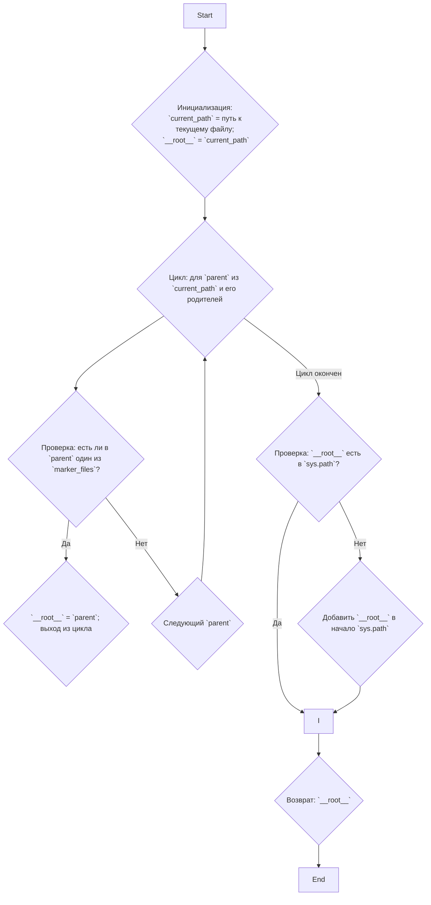

## АНАЛИЗ КОДА: `hypotez/src/endpoints/hypo69/desktop_assistant/header.py`

### 1. <алгоритм>

**Блок-схема:**



**Примеры:**

1. **Начало:**
    - `__file__` = `/path/to/hypotez/src/endpoints/hypo69/desktop_assistant/header.py`
    - `current_path` = `/path/to/hypotez/src/endpoints/hypo69/desktop_assistant`
    - `__root__` = `/path/to/hypotez/src/endpoints/hypo69/desktop_assistant`
2. **Поиск корня:**
    - Предположим, файл `__root__` находится в `/path/to/hypotez/`
    - Цикл проверяет пути:
        - `/path/to/hypotez/src/endpoints/hypo69/desktop_assistant`
        - `/path/to/hypotez/src/endpoints/hypo69`
        - `/path/to/hypotez/src/endpoints`
        - `/path/to/hypotez/src`
        - `/path/to/hypotez/`
    - Обнаружен `__root__` в `/path/to/hypotez/`
    - `__root__`  присваивается значение `/path/to/hypotez/`
3. **Добавление в `sys.path`:**
    - Если `/path/to/hypotez/` еще нет в `sys.path`, то он добавляется.
    - Функция возвращает `/path/to/hypotez/`

### 2. <mermaid>

```mermaid
flowchart TD
    A[<code>header.py</code> <br> Определить корень проекта] --> B{Инициализация: <br> `current_path` = путь к файлу;<br> `__root__` =  `current_path`};
    B --> C{Поиск родительских каталогов: <br> для `parent` в `current_path.parents`};
    C --> D{Проверка наличия файла: <br> есть ли  `marker_files` в `parent`?};
    D -- "Да" --> E{Найдено: <br> `__root__` = `parent`; <br> Выход из цикла};
    D -- "Нет" --> C;
    C --> F{Проверка: <br> `__root__` в `sys.path`?};
    F -- "Нет" --> G{Добавить в начало `sys.path`: <br> `sys.path.insert(0, str(__root__))`};
    F -- "Да" --> H;
    G --> H;
    H --> I{Возврат: <br> `__root__`};
```

**Объяснение зависимостей:**

1.  **`sys`**: Модуль `sys` используется для доступа к системным переменным, в частности `sys.path` используется для добавления пути к корню проекта, чтобы при импорте не выходила ошибка `ModuleNotFoundError: No module named`.
2.  **`pathlib.Path`**: Класс `Path` из модуля `pathlib` обеспечивает удобный и объектно-ориентированный способ работы с файловыми путями. Он используется для представления путей к файлам и директориям и для операций поиска и манипуляций с путями.

### 3. <объяснение>

**Импорты:**

*   `import sys`:
    *   **Назначение:** Предоставляет доступ к переменным и функциям, которые взаимодействуют с интерпретатором Python, в частности, к `sys.path` для модификации пути поиска модулей.
    *   **Связь с `src`**: Используется для добавления пути к корню проекта в `sys.path`, чтобы модули из пакета `src` могли быть импортированы без ошибок.
*  `from pathlib import Path`:
    *   **Назначение**: `Path` используется для представления путей в файловой системе и их манипуляции.
    *   **Связь с `src`**: Используется для определения корня проекта, манипулируя путями к файлам и каталогам.

**Функции:**

*   `set_project_root(marker_files=('__root__', '.git')) -> Path`:
    *   **Аргументы:**
        *   `marker_files` (tuple, optional): Набор имен файлов или каталогов, которые используются в качестве маркеров для определения корня проекта. По умолчанию `('__root__', '.git')`.
    *   **Возвращаемое значение:** `Path` - путь к корню проекта (Path).
    *   **Назначение:** Функция ищет корень проекта, начиная с каталога, где расположен файл, поднимаясь вверх по дереву каталогов, пока не найдет каталог, содержащий один из файлов, указанных в `marker_files`. Если корень проекта не найден, возвращает путь к каталогу, где расположен файл. После того как корень проекта определен, он добавляется в `sys.path` для того, чтобы интерпретатор Python мог корректно находить импортируемые модули.
    *   **Примеры:**
        - если `marker_files` содержит `__root__` в текущем каталоге, то `__root__` будет равен текущему каталогу.
        - если `marker_files` содержит `.git` в родительском каталоге, то `__root__` будет равен родительскому каталогу.

**Переменные:**

*   `__root__`:
    *   **Тип:** `Path`
    *   **Использование:** Хранит путь к корню проекта. Изначально присваивается значение пути к текущей директории, после чего обновляется в процессе поиска корня проекта.
* `current_path`:
   *   **Тип:** `Path`
   *   **Использование:**  Хранит путь к текущей директории скрипта, используется как отправная точка для поиска корня проекта.

**Потенциальные ошибки и области для улучшения:**

*   **Обработка ошибок:** В коде нет обработки исключений. Если ни один из `marker_files` не будет найден, функция вернет путь к каталогу скрипта, что может вызвать ошибку, если это не корень проекта.
*   **Гибкость `marker_files`:** Возможно, стоит сделать возможность указывать больше типов маркеров.
*   **Производительность:** Поиск по родительским каталогам может занять некоторое время, особенно в больших проектах. Можно рассмотреть кэширование результата поиска корня.

**Взаимосвязь с другими частями проекта:**

*   `__root__` используется как глобальная переменная в рамках пакета `hypotez` для определения путей к другим модулям и файлам проекта. Это позволяет импортировать модули из проекта используя абсолютные пути, не завися от текущей рабочей директории.

**Цепочка взаимосвязей:**

1.  Этот модуль (`header.py`) определяет корень проекта.
2.  `__root__` импортируется во многих модулях, таких как `src.gs`, для определения абсолютных путей к файлам и модулям.
3.  Другие модули импортируют модули из `src`, используя путь, добавленный в `sys.path`.
4.  Зависимости между модулями становятся явными и легко управляемыми.