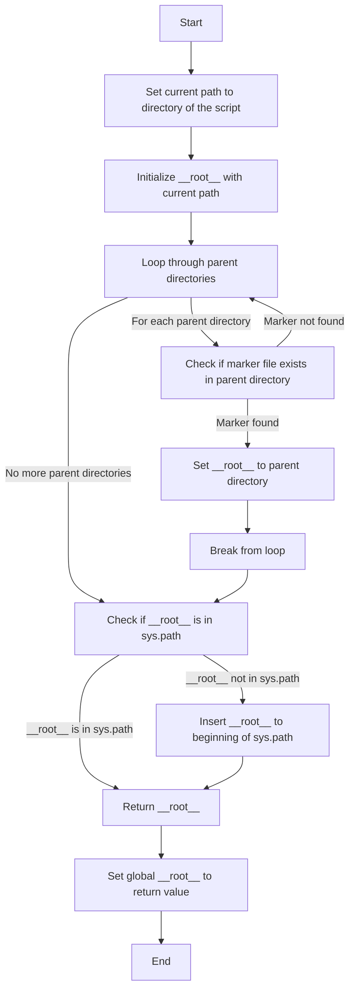
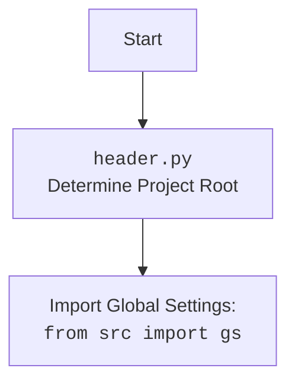

## <алгоритм>

1.  **Начало:** Программа начинает выполнение с вызова функции `set_project_root()`.
    *   Пример: `set_project_root(marker_files=('__root__', '.git'))`
2.  **Инициализация:** Внутри функции `set_project_root()`, текущий путь к файлу (`__file__`) преобразуется в абсолютный путь и определяется родительский каталог `current_path`.  `__root__` инициализируется как `current_path`.
    *   Пример: Если `__file__` это `/src/endpoints/hypo69/header.py`, то `current_path` будет `/src/endpoints/hypo69`.
3.  **Поиск корневого каталога:** Функция перебирает каталоги, начиная с `current_path` и двигаясь вверх по дереву каталогов, к родительским. Для каждого каталога `parent` проверяется наличие файлов или каталогов, указанных в `marker_files`.
    *   Пример: `parent` может быть `/src/endpoints/hypo69`, `/src/endpoints`, `/src`.
4.  **Проверка маркеров:** Для каждого `parent` проверяется, существует ли любой из `marker_files` (например, "__root__" или ".git") в текущем каталоге.
    *   Пример: Проверяется наличие файлов `/src/endpoints/hypo69/__root__` , `/src/endpoints/hypo69/.git` и тд.
5.  **Обновление корня:** Если хотя бы один маркер найден, текущий `parent` объявляется корневым каталогом `__root__`, и цикл поиска прекращается.
    *   Пример: Если файл `/src/.git` существует, то `/src` станет корневым каталогом.
6.  **Добавление в sys.path:** Если `__root__` не присутствует в `sys.path`, он добавляется в начало. Это нужно, чтобы программа могла импортировать модули из корневого каталога.
    *   Пример: `/src` добавляется в `sys.path`.
7.  **Возврат корня:** Функция возвращает `__root__` в виде объекта `Path`.
    *   Пример: Функция возвращает объект `Path` представляющий каталог `/src`.
8.  **Присвоение:** Возвращенное значение `__root__` присваивается глобальной переменной `__root__`.
    *   Пример: Глобальная переменная `__root__` становится объектом `Path` для `/src`.
9.  **Конец:** Программа продолжает выполнение, используя определенный корневой каталог.

## <mermaid>

**Объяснение зависимостей в mermaid:**

*   **`Start`**: Начало выполнения скрипта.
*   **`SetCurrentPath`**: Определение абсолютного пути к каталогу, содержащему текущий файл (скрипт).
*   **`InitializeRoot`**: Инициализация переменной `__root__` текущим путем.
*   **`LoopThroughParents`**: Цикл, который перебирает родительские каталоги, начиная с текущего и двигаясь вверх по дереву каталогов.
*  **`CheckForMarker`**: Проверка наличия файлов-маркеров в текущем родительском каталоге.
*  **`SetRoot`**: Если маркер найден, то переменная `__root__` устанавливается в текущий родительский каталог.
*  **`StopLoop`**: Прерывание цикла перебора родительских каталогов, если маркер найден.
*  **`CheckInSysPath`**: Проверка наличия корневого каталога в списке путей поиска модулей.
*  **`InsertPath`**: Добавление корневого каталога в начало списка путей поиска модулей.
*  **`ReturnRoot`**: Возврат значения переменной `__root__` из функции.
*  **`SetGlobalRoot`**: Присвоение возвращенного значения переменной `__root__` в глобальной области видимости.
*   **`End`**: Конец выполнения скрипта.

## <объяснение>

### Импорты:

1.  `import sys`: Модуль `sys` предоставляет доступ к некоторым переменным и функциям, используемым или поддерживаемым интерпретатором Python. В данном коде используется для доступа и модификации списка путей поиска модулей (`sys.path`). Это необходимо для того, чтобы модули, находящиеся в корневом каталоге, могли быть импортированы.
2.  `from pathlib import Path`: Модуль `pathlib` предоставляет классы для представления путей файловой системы. `Path` используется для работы с путями как с объектами, что упрощает операции с каталогами и файлами.

### Функции:

1.  **`set_project_root(marker_files: tuple = ('__root__', '.git')) -> Path`**
    *   **Аргументы:**
        *   `marker_files` (tuple, необязательный): Кортеж строк, представляющих имена файлов или каталогов, которые используются для определения корневого каталога проекта. По умолчанию используется `('__root__', '.git')`.
    *   **Возвращаемое значение:**
        *   `Path`: Объект `Path`, представляющий абсолютный путь к корневому каталогу проекта. Если корневой каталог не найден, то возвращается путь к каталогу, где расположен текущий скрипт.
    *   **Назначение:** Функция ищет корневой каталог проекта, начиная с каталога, в котором расположен текущий файл, и поднимаясь вверх по дереву каталогов, пока не найдёт один из `marker_files`.  Найденный корневой каталог добавляется в `sys.path`. Это позволяет импортировать модули из корневого каталога проекта.
    *   **Примеры:**
        *   Вызов `set_project_root()` найдет корневой каталог, используя маркеры по умолчанию.
        *   Вызов `set_project_root(marker_files=('.project', '.config'))` найдет корневой каталог, используя маркеры `.project` или `.config`.

### Переменные:

1.  `__root__` (Path): Глобальная переменная, которая хранит путь к корневому каталогу проекта. Она инициализируется при вызове `set_project_root()`.
2.  `current_path` (Path): Локальная переменная внутри функции `set_project_root`, представляющая путь к каталогу, где находится текущий файл.
3.  `parent` (Path): Локальная переменная внутри цикла `for`, представляющая родительский каталог в текущей итерации.
4.  `marker` (str): Локальная переменная внутри генераторного выражения, представляющая текущий маркер файла из `marker_files`.

### Потенциальные ошибки и области для улучшения:

1.  **Отсутствие обработки ошибок:** Функция не обрабатывает ситуации, когда ни один из маркерных файлов не найден. В таком случае она возвращает путь к каталогу, где находится скрипт. Возможно, стоит добавить логику для генерации исключения или логирования предупреждения в таких случаях.
2.  **Использование глобальной переменной:** Использование глобальной переменной `__root__` может быть не всегда желательным. Лучше было бы возвращать значение и использовать его по мере надобности, избегая глобального состояния.
3.  **Жестко заданные маркеры:**  Маркерные файлы заданы по умолчанию `('__root__', '.git')`. Можно было бы сделать их настраиваемыми через параметры или переменные окружения.
4.  **Неявная зависимость от наличия `__file__`:** Код полагается на наличие переменной `__file__`, что может быть проблемой при выполнении кода в интерактивном режиме или если код импортируется не из файла.
5. **Производительность:**  Для очень больших деревьев каталогов перебор всех родительских элементов может быть не оптимальным, но для типичных проектов это приемлемо.

### Взаимосвязи с другими частями проекта:
*   Этот файл устанавливает корневую директорию проекта, что позволяет всем другим модулям корректно импортировать модули и ресурсы.
*  Это важный компонент для `hypotez` чтобы обеспечить возможность импорта  модулей из любого места проекта.

**Цепочка взаимосвязей:**
`header.py` → Устанавливает `__root__` → используется для импорта других модулей проекта `src`.