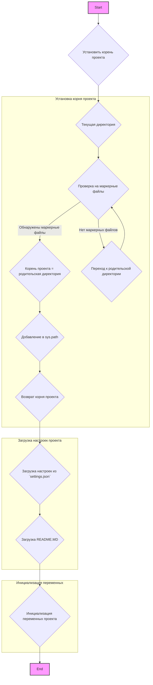

## Анализ кода `hypotez/src/endpoints/hypo69/header.py`

### 1. <алгоритм>

**Блок-схема:**



**Примеры для логических блоков:**

1. **Установка корня проекта (B):**
    - Ищет маркерные файлы, например, `__root__`, начиная с текущей директории файла.
    - Пример: если `header.py` находится в `/hypotez/src/endpoints/hypo69`, а маркер `__root__` находится в `/hypotez`, то корень проекта будет `/hypotez`.

2. **Текущая директория (C):**
    - Определяет директорию, в которой находится текущий файл `header.py`.
    - Пример:  `/hypotez/src/endpoints/hypo69`.

3. **Проверка на маркерные файлы (D):**
   - Проверяет существование маркерных файлов в текущей директории и всех родительских директориях.
   - Пример: Если маркерный файл `__root__` не существует в `/hypotez/src/endpoints/hypo69` но он существует в `/hypotez`, то алгоритм продолжит выполняться дальше.

4. **Корень проекта = родительская директория (E):**
    - Если маркерный файл найден, то родительская директория становится корнем проекта.
    - Пример: `/hypotez`.

5. **Переход к родительской директории (F):**
    - Если маркерный файл не найден, переходим к родительской директории.
    - Пример: из `/hypotez/src/endpoints/hypo69` переходим к `/hypotez/src/endpoints`.

6. **Добавление в sys.path (G):**
    - Добавляет корень проекта в `sys.path` для корректного импорта модулей.

7.  **Возврат корня проекта (H):**
    -  Возвращает корень проекта в виде объекта `Path` .
     - Пример: `/hypotez`.

8. **Загрузка настроек из `settings.json` (I):**
    - Пытается загрузить настройки из файла `settings.json` (если он существует) в переменную `settings` и при возникновении ошибки переменная остается `None`.
    - Пример: `settings = { "project_name": "hypotez", "version": "0.1.0", ... }`.

9. **Загрузка README.MD (J):**
    - Пытается загрузить текст из `README.MD` в переменную `doc_str` и при возникновении ошибки переменная остается `None`.

10. **Инициализация переменных проекта (K):**
   - Инициализирует переменные проекта `__project_name__`, `__version__`, `__doc__`, `__details__`, `__author__`, `__copyright__`, и `__cofee__` на основе данных из `settings.json` (если он был загружен) или значений по умолчанию.

### 2. <mermaid>

```mermaid
flowchart TD
    Start --> FindRoot[set_project_root: <br>Find project root using marker files];
    FindRoot --> PathObject[__root__: <br>Path to project root];
    PathObject --> ImportGS[Import Global Settings: <br><code>from src import gs</code>];
    ImportGS --> LoadSettings[Load settings:<br> <code>settings = json.load(...)</code>];
    LoadSettings --> LoadReadme[Load README.MD:<br><code>doc_str = settings_file.read()</code>];
    LoadReadme --> InitializeVariables[Initialize project variables:<br><code>__project_name__</code>, <code>__version__</code>, etc.];
     InitializeVariables --> End;
    
    style Start fill:#f9f,stroke:#333,stroke-width:2px
    style End fill:#f9f,stroke:#333,stroke-width:2px
    
    subgraph "Module: header.py"
        FindRoot
        PathObject
        ImportGS
        LoadSettings
        LoadReadme
        InitializeVariables
    end
```

**Объяснение `mermaid` диаграммы:**

- `Start`: Начало выполнения скрипта `header.py`.
- `FindRoot`: Функция `set_project_root` определяет корневую директорию проекта, используя маркерные файлы.
- `PathObject`: Переменная `__root__` хранит объект `Path` к корневой директории проекта.
- `ImportGS`: Импортируются глобальные настройки из модуля `src.gs`, который содержит информацию о путях.
- `LoadSettings`: Загрузка настроек проекта из файла `settings.json`.
- `LoadReadme`: Загрузка содержимого файла `README.MD`.
- `InitializeVariables`: Инициализация переменных проекта, таких как `__project_name__`, `__version__` и других, с использованием данных из `settings.json` или значений по умолчанию.
- `End`: Конец выполнения скрипта `header.py`.

### 3. <объяснение>

**Импорты:**

- `import sys`: Модуль `sys` используется для доступа к переменным и функциям, которые взаимодействуют с интерпретатором Python. В данном случае используется для добавления пути к корневой директории проекта в `sys.path`, что позволяет импортировать модули из этого каталога.
- `import json`: Модуль `json` используется для работы с данными в формате JSON. Здесь применяется для загрузки настроек проекта из файла `settings.json`.
- `from packaging.version import Version`: Из модуля `packaging.version` импортируется класс `Version` ,но в данном файле не используется.
- `from pathlib import Path`: Из модуля `pathlib` импортируется класс `Path`, который предоставляет удобный способ работы с путями к файлам и директориям.
- `from src import gs`: Из модуля `src` импортируется подмодуль `gs`, предположительно, содержащий глобальные настройки и пути.

**Функция `set_project_root`:**

-   **Аргументы**:
    -   `marker_files` (tuple, optional): Кортеж, содержащий имена файлов или папок, которые используются для определения корня проекта. По умолчанию `('__root__')`.
-   **Возвращаемое значение**:
    -   `Path`: Объект `Path` представляющий путь к корню проекта.

**Пример вызова функции:**

```python
from pathlib import Path
root_dir = set_project_root(marker_files=('__root__', '.git'))
print(root_dir)  # Выведет Path к корневой директории проекта
```

**Переменные:**

- `MODE`: Глобальная переменная, устанавливающая режим работы приложения (`'dev'`).
- `__root__`: Переменная, хранящая путь к корневой директории проекта, вычисленный функцией `set_project_root`.
- `settings`: Словарь, загруженный из `settings.json`, содержащий настройки проекта. Инициализируется как `None` и заполняется в блоке `try`.
- `doc_str`: Строка, загруженная из `README.MD`, содержащая описание проекта.  Инициализируется как `None` и заполняется в блоке `try`.
- `__project_name__`: Название проекта, полученное из `settings.json` или `'hypotez'` по умолчанию.
- `__version__`: Версия проекта, полученная из `settings.json` или `''` по умолчанию.
- `__doc__`: Описание проекта, полученное из `README.MD` или `''` по умолчанию.
- `__details__`: Дополнительная информация о проекте (в данном коде остается пустой строкой).
- `__author__`: Автор проекта, полученный из `settings.json` или `''` по умолчанию.
- `__copyright__`: Авторское право проекта, полученное из `settings.json` или `''` по умолчанию.
- `__cofee__`: Сообщение для пожертвования на кофе, полученное из `settings.json` или значение по умолчанию.

**Потенциальные ошибки и области для улучшения:**

- **Обработка ошибок при загрузке файлов:** При загрузке `settings.json` и `README.MD` используются блоки `try-except`, но исключения обрабатываются просто пропуском (`...`).  Желательно добавить логирование ошибок или предпринять другие действия для более надежной работы.
- **Использование `gs`:**  Зависимость от `src.gs` делает этот файл менее переносимым. Стоит рассмотреть возможность передачи путей в качестве параметров или использования конфигурационных файлов.
- **Отсутствие проверок:** Отсутствуют проверки корректности данных, загруженных из файла `settings.json`.
- **Использование  магических строк:** Значения  по умолчанию для `__cofee__` является магической строкой и ее нужно вынести в константу.

**Взаимосвязь с другими частями проекта:**

- **Зависимость от `src.gs`:** Этот файл зависит от модуля `src.gs`, который, по-видимому, предоставляет пути к другим частям проекта.
- **Использование настроек:** Переменные, инициализированные в этом файле, используются в других частях проекта, например, для определения имени, версии и описания.

В целом, этот код выполняет важную функцию определения корня проекта, загрузки его настроек и инициализации переменных. Однако он может быть улучшен за счет более надежной обработки ошибок, переносимости и проверок данных.