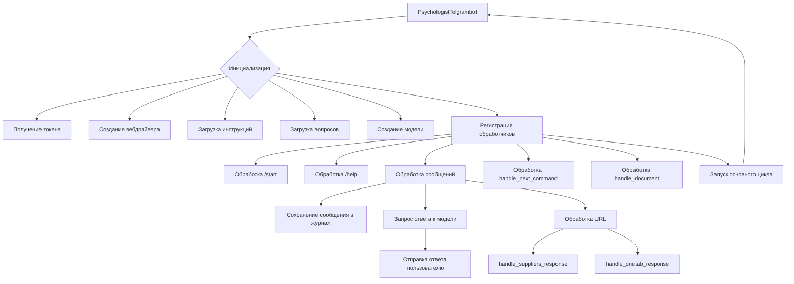

# <input code>

```python
## \file hypotez/src/endpoints/hypo69/psychologist_bot/bot.py
# -*- coding: utf-8 -*-\
#! venv/Scripts/python.exe
#! venv/bin/python/python3.12

"""
.. module: src.endpoints.hypo69.psychologist_bot 
	:platform: Windows, Unix
	:synopsis:

"""
MODE = 'dev'

"""
	:platform: Windows, Unix
	:synopsis:

"""

"""
	:platform: Windows, Unix
	:synopsis:

"""


"""
  :platform: Windows, Unix

"""
"""
  :platform: Windows, Unix
  :platform: Windows, Unix
  :synopsis:
"""MODE = 'dev'
  
""" module: src.endpoints.hypo69.psychologist_bot """


...
""" t.me/hypo69_psychologist_bot_bot's specific bot with customized behavior."""

import asyncio
from pathlib import Path
from typing import Optional
from dataclasses import dataclass, field
import random
from telegram import Update
from telegram.ext import CommandHandler, MessageHandler, filters, CallbackContext

from src import gs
from src.bots.telegram import TelegramBot
from src.webdriver.driver import Driver, Chrome
from src.ai.gemini import GoogleGenerativeAI
from src.utils.file import read_text_file, recursively_read_text_files, save_text_file
from src.utils.url import is_url
from src.logger import logger

@dataclass
class PsychologistTelgrambot(TelegramBot):
    """Telegram bot with custom behavior for Kazarinov."""

    token: str = field(init=False)
    d: Driver = field(init=False)
    model: GoogleGenerativeAI = field(init=False)
    system_instruction: str = field(init=False)
    questions_list: list = field(init=False)
    timestamp: str = field(default_factory=lambda: gs.now)

    def __post_init__(self):
        mode = 'test'
        #self.token = gs.credentials.telegram.hypo69_test_bot if mode == 'test' else gs.credentials.telegram.hypo69_psychologist_bot
        self.token = gs.credentials.telegram.hypo69_psychologist_bot
        super().__init__(self.token)

        self.d = Driver(Chrome)
        
        self.system_instruction = read_text_file(
            gs.path.google_drive / 'hypo69_psychologist_bot' / 'prompts' / 'chat_system_instruction.txt'
        )
        self.questions_list = recursively_read_text_files(
            gs.path.google_drive / 'hypo69_psychologist_bot' / 'prompts' / 'train_data' / 'q', ['*.*'], as_list=True
        )

        self.model = GoogleGenerativeAI(
            api_key=gs.credentials.gemini.hypo69_psychologist_bot,
            system_instruction=self.system_instruction,
            generation_config={"response_mime_type": "text/plain"}
        )
        
        self.register_handlers()

    # ... (other methods)
```

# <algorithm>

**Блок-схема алгоритма:**

1. **Инициализация:**
   - Создается экземпляр класса `PsychologistTelgrambot`.
   - Получается токен Telegram бота из `gs.credentials`.
   - Создается экземпляр вебдрайвера `Driver` с использованием Chrome.
   - Загружаются системные инструкции из файла.
   - Загружается список вопросов из каталога.
   - Создается экземпляр модели `GoogleGenerativeAI`.
   - Регистрируются обработчики команд и сообщений.

2. **Обработка команд:**
   - `/start` - отвечает приветствием.
   - `/help` - (предполагается обработка помощи).
   - Обработка текстовых сообщений.
     - Сохраняет сообщение пользователя в файл журналов.
     - Запрашивает ответ у модели `GoogleGenerativeAI` с использованием полученного вопроса и истории диалога.
     - Отправляет ответ пользователю.

3. **Обработка URL-ссылок:**
   - Функция `get_handler_for_url` определяет соответствующий обработчик на основе префикса URL.
   - `handle_suppliers_response` - обработчик для URL поставщиков.
   - `handle_onetab_response` - обработчик для URL сервиса OneTab.


4. **Обработка других команд:**
   - `handle_next_command` - генерирует случайный вопрос из списка и запрашивает ответ у модели.
   - `handle_document` - обрабатывает загруженные документы, выводит их содержимое.


5. **Запуск бота:**
   - Запускается основной цикл обработки событий Telegram бота.


**Пример данных:**

- **Входные данные:**  Пользователь отправляет сообщение: "Привет, как дела?"
- **Передача данных:** Полученное сообщение хранится в `response`.
- **Обработка:** `self.model.ask` обращается к внешней модели, получает ответ.
- **Вывод данных:**  Ответ отправляется пользователю.


# <mermaid>



# <explanation>

**Импорты:**

- `asyncio`: Для асинхронной работы.
- `pathlib`: Для работы с путями к файлам.
- `typing`: Для указания типов.
- `dataclasses`: Для создания данных классов.
- `random`: Для генерации случайных чисел.
- `telegram`, `telegram.ext`: Библиотеки для работы с Telegram API.
- `src.gs`, `src.bots.telegram`, `src.webdriver.driver`, `src.ai.gemini`, `src.utils.file`, `src.utils.url`, `src.logger`: Импортируются модули из собственного проекта `src`.  Это говорит о модульной структуре проекта, где отдельные компоненты (в данном случае, подключение к Google drive, боты, вебдрайверы, генерация текста и логирование) объединены в рамках проекта.  Необходимо изучить `src` чтобы понять детали, например, как работает `gs` для взаимодействия с Google Drive.

**Классы:**

- `PsychologistTelgrambot(TelegramBot)`: Наследует функциональность базового класса `TelegramBot`, добавляя специфические методы для психологического бота. Атрибуты `token`, `d`, `model`, `system_instruction`, `questions_list`, `timestamp` хранят необходимые данные для работы бота. `__post_init__` используется для инициализации дополнительных параметров. `register_handlers` регистрирует обработчики команд и сообщений.  Важно, что `TelegramBot` и `PsychologistTelgrambot` предполагают взаимодействие с другими компонентами проекта, скорее всего, для хранения данных и доступа к API.

**Функции:**

- `start`, `help_command`, `handle_message`, `handle_voice`, `handle_document`, `get_handler_for_url`, `handle_suppliers_response`, `handle_onetab_response`, `handle_next_command`:  Каждая функция отвечает за определенную задачу (обработка команд, сообщений, документов, URL). `handle_message` является ключевой, запрашивая ответ у модели `GoogleGenerativeAI`. `get_handler_for_url` предоставляет роутинг к различным обработчикам в зависимости от входных URL.  Обратите внимание на `async` ключевое слово, используемое для асинхронных функций.

**Переменные:**

- `MODE`, `token`: Хранят конфигурационные данные.
- `questions_list`: Список вопросов для случайной генерации.

**Возможные ошибки и улучшения:**

- **Недостаточное описание функциональности:**  Необходимо более детальное описание методов `handle_suppliers_response` и `handle_onetab_response`.  На данный момент не ясна логика обработки ответов и как они связаны с внешними API (`self.mexiron`).
- **Отсутствие обработки ошибок:** В `handle_next_command` есть `try...except`, но не хватает проверки на пустой список вопросов `questions_list`. Добавьте проверки ошибок на каждом этапе, особенно при чтении из файлов.
- **Журналирование:** Журналирование полезно, но может быть более информативным, если включать ID пользователя, тип сообщения и время.
- **Детализация обработки URL:** Необходимо объяснить, как происходит построение URL-обработчиков.
- **`mexiron`:** Не ясен механизм работы с модулем `mexiron`. Необходимо уточнить, как он используется для обработки ответов на URL, какие данные он принимает и возвращает, и как происходит взаимодействие между `mexiron` и `TelegramBot`.  Предполагается, что `mexiron` это какой-то внешние модуль для обработки веб-ссылок или сценариев.


**Цепочка взаимосвязей:**

Код взаимодействует с несколькими частями проекта через импорты (`src.*`).  `gs` взаимодействует с Google Drive, `GoogleGenerativeAI` использует API для получения ответов на вопросы, `telegram.ext` взаимодействует с Telegram API.  `self.mexiron` предполагает подключение к стороннему API для обработки URL.  Взаимодействие между `mexiron` и `PsychologistTelgrambot` нуждается в дополнительном описании.