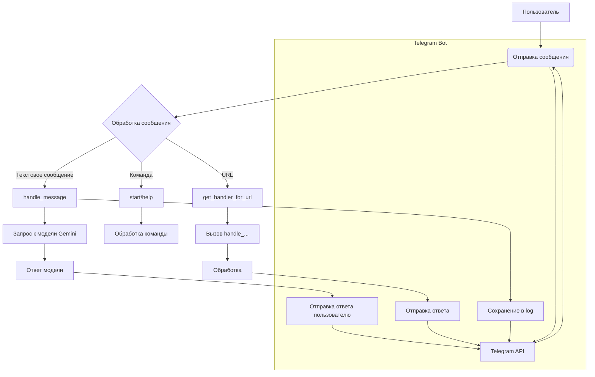

# <input code>

```python
## \file hypotez/src/endpoints/hypo69/psychologist_bot/bot.py
# -*- coding: utf-8 -*-\
#! venv/Scripts/python.exe
#! venv/bin/python/python3.12

"""
.. module: src.endpoints.hypo69.psychologist_bot 
	:platform: Windows, Unix
	:synopsis:

"""
MODE = 'dev'


"""
	:platform: Windows, Unix
	:synopsis:

"""


"""
	:platform: Windows, Unix
	:synopsis:

"""


"""
  :platform: Windows, Unix

"""
"""
  :platform: Windows, Unix
  :platform: Windows, Unix
  :synopsis:
"""MODE = 'dev'
  
""" module: src.endpoints.hypo69.psychologist_bot """


...
""" t.me/hypo69_psychologist_bot_bot's specific bot with customized behavior."""

import asyncio
from pathlib import Path
from typing import Optional
from dataclasses import dataclass, field
import random
from telegram import Update
from telegram.ext import CommandHandler, MessageHandler, filters, CallbackContext

from src import gs
from src.bots.telegram import TelegramBot
from src.webdriver import Driver, Chrome
from src.ai.gemini import GoogleGenerativeAI
from src.utils.file import read_text_file, recursively_read_text_files, save_text_file
from src.utils.url import is_url
from src.logger import logger

@dataclass
class PsychologistTelgrambot(TelegramBot):
    """Telegram bot with custom behavior for Kazarinov."""

    token: str = field(init=False)
    d: Driver = field(init=False)
    model: GoogleGenerativeAI = field(init=False)
    system_instruction: str = field(init=False)
    questions_list: list = field(init=False)
    timestamp: str = field(default_factory=lambda: gs.now)

    def __post_init__(self):
        mode = 'test'
        #self.token = gs.credentials.telegram.hypo69_test_bot if mode == 'test' else gs.credentials.telegram.hypo69_psychologist_bot
        self.token = gs.credentials.telegram.hypo69_psychologist_bot
        super().__init__(self.token)

        self.d = Driver(Chrome)
        
        self.system_instruction = read_text_file(
            gs.path.google_drive / 'hypo69_psychologist_bot' / 'prompts' / 'chat_system_instruction.txt'
        )
        self.questions_list = recursively_read_text_files(
            gs.path.google_drive / 'hypo69_psychologist_bot' / 'prompts' / 'train_data' / 'q', ['*.*'], as_list=True
        )

        self.model = GoogleGenerativeAI(
            api_key=gs.credentials.gemini.hypo69_psychologist_bot,
            system_instruction=self.system_instruction,
            generation_config={"response_mime_type": "text/plain"}
        )
        
        self.register_handlers()

    # ... (rest of the code)
```

# <algorithm>

**Шаг 1:**  Инициализация бота `PsychologistTelgrambot`

   - Получает токен для Telegram бота из `gs.credentials`.
   - Создает экземпляр драйвера `Driver` с использованием браузера Chrome (`Driver(Chrome)`).
   - Загружает инструкции для модели `GoogleGenerativeAI` из файла `chat_system_instruction.txt`.
   - Загружает список вопросов из папки `train_data/q` с помощью `recursively_read_text_files`.
   - Создает экземпляр модели `GoogleGenerativeAI` с загруженными инструкциями и API ключом.
   - Регистрирует обработчики команд и сообщений `register_handlers()`.

**Шаг 2:** Регистрация обработчиков `register_handlers()`

   - Регистрирует обработчик для команды `/start`.
   - Регистрирует обработчик для команды `/help`.
   - Регистрирует обработчик для текстовых сообщений (`filters.TEXT & ~filters.COMMAND`).
   - Регистрирует обработчик для голосовых сообщений (`filters.VOICE`).
   - Регистрирует обработчик для документов (`filters.Document.ALL`).

**Шаг 3:** Обработка сообщений `handle_message()`

   - Получает текст сообщения `response` и `user_id`.
   - Сохраняет текст сообщения в файл `chat_logs.txt`.
   - Использует модель `GoogleGenerativeAI` для получения ответа на вопрос `response` и сохраняет историю в файл `user_id.txt`.
   - Отправляет ответ пользователю.

**Шаг 4:** Обработка команд `start`, `help` и др.

   - Обрабатывает команды `/start` и `/help` с использованием функций `start()` и `help_command()`.

**Шаг 5:** Обработка URL (при наличии) `get_handler_for_url()`

   - Проверяет, начинается ли сообщение с URL из словаря `url_handlers`.
   - Если да, вызывает соответствующую функцию обработки URL, например, `handle_suppliers_response()`.

**Шаг 6:** Обработка URL (`handle_suppliers_response`, `handle_onetab_response`)

    - Запускает сценарий `run_scenario` на URL'е.
    - Отправляет ответ пользователю.

**Шаг 7:**  Обработка команды `--next` `handle_next_command()`

   - Выбирает случайный вопрос из `questions_list`.
   - Запрашивает ответ от модели `GoogleGenerativeAI` на выбранный вопрос.
   - Отправляет вопрос и ответ пользователю.


**Шаг 8:** Обработка файлов `handle_document()`

   - Обрабатывает загруженные документы и отправляет подтверждение с содержанием файла пользователю.

**Шаг 9:** Запуск бота `if __name__ == "__main__":`

   - Создает экземпляр `PsychologistTelgrambot`.
   - Запускает бота с использованием `asyncio.run(kt.application.run_polling())`.


# <mermaid>



**Объяснение диаграммы:**

Диаграмма описывает взаимодействие между пользователем и ботом. Пользователь отправляет сообщение (текст, команду или URL), которое обрабатывается ботом.  Обработка может включать запрос к внешней модели (Gemini), сохранение лога сообщений, отправку ответа обратно пользователю.  Блок `Telegram API` представляет взаимодействие с Telegram сервером для отправки и получения сообщений.


# <explanation>

**Импорты:**

- `asyncio`:  Для асинхронной работы бота.
- `pathlib`: Для работы с путями к файлам.
- `typing`: Для типов данных.
- `dataclasses`: Для создания данных-классов.
- `random`: Для случайного выбора вопроса.
- `telegram`: Для взаимодействия с Telegram API.
- `telegram.ext`: Для создания обработчиков команд и сообщений.
- `src.gs`:  Предположительно, модуль для доступа к глобальным ресурсам (напр., конфигурации, хранилищу данных).  Связь с другими частями проекта через `gs.credentials`, `gs.path` и т.д.
- `src.bots.telegram`: Модуль для создания Telegram ботов (возможно, содержит базовый класс для `TelegramBot`).
- `src.webdriver`:  Модуль для управления браузером (WebDriver) - возможно, для web-скрейпинга.
- `src.ai.gemini`:  Модуль для взаимодействия с моделью Gemini.
- `src.utils.file`: Функции для работы с файлами (чтение, запись).
- `src.utils.url`: Функции для проверки URL.
- `src.logger`: Модуль для логирования.


**Классы:**

- `PsychologistTelgrambot(TelegramBot)`:  Наследует функциональность базового класса `TelegramBot`, добавляя специфические методы для психолога-бота.
    - `token`, `d`, `model`, `system_instruction`, `questions_list`:  Атрибуты, хранящие токен, драйвер, модель, инструкции и список вопросов соответственно.  Инициализируются в методе `__post_init__`.


**Функции:**

- `__post_init__(self)`:  Инициализирует бота, загружает конфигурацию и регистрирует обработчики.
- `register_handlers(self)`: Регистрирует обработчики для различных событий (команд, сообщений).
- `start(self, update: Update, context: CallbackContext)`: Обрабатывает команду `/start`.
- `handle_message(self, update: Update, context: CallbackContext)`:  Обрабатывает текстовые сообщения от пользователя, взаимодействуя с моделью Gemini.
- `handle_voice(self, update: Update, context: CallbackContext)`: Обработчик голосовых сообщений.
- `handle_document(self, update: Update, context: CallbackContext)`: Обработка документов.
- `handle_suppliers_response(self, update: Update, response: str)`: Обработка URL'ей поставщиков.
- `handle_onetab_response(self, update: Update, response: str)`: Обработка URL'ей сервиса onetab.
- `handle_next_command(self, update: Update)`:  Обрабатывает команду `--next`, запрашивая случайный вопрос и ответ.
- `get_handler_for_url(self, response: str)`:  Назначение обработчиков на основе URL.


**Переменные:**

- `MODE`:  Переменная, определяющая режим работы (различие тестов и рабочего состояния).
- `gs.credentials`, `gs.path`:  Переменные, хранящие настройки и пути, вероятно, определены в другом модуле `src.gs`.

**Возможные ошибки и улучшения:**

- **Обработка ошибок:**  Блок `try...except` в `handle_next_command` обрабатывает ошибку `FileNotFoundError`, но недостаточно. Добавьте обработку более широкого спектра возможных исключений.
- **Логирование:** Логирование используется, но может быть расширено, чтобы выводить более подробную информацию.
- **Обработка исключений:**  Не хватает обработчиков для других возможных исключений, таких как проблемы с подключением к API, проблемы с чтением файлов и др.
- **mexiron:**  Не ясна роль `mexiron`. Необходимо добавить описание и реализацию этого модуля для полного понимания функциональности.
- **Типизация:** В некоторых местах можно использовать более специфическую типизацию для переменных и возвращаемых значений.
- **Чтение из файлов:**  Возможно, нужно пересмотреть способ чтения вопросов из файлов, чтобы избежать проблем с кодировкой или форматом.
- **URL-обработка:**  Добавить проверку корректности URL, чтобы избежать невалидных адресов.


**Цепочка взаимосвязей:**

Код бота зависит от функций и классов в модулях `src`, особенно от `gs`, `TelegramBot`, `GoogleGenerativeAI`, `Driver` и `Chrome`.  Он взаимодействует с Telegram API для отправки и получения сообщений.  Для работы бота необходима подгрузка данных из файлов, расположенных в `gs.path.google_drive`.  Модель Gemini используется для генерации ответов. Код связан с другими частями проекта, поскольку использует модули из пакета `src`, в особенности для доступа к API.