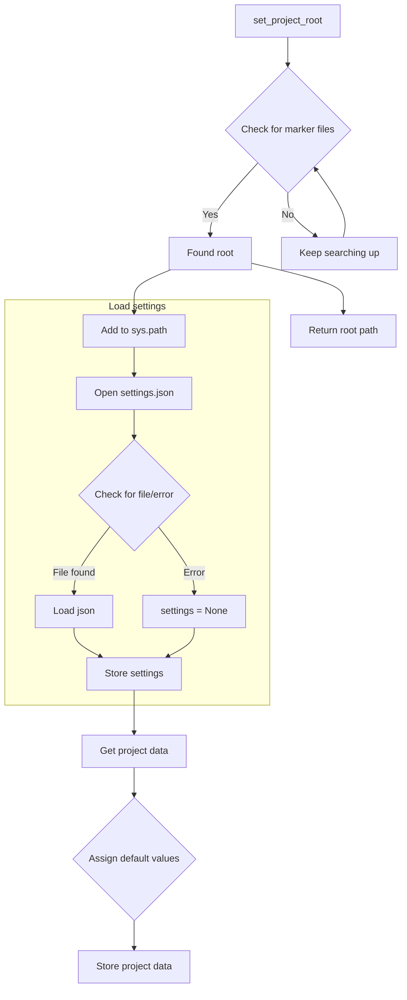

# <input code>

```python
## \file hypotez/src/endpoints/hypo69/psychologist_bot/header.py
# -*- coding: utf-8 -*-\
#! venv/Scripts/python.exe
#! venv/bin/python/python3.12

"""
.. module: src.endpoints.hypo69.psychologist_bot 
	:platform: Windows, Unix
	:synopsis:

"""
MODE = 'dev'

"""
	:platform: Windows, Unix
	:synopsis:

"""


"""
	:platform: Windows, Unix
	:synopsis:

"""


"""
  :platform: Windows, Unix

"""
"""
  :platform: Windows, Unix
  :platform: Windows, Unix
  :synopsis:
"""MODE = 'dev'
  
""" module: src.endpoints.hypo69.psychologist_bot """

import sys
import json
from packaging.version import Version

from pathlib import Path
def set_project_root(marker_files=('pyproject.toml', 'requirements.txt', '.git')) -> Path:
    """
    Finds the root directory of the project starting from the current file's directory,
    searching upwards and stopping at the first directory containing any of the marker files.

    Args:
        marker_files (tuple): Filenames or directory names to identify the project root.
    
    Returns:
        Path: Path to the root directory if found, otherwise the directory where the script is located.
    """
    __root__:Path
    current_path:Path = Path(__file__).resolve().parent
    __root__ = current_path
    for parent in [current_path] + list(current_path.parents):
        if any((parent / marker).exists() for marker in marker_files):
            __root__ = parent
            break
    if __root__ not in sys.path:
        sys.path.insert(0, str(__root__))
    return __root__


# Get the root directory of the project
__root__ = set_project_root()
"""__root__ (Path): Path to the root directory of the project"""

from src import gs

settings:dict = None
try:
    with open(gs.path.root / 'src' /  'settings.json', 'r') as settings_file:
        settings = json.load(settings_file)
except (FileNotFoundError, json.JSONDecodeError):
    ...

doc_str:str = None
try:
    with open(gs.path.root / 'src' /  'README.MD', 'r') as settings_file:
        doc_str = settings_file.read()
except (FileNotFoundError, json.JSONDecodeError):
    ...


__project_name__ = settings.get("project_name", 'hypotez') if settings  else 'hypotez'
__version__: str = settings.get("version", '')  if settings  else ''
__doc__: str = doc_str if doc_str else ''
__details__: str = ''
__author__: str = settings.get("author", '')  if settings  else ''
__copyright__: str = settings.get("copyrihgnt", '')  if settings  else ''
__cofee__: str = settings.get("cofee", "Treat the developer to a cup of coffee for boosting enthusiasm in development: https://boosty.to/hypo69")  if settings  else "Treat the developer to a cup of coffee for boosting enthusiasm in development: https://boosty.to/hypo69"
```

# <algorithm>

1. **Найти корень проекта:** Функция `set_project_root` ищет корневую директорию проекта, начиная от текущей директории файла и поднимаясь по иерархии. Она проверяет наличие файлов `pyproject.toml`, `requirements.txt`, и `.git` в родительских директориях.  
    * **Вход:** Кортеж файлов `marker_files` для поиска.
    * **Выход:** Путь до корневой директории проекта.

2. **Добавить корень проекта в sys.path:** Если корневая директория не находится в `sys.path`, то она добавляется в начало списка `sys.path`. Это необходимо для импорта модулей из корневой директории проекта.

3. **Загрузить настройки:** Файл `settings.json` ищется в корне проекта. Если он найден, то его содержимое парсится с использованием `json.load()` и сохраняется в переменной `settings`. Если файл не найден или некорректен, то переменной `settings` присваивается `None`.

4. **Загрузить документацию:** Файл `README.MD` ищется в корне проекта. Если он найден, то его содержимое читается и сохраняется в переменной `doc_str`. Если файл не найден или некорректен, то переменной `doc_str` присваивается `None`.

5. **Извлечь данные из настроек:** Из переменной `settings` извлекаются значения для `__project_name__`, `__version__`, `__doc__`, `__author__`, `__copyright__`, и `__cofee__`. Если `settings` - None, то используется значение по умолчанию.


# <mermaid>



# <explanation>

**Импорты:**

- `sys`: Модуль для доступа к системе. Используется для добавления корневой директории проекта в `sys.path`.
- `json`: Модуль для работы с JSON-файлами. Используется для загрузки настроек проекта из `settings.json`.
- `packaging.version`: Модуль для работы с версиями пакетов.  Используется, предположительно, для работы с версиями, но в данном коде не используется напрямую.
- `pathlib`: Модуль для работы с путями к файлам. Используется для получения пути к файлу `__file__` и работы с файлами проекта.
- `src.gs`:  Указан как импортируемый модуль, но не определен. Предположительно содержит полезные функции для работы с файлами и путями проекта.


**Классы:**

Нет определенных классов. Только вспомогательная функция `set_project_root`.


**Функции:**

- `set_project_root(marker_files)`: Ищет корневую директорию проекта, начиная с текущей директории, поднимаясь по дереву директорий до первой, содержащей файлы из `marker_files`. Возвращает путь к корню.


**Переменные:**

- `MODE`: Строковая константа, хранящая режим работы (предположительно, 'dev' или 'prod').
- `__root__`: Путь до корня проекта.
- `settings`: Словарь, содержащий настройки проекта, загружаемый из `settings.json`.
- `doc_str`: Строка, содержащая содержимое файла `README.MD`, загружаемая из `README.MD`.
- `__project_name__`, `__version__`, `__doc__`, `__author__`, `__copyright__`, `__cofee__`:  Строки, содержащие соответствующие данные из настроек проекта.


**Возможные ошибки и улучшения:**

- **Обработка ошибок:** Блоки `try...except` для загрузки `settings.json` и `README.MD` обрабатывают возможные `FileNotFoundError` и `json.JSONDecodeError`. Это важно, чтобы скрипт не падал при отсутствии файла или проблем с форматом файла.
- **Более специфичные исключения:** Обработка `json.JSONDecodeError` более точна, чем просто `Exception`.
- **Явное указание типов:** В Python 3.x  лучше явно указывать типы переменных, особенно когда это возможно. Это повышает читаемость и позволяет IDE лучше анализировать код. 
- **Документирование переменных:** Документирование переменных, особенно глобальных, должно быть более подробным и описывать их типы.
- **`gs`:** Необходимо указать назначение и местоположение модуля `gs`.


**Взаимосвязи с другими частями проекта:**

Скрипт `header.py` инициализирует переменные, необходимые для работы других компонентов проекта.  Он загружает настройки из `settings.json`,  использует функции из `gs` для работы с путями. Это значит, что этот модуль является частью инфраструктуры проекта и связан с другими файлами проекта через `settings.json`, `README.MD` и `src.gs`.