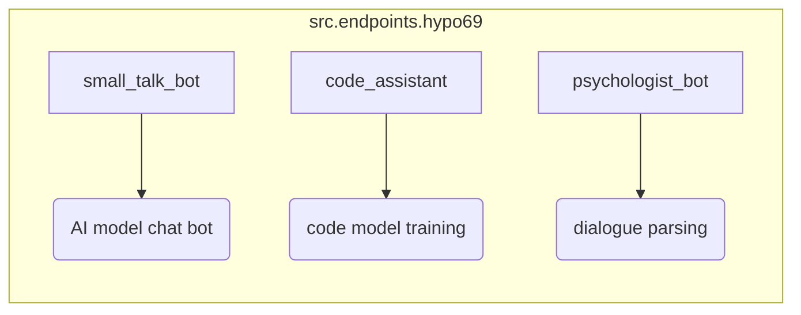

# Анализ кода модуля `src.endpoints.hypo69`

## <input code>

```rst
.. module: src.endpoints.hypo69
    .. synopsys: endpoints for the developer
```

### **hypo69 Module**: endpoints for the developer
**small_talk_bot** - AI model chat bot  
**code_assistant** - module for training the project's code model  
**psychologist_bot** - early development of the dialogue parsing module
```

## <algorithm>

Поскольку предоставленный код представляет собой документацию, а не исполняемый код, построить блок-схему алгоритма невозможно.  Документация описывает модуль `src.endpoints.hypo69` и его составляющие: `small_talk_bot`, `code_assistant` и `psychologist_bot`.  Эта информация служит для понимания функциональности модуля, но не описывает алгоритмы работы этих компонентов.


## <mermaid>



**Описание диаграммы:**

Диаграмма представляет модуль `src.endpoints.hypo69` как совокупность трех компонентов: `small_talk_bot`, `code_assistant` и `psychologist_bot`.  Стрелки символизируют взаимосвязи – каждый компонент отвечает за определенный функционал. Диаграмма отражает структуру документации, а не алгоритмы внутри этих компонентов.  Связей между компонентами нет, так как документация только описывает их.


## <explanation>

**Импорты**:

В предоставленном фрагменте кода нет импортов.  Это документация, описывающая модуль `src.endpoints.hypo69` и его подмодули.

**Классы**:

Нет классов.

**Функции**:

Нет функций.

**Переменные**:

Нет переменных.

**Описание модуля `src.endpoints.hypo69`:**

Данный модуль (скорее всего, Python) документирует набор `endpoints` (точек входа) для разработчиков, представляющих собой различные компоненты, связанные с обработкой естественного языка и кода.  Подмодули `small_talk_bot`, `code_assistant` и `psychologist_bot` — это отдельные функциональные блоки.  
    * `small_talk_bot`:  предполагается, что он реализует чат-бота, основанного на AI модели.
    * `code_assistant`:  предполагается, что он отвечает за обучение модели, анализирующей код.
    * `psychologist_bot`:  компонент, который находится на ранней стадии разработки и предназначен для анализа диалоговых парсингов.

**Возможные ошибки или области для улучшений:**

* Документация недостаточно подробна.  Для каждого компонента желательно добавить более подробные описания.  Необходимо указать, какие именно API, интерфейсы или функции доступны для взаимодействия с этими компонентами.

**Цепочка взаимосвязей с другими частями проекта:**

Предположительно, эти компоненты `small_talk_bot`, `code_assistant` и `psychologist_bot`  являются частью более крупного проекта, связанного с обработкой естественного языка и разработкой ИИ-помощников. Они, скорее всего, взаимодействуют с другими модулями и классами, которые выполняют вспомогательные функции, такие как обучение моделей, хранение данных, обработку запросов от пользователя.  Без доступа к полному проекту сложно определить точные связи.