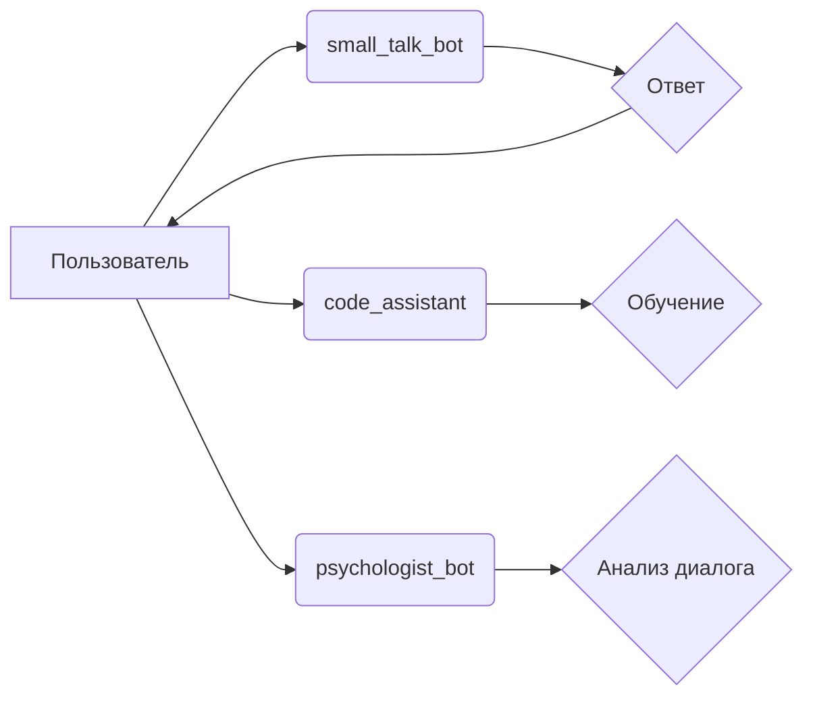

```MD
# Анализ кода из файла hypotez/src/endpoints/hypo69/readme.md

**1. <input code>**

```rst
.. module: src.endpoints.hypo69
    .. synopsys: endpoints for the developer
```
[Русский](https://github.com/hypo69/hypo/blob/master/src/endpoints/hypo69/readme.ru.md)
### **hypo69 Module**: endpoints for the developer
**small_talk_bot** - AI model chat bot  
**code_assistant** - module for training the project's code model  
**psychologist_bot** - early development of the dialogue parsing module
```

**2. <algorithm>**

Данный код не содержит алгоритма в традиционном понимании. Он представляет собой описание модуля `hypo69` в структуре документации Sphinx.  Алгоритмическая часть реализована в коде, который содержится *внутри* модуля, но сам по себе данный фрагмент - это просто заголовок и комментарии.

**Пример возможного алгоритма работы компонентов:**

Предположим, что внутри `src.endpoints.hypo69` существуют функции `small_talk_bot`, `code_assistant` и `psychologist_bot`. Тогда алгоритм работы этих компонентов может выглядеть следующим образом (это пример, точный алгоритм зависит от реализации):

1. Пользователь отправляет запрос в `small_talk_bot`.
2. `small_talk_bot` обрабатывает запрос, используя AI модель, и возвращает ответ пользователю.
3. Пользователь отправляет код в `code_assistant` для обучения.
4. `code_assistant` обрабатывает код и выполняет соответствующие операции.
5. Пользователь использует `psychologist_bot` для анализа диалога.
6. `psychologist_bot` выполняет анализ.


**3. <mermaid>**



**Описание зависимостей:**

Диаграмма показывает взаимодействие пользователя с различными компонентами `hypo69`.  Зависимости неявно содержатся в функциональности каждого компонента, т.к. они представляют собой отдельные модули/функции, которые выполняют отдельные задачи и взаимодействуют друг с другом.  Прямые зависимости от других частей проекта не видны в этом куске документации.


**4. <explanation>**

* **Импорты**: Нет импортов в данном фрагменте документации. Импорты будут определены в самих модулях `small_talk_bot`, `code_assistant` и `psychologist_bot`, а не в этом заголовке.
* **Классы**: Классы не определены в данном фрагменте. Классы также могут быть реализованы внутри модулей.
* **Функции**:  `small_talk_bot`, `code_assistant`, `psychologist_bot` — это, скорее всего, функции (или методы классов),  которые будут реализовывать функциональность каждого компонента.
* **Переменные**: Переменные, необходимые для работы функций, также будут определены в коде внутри этих модулей.
* **Возможные ошибки или области для улучшений**:  В предоставленном фрагменте документации нет ошибок.  Недостаточно информации для оценки потенциальных ошибок в реализации.  Должно быть предоставлено больше кода, чтобы оценить возможные проблемы в дизайне и структуре.


**Цепочка взаимосвязей с другими частями проекта**:

Данный модуль `hypo69` скорее всего взаимодействует с другими частями проекта через определённые интерфейсы. Например, `small_talk_bot` может использовать AI модель из отдельного модуля, а `code_assistant` — взаимодействовать с хранилищем кода. Без доступа к полному коду невозможно точно определить эти зависимости.