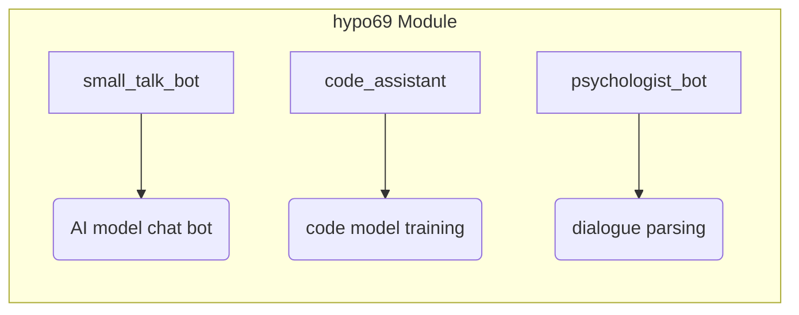

```MD
# Анализ кода из hypotez/src/endpoints/hypo69/readme.md

## <input code>

```rst
.. module: src.endpoints.hypo69
    .. synopsys: endpoints for the developer
```

### **hypo69 Module**: endpoints for the developer
**small_talk_bot** - AI model chat bot  
**code_assistant** - module for training the project's code model  
**psychologist_bot** - early development of the dialogue parsing module
```

## <algorithm>

К сожалению, предоставленный код не содержит алгоритмов или функций. Это лишь документация, описывающая модуль `src.endpoints.hypo69`.  Блок-схема не может быть построена.  Алгоритм работы  зависит от реализации классов `small_talk_bot`, `code_assistant` и `psychologist_bot`, которые не представлены.

## <mermaid>



## <explanation>

Предоставленный фрагмент – это документация, а не исполняемый код.  Он описывает модуль `src.endpoints.hypo69`,  представляющий собой набор конечных точек (endpoints) для разработчиков.  Документация описывает три ключевые компоненты внутри этого модуля:

* **`small_talk_bot`**:  Представляет собой чат-бота, работающего на основе AI модели.  В данном контексте, это API endpoint, который должен предоставлять функционал для общения с ботом.

* **`code_assistant`**: Модуль, отвечающий за обучение кодовой модели проекта.  Этот компонент, скорее всего, содержит функции для обучения и/или использования обученной модели для анализа кода.

* **`psychologist_bot`**: На ранней стадии разработки модуль для анализа диалогов.  Предполагается, что он будет обрабатывать входящие данные и выдавать соответствующий ответ или результат.


**Импорты**:  Из-за отсутствия кода, мы не можем определить импорты и их связь с другими пакетами проекта (`src`). Обычно импорты будут присутствовать в файлах `.py`, а не в `.md` файлах.


**Классы**: Точное представление классов и их атрибутов/методов неизвестно, поскольку код не предоставлен.  Мы можем лишь предположить, что каждый из компонентов (`small_talk_bot`, `code_assistant`, `psychologist_bot`) будет представлен классами в соответствующих файлах `.py` внутри папки `src.endpoints.hypo69`.


**Функции**:  Аналогично классам, функции, их параметры и возвращаемые значения неизвестны. Ожидается, что каждая из этих компонентов `small_talk_bot`, `code_assistant`, `psychologist_bot` будет иметь свои собственные функции для реализации своих задач.


**Переменные**:  Нет информации о переменных, так как код отсутствует.


**Возможные ошибки или области для улучшений**:

* **Недостаток кода**: Для полноценного анализа необходим сам код Python для модуля `src.endpoints.hypo69`.


**Взаимосвязи с другими частями проекта**:

Модуль `src.endpoints.hypo69` скорее всего взаимодействует с другими частями проекта, такими как модели машинного обучения, сервисы базы данных, или другими endpoint's, используя API вызовы.  Без доступа к коду невозможно детально проанализировать эти взаимосвязи.


**Заключение**: Данный анализ ограничен отсутствием кода.  Для более глубокого понимания, необходимо проанализировать реализацию этих компонентов на уровне кода Python, например, в файлах `.py` модуля `src.endpoints.hypo69`.