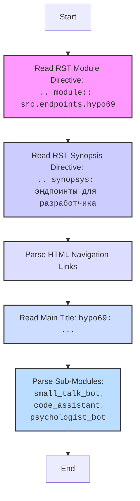

## АНАЛИЗ КОДА

### <алгоритм>

1.  **Начало**: Пользователь обращается к файлу `readme.ru.md` в каталоге `hypotez/src/endpoints/hypo69/`.
2.  **Чтение метаданных**: Парсинг `rst` (reStructuredText) директивы `module` для определения области видимости модуля. В данном случае, это `src.endpoints.hypo69`.
    -   **Пример**: `.. module:: src.endpoints.hypo69`
3.  **Чтение синопсиса**: Парсинг `rst` директивы `synopsys` для получения краткого описания модуля.
    -   **Пример**: `.. synopsys: эндпоинты для разработчика`
4.  **Чтение навигационных ссылок**: Разбор HTML-таблицы, содержащей ссылки на другие разделы документации.
    -   **Пример**: 
        -   `[Root ↑]` - ссылка на корневой `readme.ru.md`
        -   `src` - ссылка на `readme.ru.md` в каталоге `src`.
        -   `endpoints` - ссылка на `readme.ru.md` в каталоге `src/endpoints`.
        -   `English` - ссылка на англоязычную версию README.
5.  **Чтение заголовка**: Извлечение заголовка документа, который начинается с `hypo69:`.
    -  **Пример**: `hypo69: эндпоинты для разработчика`
6.  **Чтение описания модулей**: Парсинг списка модулей, каждый из которых представлен как заголовок:
    -   `small_talk_bot`
    -   `code_assistant`
    -   `psychologist_bot`
    -  **Пример**: `**small_talk_bot** - бот с чатом модели ии`
7.  **Конец**: Вывод информации о модуле `hypo69`, его назначение, и о входящих в него подмодулях.

### <mermaid>

**Анализ зависимостей `mermaid`:**

В данной диаграмме `mermaid` нет импортированных зависимостей, поскольку она описывает поток обработки текста в `markdown` файле. Зависимости возникают на уровне кода, который обрабатывает этот текст и вызывает, например, библиотеки для парсинга `rst` или `html`. В представленной `mermaid` диаграмме нет кода, который бы что-то импортировал, он лишь визуализирует процесс.
   
### <объяснение>

**Импорты:**

В данном коде нет явных импортов. Он представляет собой `markdown` файл с `rst` директивами и HTML-таблицей. Импорты будут на уровне кода Python, который будет обрабатывать этот `markdown` файл.

**Классы:**

В этом `markdown` файле нет классов. Он используется для документации и не содержит исполняемого кода.

**Функции:**

В этом файле отсутствуют функции. Однако в процессе обработки этого файла будут использоваться функции:

*   **Парсер `rst`**: Функции, разбирающие директивы `.. module::` и `.. synopsys::`.
*   **Парсер `HTML`**: Функции, извлекающие ссылки из HTML-таблицы.
*   **Текстовые парсеры**: Функции, обрабатывающие текст заголовков и описаний модулей.

**Переменные:**

В данном файле нет переменных. Однако при обработке будут использоваться переменные, например:

*   `module_name`: Строка, хранящая имя модуля `src.endpoints.hypo69`.
*   `synopsis_text`: Строка, содержащая описание модуля "эндпоинты для разработчика".
*   `navigation_links`: Список словарей, содержащих ссылки на другие разделы документации.
*   `submodules`: Список строк, содержащих имена подмодулей `small_talk_bot`, `code_assistant`, `psychologist_bot`.

**Объяснение:**

Этот `markdown` файл (`readme.ru.md`) служит точкой входа для документации модуля `hypo69`. Он содержит:

1.  **Метаданные `rst`**:
    *   `module:: src.endpoints.hypo69`: Указывает, что этот файл документирует модуль `src.endpoints.hypo69`.
    *   `synopsys:: эндпоинты для разработчика`: Дает краткое описание модуля.
2.  **HTML-таблица с навигацией**: Ссылки на другие `readme.md` файлы:
    *   Ссылка на корень проекта.
    *   Ссылка на директорию `src`.
    *   Ссылка на директорию `endpoints`.
    *   Ссылка на англоязычную версию этого документа.
3.  **Заголовок**: Описывает назначение модуля `hypo69`.
4.  **Описание подмодулей**: Перечисляет модули, входящие в `hypo69`: `small_talk_bot`, `code_assistant` и `psychologist_bot`.

**Потенциальные ошибки и улучшения:**

1.  **Зависимость от формата**: Структура файла (использование `rst` директив, HTML-таблицы) должна соответствовать тому, как она парсится в коде.
2.  **Унификация**: Если есть другие подобные файлы, необходимо убедиться в согласованности их структуры.
3.  **Поддержка языков**: В данный момент английская версия доступна, но в будущем возможно понадобится поддержка других языков.
4.  **Автоматизация**: Процесс генерации и обновления этого файла можно автоматизировать, чтобы уменьшить количество ошибок.

**Цепочка взаимосвязей с другими частями проекта:**

1.  `hypo69` является частью директории `src/endpoints`, что указывает на то, что этот модуль является точкой входа для определенных функциональных возможностей.
2.  Навигационные ссылки указывают на взаимосвязь с `readme.ru.md` на более высоких уровнях (`src` и корень проекта).
3.  Описание подмодулей (`small_talk_bot`, `code_assistant`, `psychologist_bot`) предполагает, что это отдельные подмодули или функциональные блоки, которые являются частью модуля `hypo69`.
4.  Этот файл служит отправной точкой для разработчиков, желающих разобраться в функционале модуля `hypo69`.