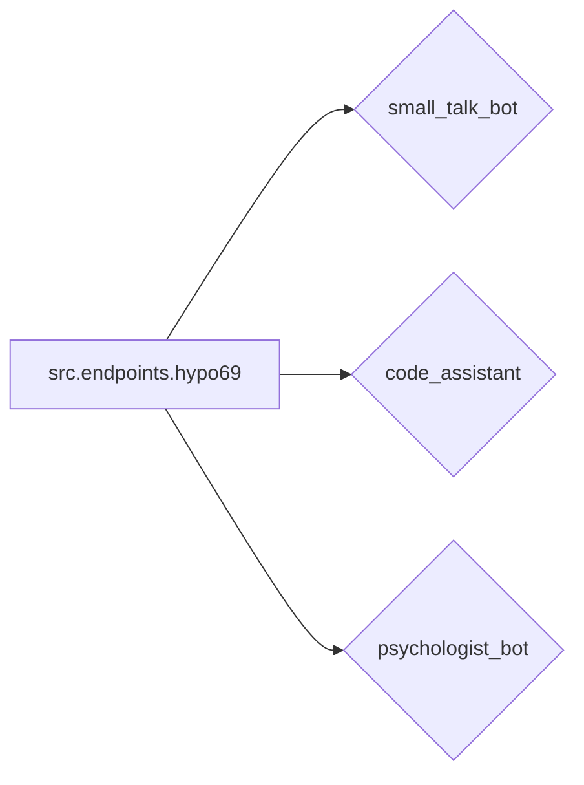

# Анализ кода из hypotez/src/endpoints/hypo69/readme.ru.md

**1. <input code>**

```rst
.. module: src.endpoints.hypo69
	.. synopsys: эндпоинты для разработчика 
```
[English](https://github.com/hypo69/hypo/blob/master/src/endpoints/hypo69/README.MD)

hypo69 Module: эндпоинты для разработчика
==============================================

**small_talk_bot** - бот с чатом модели ии
**code_assistant** - модуль обучения модели коду проекта
**psychologist_bot** - ранняя разработка модуля парсинга диалогов
```

**2. <algorithm>**

Из-за отсутствия кода, алгоритм невозможно отобразить в виде блок-схемы.  Этот файл является README, содержащим описание модуля, а не код.  Он описывает функции, входящие в модуль `src.endpoints.hypo69`, но не их реализацию.

**3. <mermaid>**



**4. <explanation>**

Файл `hypotez/src/endpoints/hypo69/readme.ru.md` — это файл документации, описывающий модуль `src.endpoints.hypo69`.  Он не содержит программного кода, а представляет собой описание функциональности модуля.

* **`.. module: src.endpoints.hypo69`**: Эта строчка в формате reStructuredText определяет, что файл относится к модулю `src.endpoints.hypo69`.  Это своего рода метаданные для системы документации.
* **`.. synopsys: эндпоинты для разработчика`**:  Краткий комментарий, описывающий предназначение модуля.
* **`small_talk_bot`**, **`code_assistant`**, **`psychologist_bot`**:  Перечисленные пункты являются *функциональными блоками* или *модулями*, которые, скорее всего, представляют собой отдельные классы или функции, реализованные в модуле `src.endpoints.hypo69`.  Они отвечают за разные аспекты взаимодействия с системой, например, чат с моделью, обучение на коде, или парсинг диалогов.
* **`src.endpoints.hypo69`**:  Этот путь указывает на структуру проекта.  `src` вероятно корневая директория проекта, `endpoints` — директория с эндпоинтами, а `hypo69` — конкретный модуль с эндпоинтами.

**Связь с другими частями проекта**:

Модуль `src.endpoints.hypo69` скорее всего взаимодействует с другими частями проекта, такими как:

* **Модель ИИ**: Модуль `small_talk_bot` требует взаимодействия с моделью ИИ для обработки диалогов.
* **Система обучения**: Модуль `code_assistant` требует доступа к системе обучения, чтобы обучить модель коду.
* **Базы данных (возможно)**:  Для хранения данных о взаимодействиях или обучении, этот модуль может использовать базы данных.
* **Другие эндпоинты**: Этот модуль взаимодействует с другими эндпоинтами, чтобы предоставлять функции для разработчиков.

**Возможные ошибки или области для улучшений**:

* **Отсутствие кода**:  В файле README отсутствует код, что делает невозможным анализ архитектуры и логики.
* **Недостаточное описание**:  Описание функций (`small_talk_bot`, `code_assistant`, `psychologist_bot`) слишком краткое. Для более глубокого понимания потребовались бы дополнительные пояснения.


**Заключение**:

Данный файл README — это важный документ, описывающий функции модуля. Но для полного анализа нужен код.