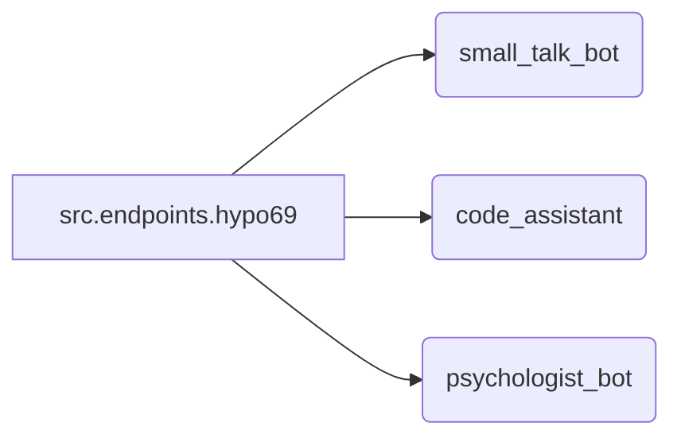

# Анализ кода из src.endpoints.hypo69/readme.ru.md

**1. <input code>**

```rst
.. module:: src.endpoints.hypo69
	.. synopsys: эндпоинты для разработчика 
```
<TABLE >
<TR>
<TD>
<A HREF = 'https://github.com/hypo69/hypo/blob/master/readme.ru.md'>[Root ↑]</A>
</TD>
<TD>
[English](https://github.com/hypo69/hypo/blob/master/src/endpoints/hypo69/README.MD)
</TD>
</TR>

hypo69 Module: эндпоинты для разработчика
==============================================

**small_talk_bot** - бот с чатом модели ии
**code_assistant** - модуль обучения модели коду проекта
**psychologist_bot** - ранняя разработка модуля парсинга диалогов
```

**2. <algorithm>**

Этот код не содержит исполняемого алгоритма. Это markdown-документация, описывающая модуль `src.endpoints.hypo69`.  Блок-схема не применима.  Данные не перемещаются между функциями или классами, так как нет ни функций, ни классов.  Это описание структуры и назначения модуля.

**3. <mermaid>**



**Описание диаграммы:**

Диаграмма показывает, что модуль `src.endpoints.hypo69` содержит три компонента: `small_talk_bot`, `code_assistant` и `psychologist_bot`.  Эти компоненты являются, вероятно, отдельными модулями или функциями, которые обеспечивают определённые возможности.  Зависимости между ними не показаны, так как в предоставленном коде это не описывается.


**4. <explanation>**

* **Импорты:** Отсутствуют. Код - это документация, а не код, который выполняется.


* **Классы:** Отсутствуют. Код описывает модуль, а не классы.


* **Функции:** Отсутствуют. Код описывает модуль, а не функции.


* **Переменные:** Отсутствуют. Код описывает модуль, а не переменные.


* **Возможные ошибки или улучшения:**  Не применимо. Код - это описание, а не работающий код, поэтому нет ошибок и нечего улучшать.

**Цепочка взаимосвязей с другими частями проекта:**

Модуль `src.endpoints.hypo69` вероятно взаимодействует с другими модулями и функциями в `src`, которые отвечают за обработку запросов, предоставление данных и логику работы каждого из описанных ботов.  Необходимость взаимодействия будет зависеть от конкретной реализации.  Например, `small_talk_bot` возможно использует модули обработки естественного языка (NLP). `code_assistant` вероятно взаимодействует с модулями обучения моделей.


**Заключение:**

Данный код - это документация для модуля `src.endpoints.hypo69`. Он описывает компоненты, но не содержит логики.  Поэтому анализ ограничен описанием функций и ожидаемых зависимостей.