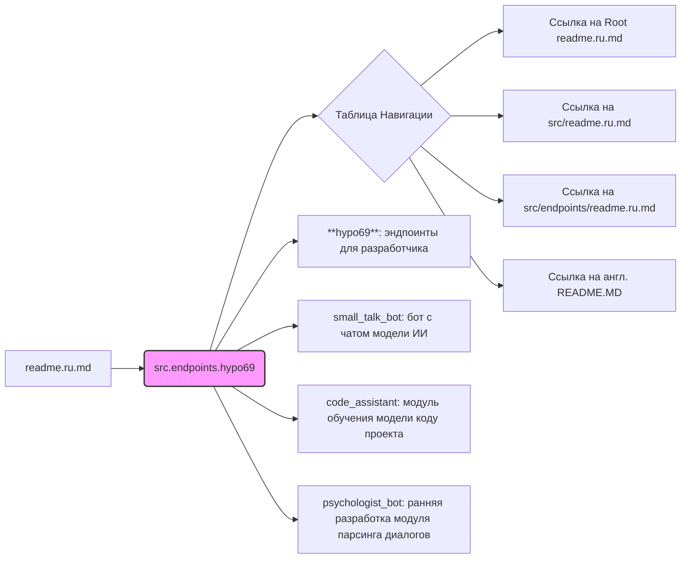

# Анализ кода `hypo69/readme.ru.md`

## <алгоритм>

1. **Начало**: Загрузка `readme.ru.md`.
2. **Разметка**:
   - Определение модуля `src.endpoints.hypo69` и его назначения: "эндпоинты для разработчика".
   - Создание таблицы навигации:
     - Ссылка на корневой `readme.ru.md`.
     - Ссылка на `src/readme.ru.md` и `src/endpoints/readme.ru.md`.
     - Ссылка на англоязычный `README.MD`.
3. **Описание**:
   - Заголовок: "**hypo69**: эндпоинты для разработчика".
   - Описание модулей:
     - `small_talk_bot`: бот с чатом модели ИИ.
     - `code_assistant`: модуль обучения модели коду проекта.
     - `psychologist_bot`: ранняя разработка модуля парсинга диалогов.
4. **Конец**: Отображение форматированного текста в формате Markdown.

## <mermaid>

**Описание диаграммы:**

- `A`: Начальный файл `readme.ru.md`.
- `B`: Модуль `src.endpoints.hypo69`, который является центром документа.
- `C`: Блок, представляющий таблицу навигации.
- `D`, `E`, `F`, `G`: Различные ссылки в таблице навигации.
- `H`: Заголовок раздела, описывающий `hypo69`.
- `I`, `J`, `K`: Описания трех основных модулей внутри `hypo69`: `small_talk_bot`, `code_assistant` и `psychologist_bot`.

**Импорты**:

В данном случае, `mermaid` не имеет импортов. Она используется как инструмент для визуализации, а не как часть программного кода. Диаграмма mermaid представляет собой визуализацию структуры и взаимосвязей внутри данного markdown файла.

## <объяснение>

**Общая структура:**

Этот `readme.ru.md` файл предоставляет документацию для модуля `src.endpoints.hypo69`, который, судя по названию, является набором эндпоинтов для разработчиков. Файл структурирован в формате reStructuredText (`rst`) и Markdown, предоставляя краткое описание, навигацию и перечисление входящих модулей.

**Импорты:**
   - Файл не содержит импортов в смысле `Python`, но он использует ссылки на другие документы проекта в `GitHub`.
      -  `https://github.com/hypo69/hypo/blob/master/readme.ru.md`: Ссылка на корневой файл `readme.ru.md` репозитория.
      -  `https://github.com/hypo69/hypo/blob/master/src/readme.ru.md`: Ссылка на файл `readme.ru.md` в директории `src`.
      -  `https://github.com/hypo69/hypo/blob/master/src/endpoints/readme.ru.md`: Ссылка на файл `readme.ru.md` в директории `src/endpoints`.
      - `https://github.com/hypo69/hypo/blob/master/src/endpoints/hypo69/README.MD`: Ссылка на англоязычный файл `README.MD` текущей директории.

Эти ссылки используются для навигации по репозиторию и позволяют пользователям быстро переходить к другим важным разделам проекта.

**Классы:**

В предоставленном файле классы отсутствуют.

**Функции:**

Функции отсутствуют. Весь текст — это Markdown-документ.

**Переменные:**

Переменные как таковые в файле отсутствуют. Вместо этого используются строки и форматирование Markdown.

**Цепочка взаимосвязей:**

- Файл `readme.ru.md` является частью структуры документации проекта.
- Он расположен в директории `src/endpoints/hypo69`, указывая на то, что этот модуль является частью более широкой архитектуры проекта.
- Ссылки на другие `readme.ru.md` файлы устанавливают иерархические связи, позволяя пользователю понимать расположение текущего модуля в контексте всего проекта.
- Содержимое файла намекает на наличие нескольких модулей, которые, вероятно, содержат API или сервисы для разработчиков.

**Потенциальные ошибки и области для улучшения:**

1. **Отсутствие подробностей:**
   - В файле отсутствует подробная документация по каждому модулю.
   - Нет описания API или функционала каждого эндпоинта.

2. **Только краткие описания:**
   - Описания модулей (`small_talk_bot`, `code_assistant`, `psychologist_bot`) очень краткие и не предоставляют достаточной информации о том, что именно они делают.

3. **Неактуальность:**
   - Описание `psychologist_bot` как "ранней разработки" может указывать на то, что модуль находится в активной разработке и его документация может быть неполной или неточной.

4. **Отсутствие примеров:**
    - Было бы полезно добавить примеры использования для каждого модуля, если это API.

**Улучшения:**

- Добавить подробное описание каждого модуля.
- Включить документацию API, если таковая имеется.
- Предоставить примеры использования каждого эндпоинта.
- Обновлять документацию по мере разработки проекта.
- Рассмотреть возможность разбиения документации на отдельные файлы для каждого модуля.

В целом, файл предоставляет базовую документацию для модуля `hypo69`, но требует значительных улучшений для того, чтобы быть по-настоящему полезным для разработчиков.