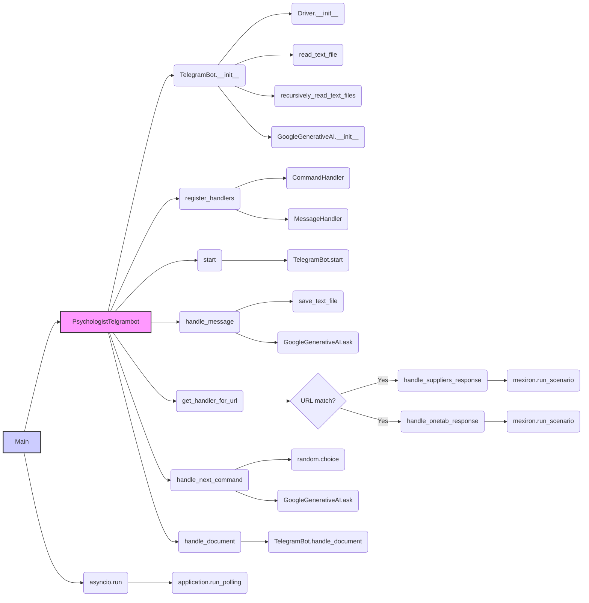

## Анализ кода `hypotez/src/endpoints/hypo69/small_talk_bot/bot.py`

### 1. <алгоритм>

1.  **Инициализация бота:**
    *   Создается экземпляр класса `PsychologistTelgrambot`.
    *   В `__post_init__` устанавливается токен бота, инициализируется драйвер браузера (`Driver(Chrome)`), загружается системная инструкция из файла, список вопросов из директории и настраивается модель Google Gemini.
    *   Пример: `self.model = GoogleGenerativeAI(...)` инициализирует AI модель.
2.  **Регистрация обработчиков:**
    *   Метод `register_handlers` добавляет обработчики для команд `/start`, `/help`, текстовых сообщений, голосовых сообщений и документов.
    *   Пример: `self.application.add_handler(CommandHandler('start', self.start))` регистрирует функцию `start` как обработчик команды `/start`.
3.  **Обработка команды /start:**
    *   Метод `start` отправляет приветственное сообщение пользователю и вызывает родительский метод `start`.
    *   Пример: `await update.message.reply_text('Hi! I am a smart assistant psychologist.')`
4.  **Обработка текстовых сообщений:**
    *   Метод `handle_message` получает текст сообщения пользователя, сохраняет его в лог-файл, отправляет запрос в модель Gemini и возвращает ответ пользователю.
    *   Пример: `answer = self.model.ask(q=response, history_file=f'{user_id}.txt')` отправляет запрос в Gemini.
5.  **Обработка URL:**
    *   Метод `get_handler_for_url` проверяет, начинается ли сообщение пользователя с известных URL.
        *   Если URL найден, возвращает соответствующий обработчик (`handle_suppliers_response` или `handle_onetab_response`).
        *   Иначе возвращает `None`.
    *   `handle_suppliers_response` обрабатывает URL, связанные с поставщиками, запуская сценарий в `mexiron`.
    *   `handle_onetab_response` обрабатывает URL OneTab, также запуская сценарий в `mexiron`.
6.  **Обработка команды next:**
    *   Метод `handle_next_command` выбирает случайный вопрос из `questions_list`, отправляет его в модель Gemini и отправляет вопрос и ответ пользователю.
    *   Пример: `question = random.choice(self.questions_list)` выбирает случайный вопрос.
7.  **Обработка документов:**
    *   Метод `handle_document` получает содержимое загруженного документа, возвращает пользователю сообщение с содержанием.
    *   Пример: `file_content = await super().handle_document(update, context)` получает содержимое документа.
8.  **Запуск бота:**
    *   В блоке `if __name__ == "__main__":` создается экземпляр бота и запускается опрос сервера Telegram (`application.run_polling()`).

### 2. <mermaid>

**Объяснение зависимостей:**

*   **`PsychologistTelgrambot`**:  Основной класс бота, наследует от `TelegramBot`. Зависит от `Driver` для управления браузером, `GoogleGenerativeAI` для обработки текста, `read_text_file` и `recursively_read_text_files` для чтения данных из файлов.
*   **`TelegramBot`**: Базовый класс для Telegram ботов. Предоставляет базовые функции, такие как запуск и остановка бота.
*   **`Driver`**: Управляет браузером для взаимодействия с веб-страницами. Используется для обработки URL-ов.
*   **`GoogleGenerativeAI`**: Класс для взаимодействия с моделью Google Gemini. Зависит от токена доступа и системных инструкций.
*   **`read_text_file` и `recursively_read_text_files`**: Функции для чтения данных из файлов. Используются для загрузки системной инструкции и вопросов для бота.
*   **`save_text_file`**: Функция для сохранения данных в файл. Используется для сохранения логов чата.
*   **`CommandHandler` и `MessageHandler`**: Классы из `telegram.ext` для обработки команд и сообщений.
*   **`asyncio`**: Библиотека для асинхронного программирования. Используется для запуска бота и параллельной обработки сообщений.
*   **`random`**: Используется для выбора случайных вопросов.
*   **`mexiron`**: Класс, предположительно, для выполнения сценариев на веб-страницах.

### 3. <объяснение>

**Импорты:**

*   `header`: Не используется в данном файле. Возможно, он импортируется в других модулях.
*   `asyncio`: Библиотека для асинхронного программирования. Позволяет боту обрабатывать несколько запросов одновременно, не блокируя основной поток.
*   `pathlib.Path`: Предоставляет объектно-ориентированный способ работы с путями в файловой системе.
*   `typing.Optional`: Используется для указания, что переменная может иметь значение `None`.
*   `dataclasses.dataclass`, `dataclasses.field`: Декоратор и функция для создания классов данных. Упрощают создание классов с автоматической генерацией методов.
*   `random`: Для генерации случайных чисел, используется в `handle_next_command` для выбора случайного вопроса.
*   `telegram.Update`, `telegram.ext.CommandHandler`, `telegram.ext.MessageHandler`, `telegram.ext.filters`, `telegram.ext.CallbackContext`: Классы и функции из библиотеки `python-telegram-bot` для работы с Telegram API. Позволяют получать обновления, обрабатывать команды и сообщения.
*   `src.gs`: Глобальные настройки проекта, включая пути к файлам и учетные данные.
*   `src.bots.telegram.TelegramBot`: Базовый класс для Telegram ботов.
*   `src.webdriver.driver.Driver`, `src.webdriver.driver.Chrome`: Классы для управления браузером Chrome. Используются для обработки URL-ов.
*   `src.ai.gemini.GoogleGenerativeAI`: Класс для взаимодействия с моделью Google Gemini.
*   `src.utils.file.read_text_file`, `src.utils.file.recursively_read_text_files`, `src.utils.file.save_text_file`: Функции для работы с файлами.
*   `src.utils.url.is_url`: Функция для проверки URL, в данном файле не используется.
*   `src.logger.logger`: Модуль для логирования.

**Классы:**

*   `PsychologistTelgrambot(TelegramBot)`:
    *   **Роль:** Основной класс бота, реализует логику для психологического ассистента.
    *   **Атрибуты:**
        *   `token`: Токен доступа к Telegram API.
        *   `d`: Экземпляр драйвера браузера (`Driver`).
        *   `model`: Экземпляр модели Google Gemini (`GoogleGenerativeAI`).
        *   `system_instruction`: Системные инструкции для модели Gemini.
        *   `questions_list`: Список вопросов для бота.
        *   `timestamp`: Временная метка создания экземпляра бота.
    *   **Методы:**
        *   `__post_init__`: Инициализирует атрибуты класса, настраивает токен, модель и драйвер браузера.
        *   `register_handlers`: Регистрирует обработчики команд и сообщений.
        *   `start`: Обрабатывает команду `/start`.
        *   `handle_message`: Обрабатывает текстовые сообщения пользователя, логирует их и отправляет запрос в Gemini.
        *   `get_handler_for_url`: Возвращает обработчик для URL, содержащегося в сообщении.
        *   `handle_suppliers_response`: Обрабатывает URL-ы поставщиков.
        *   `handle_onetab_response`: Обрабатывает URL-ы OneTab.
        *   `handle_next_command`: Обрабатывает команды, связанные с получением случайных вопросов.
        *   `handle_document`: Обрабатывает загрузку документов.

**Функции:**

*   `__post_init__(self)`:
    *   **Аргументы:** `self` (экземпляр класса).
    *   **Возвращает:** `None`.
    *   **Назначение:** Инициализирует атрибуты класса, загружает данные из файлов и настраивает AI модель.
    *   **Пример:** `self.token = gs.credentials.telegram.hypo69_psychologist_bot` устанавливает токен бота.

*   `register_handlers(self)`:
    *   **Аргументы:** `self` (экземпляр класса).
    *   **Возвращает:** `None`.
    *   **Назначение:** Регистрирует обработчики команд и сообщений.
    *   **Пример:** `self.application.add_handler(CommandHandler('start', self.start))` добавляет обработчик для команды `/start`.

*   `start(self, update: Update, context: CallbackContext)`:
    *   **Аргументы:** `self`, `update` (обновление от Telegram), `context` (контекст).
    *   **Возвращает:** `None`.
    *   **Назначение:** Отправляет приветственное сообщение пользователю при команде `/start`.
    *   **Пример:** `await update.message.reply_text('Hi! I am a smart assistant psychologist.')` отправляет сообщение пользователю.

*   `handle_message(self, update: Update, context: CallbackContext)`:
    *   **Аргументы:** `self`, `update` (обновление от Telegram), `context` (контекст).
    *   **Возвращает:** `None`.
    *   **Назначение:** Обрабатывает текстовые сообщения пользователя, сохраняет их в лог, отправляет запрос в Gemini и возвращает ответ.
    *   **Пример:** `answer = self.model.ask(q=response, history_file=f'{user_id}.txt')` отправляет запрос в Gemini.

*   `get_handler_for_url(self, response: str)`:
    *   **Аргументы:** `self`, `response` (текст сообщения).
    *   **Возвращает:** Функция-обработчик или `None`.
    *   **Назначение:** Определяет, какой обработчик использовать для URL в сообщении.
    *   **Пример:** `if response.startswith(urls): return handler_func` проверяет, начинается ли сообщение с известных URL.

*   `handle_suppliers_response(self, update: Update, response: str)`:
    *   **Аргументы:** `self`, `update`, `response`.
    *   **Возвращает:** `None`.
    *   **Назначение:** Обрабатывает URL-ы поставщиков.
    *   **Пример:** `if await self.mexiron.run_scenario(response, update):` запускает сценарий обработки URL.

*   `handle_onetab_response(self, update: Update, response: str)`:
    *   **Аргументы:** `self`, `update`, `response`.
    *   **Возвращает:** `None`.
    *   **Назначение:** Обрабатывает URL-ы OneTab.
    *   **Пример:** `if await self.mexiron.run_scenario(price=price, mexiron_name=mexiron_name, urls=urls):` запускает сценарий обработки URL.

*   `handle_next_command(self, update: Update)`:
    *   **Аргументы:** `self`, `update`.
    *   **Возвращает:** `None`.
    *   **Назначение:** Обрабатывает команды для получения случайных вопросов и ответов.
    *   **Пример:** `question = random.choice(self.questions_list)` выбирает случайный вопрос.

*   `handle_document(self, update: Update, context: CallbackContext)`:
    *   **Аргументы:** `self`, `update`, `context`.
    *   **Возвращает:** `None`.
    *   **Назначение:** Обрабатывает загрузку документов и возвращает их содержимое.
    *   **Пример:** `file_content = await super().handle_document(update, context)` получает содержимое документа.

**Переменные:**

*   `MODE`:  Устанавливает режим работы бота (`dev`, `test` и т.д.).
*   `token`: Токен бота (берется из gs).
*   `d`: Экземпляр драйвера браузера.
*   `model`: Экземпляр AI модели.
*   `system_instruction`: Текст системной инструкции для модели Gemini.
*   `questions_list`: Список вопросов для модели.
*   `timestamp`: Временная метка.

**Потенциальные ошибки и области для улучшения:**

*   В `handle_onetab_response` не определены `price`, `mexiron_name` и `urls`. Это может привести к ошибке при выполнении сценария.
*   Обработка URL-ов в `get_handler_for_url` может быть более гибкой, например, с использованием регулярных выражений.
*   В обработке ошибок в `handle_next_command` стоит предусмотреть более детальное логирование ошибки, а не просто "Ошибка чтения вопросов".
*   Можно добавить обработку других типов сообщений (фото, видео и т. д.).
*   Хранение логов в файловой системе без ротации может привести к их чрезмерному разрастанию.

**Цепочка взаимосвязей:**

1.  **Пользователь** отправляет сообщение боту в Telegram.
2.  **Telegram** отправляет обновление на сервер бота.
3.  **`PsychologistTelgrambot`** получает обновление.
4.  Если это команда (`/start`, `/help`, `/next`), вызывается соответствующий обработчик (`start`, `handle_next_command`).
5.  Если это текстовое сообщение, вызывается `handle_message` или `get_handler_for_url` для определения, какой обработчик использовать.
6.  `handle_message` сохраняет сообщение в лог и отправляет запрос в `GoogleGenerativeAI` для получения ответа.
7.  `GoogleGenerativeAI` отправляет запрос в Google Gemini API и возвращает ответ.
8.  Бот отправляет ответ пользователю через Telegram.
9.  `handle_suppliers_response` и `handle_onetab_response` используют `mexiron` для взаимодействия с веб-страницами.

Этот код представляет собой достаточно сложного Telegram-бота, использующего AI для обработки текста и автоматизации работы с веб-страницами.