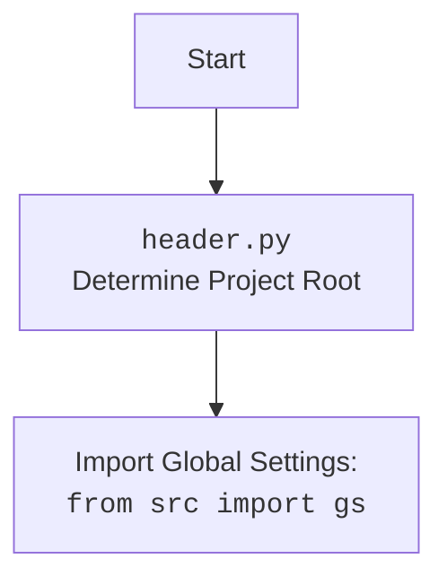

## ИНСТРУКЦИЯ:

Анализируй предоставленный код подробно и объясни его функциональность. Ответ должен включать три раздела:

1.  **<алгоритм>**: Опиши рабочий процесс в виде пошаговой блок-схемы, включая примеры для каждого логического блока, и проиллюстрируй поток данных между функциями, классами или методами.
2.  **<mermaid>**: Напиши код для диаграммы в формате `mermaid`, проанализируй и объясни все зависимости,
    которые импортируются при создании диаграммы.
    **ВАЖНО!** Убедитесь, что все имена переменных, используемые в диаграмме `mermaid`,
    имеют осмысленные и описательные имена. Имена переменных вроде `A`, `B`, `C`, и т.д., не допускаются!

    **Дополнительно**: Если в коде есть импорт `import header`, добавьте блок `mermaid` flowchart, объясняющий `header.py`:
    ```mermaid
    flowchart TD
        Start --> Header[<code>header.py</code><br> Determine Project Root]

        Header --> import[Import Global Settings: <br><code>from src import gs</code>]
    ```

3.  **<объяснение>**: Предоставьте подробные объяснения:
    *   **Импорты**: Их назначение и взаимосвязь с другими пакетами `src.`.
    *   **Классы**: Их роль, атрибуты, методы и взаимодействие с другими компонентами проекта.
    *   **Функции**: Их аргументы, возвращаемые значения, назначение и примеры.
    *   **Переменные**: Их типы и использование.
    *   Выделите потенциальные ошибки или области для улучшения.

Дополнительно, постройте цепочку взаимосвязей с другими частями проекта (если применимо).

Это обеспечивает всесторонний и структурированный анализ кода.
## Формат ответа: `.md` (markdown)
**КОНЕЦ ИНСТРУКЦИИ**

## <алгоритм>

```mermaid
graph LR
    A[Start] --> B(PsychologistTelgrambot.__init__);
    B --> C{Initialize bot, driver, model, data};
    C --  "set token"--> D(TelegramBot.__init__);
    C --  "init Driver" --> E(Driver.__init__);
    C -- "read system_instruction" --> F(read_text_file);
    C -- "read questions_list" --> G(recursively_read_text_files);
    C -- "init GoogleGenerativeAI" --> H(GoogleGenerativeAI.__init__);
    C --> I(register_handlers);
    I --> J{Add handlers to telegram bot};
    J -- "/start" --> K(start);
    J -- "/help" --> L(help_command);
    J -- "text message" --> M(handle_message);
    J -- "voice message" --> N(handle_voice);
    J -- "document" --> O(handle_document);
    K --> P{Reply with "Hi! I am a smart assistant psychologist."};
    P --> Q(TelegramBot.start);
    M --> R{Log message, generate response};
    R --> S(save_text_file);
    R --> T(GoogleGenerativeAI.ask);
    T --> U(reply_text);
    O --> V(TelegramBot.handle_document);
    V --> W{Reply with document content};
    W --> X(reply_text);
     Y{is_url}
    M  -- "Check URL"--> Y
     Y -- "True" --> Z{Find Handler by URL}
    Z --> AA(get_handler_for_url)
    AA --> AB{Call handler}
    AB -- "suppliers" --> AC(handle_suppliers_response)
    AB -- "onetab" --> AD(handle_onetab_response)
    AC --> AE(mexiron.run_scenario);
    AD --> AF(mexiron.run_scenario);
    AE --> AG{Reply}
    AF --> AG
    Z -- "Not Found" --> R
    A --> BB(if __name__ == "__main__")
    BB --> CC(Create PsychologistTelgrambot Instance)
    CC --> DD(run_polling)
    

    
    style A fill:#f9f,stroke:#333,stroke-width:2px
    style BB fill:#f9f,stroke:#333,stroke-width:2px
    style CC fill:#ccf,stroke:#333,stroke-width:2px
    style DD fill:#ccf,stroke:#333,stroke-width:2px
```

**Примеры:**

*   **Инициализация (`__init__`)**: При создании экземпляра `PsychologistTelgrambot`, устанавливается токен бота, создается драйвер браузера, загружается системная инструкция и список вопросов из файлов. Инициализируется модель Gemini AI.
*   **Обработка команды `/start`**: Когда пользователь отправляет команду `/start`, бот отвечает приветственным сообщением "Hi! I am a smart assistant psychologist."
*   **Обработка текстового сообщения (`handle_message`)**: Когда пользователь отправляет текстовое сообщение, оно сохраняется в лог, и передается в модель Gemini AI для генерации ответа. Ответ отправляется пользователю.
*   **Обработка URL**: Если сообщение пользователя начинается с известного URL, бот вызывает соответствующий обработчик. Например, если URL  `https://ksp.co.il` будет передан в `handle_message` , то сработает `get_handler_for_url`, который вызовет `handle_suppliers_response`.
*   **Обработка документа (`handle_document`)**: Когда пользователь отправляет документ, его содержимое сохраняется и отправляется ответное сообщение с этим содержанием.
*    **Обработка `--next`**:  Когда приходит команда `--next` бот рандомно выбирает вопрос из списка и отправляет его пользователю и ответ на него.

## <mermaid>

```mermaid
flowchart TD
    Start --> ImportHeader[<code>import header</code> <br> <code>header.py</code>: Determine Project Root]
    ImportHeader --> ImportGlobalSettings[<code>from src import gs</code> <br> Import Global Settings]
    ImportGlobalSettings --> TelegramBotClass[<code>class PsychologistTelgrambot(TelegramBot)</code> <br> Custom Telegram Bot]
    TelegramBotClass --> TelegramBotInit[<code>__init__</code> <br> Initialize Bot]
    TelegramBotInit --> SetToken[Set Token]
    TelegramBotInit --> InitDriver[Init Driver: <code>src.webdriver.driver.Driver</code>]
    TelegramBotInit --> ReadSystemInstruction[Read System Instruction: <code>src.utils.file.read_text_file</code>]
    TelegramBotInit --> ReadQuestionsList[Read Questions List: <code>src.utils.file.recursively_read_text_files</code>]
    TelegramBotInit --> InitGeminiModel[Init Gemini Model: <code>src.ai.gemini.GoogleGenerativeAI</code>]
    TelegramBotInit --> RegisterHandlers[<code>register_handlers</code> <br> Register Telegram handlers]
    RegisterHandlers --> AddStartHandler[Add /start Handler]
    RegisterHandlers --> AddHelpHandler[Add /help Handler]
    RegisterHandlers --> AddMessageHandler[Add Message Handler (Text)]
    RegisterHandlers --> AddVoiceHandler[Add Message Handler (Voice)]
    RegisterHandlers --> AddDocumentHandler[Add Message Handler (Document)]
     TelegramBotClass --> StartCommandHandler[<code>start(update, context)</code> <br> Handle /start command]
    StartCommandHandler --> SendStartMessage[Reply with start message]
    TelegramBotClass --> HandleMessage[<code>handle_message(update, context)</code><br> Handle text messages]
    HandleMessage --> LogMessage[Log Message: <code>src.utils.file.save_text_file</code>]
    HandleMessage --> GeminiAsk[Ask Gemini: <code>src.ai.gemini.GoogleGenerativeAI.ask</code>]
    GeminiAsk --> ReplyMessage[Reply Message]
    TelegramBotClass --> GetHandlerForURL[<code>get_handler_for_url(response)</code> <br> Get handler for url]
    GetHandlerForURL --> CheckURL[Check if response starts with known URLs]
    CheckURL -- "URL Matched" --> CallURLHandler[Call URL Handler]
    CheckURL -- "URL Not Matched" --> GeminiAsk
    CallURLHandler -- suppliers --> HandleSuppliersResponse[<code>handle_suppliers_response(update, response)</code>]
    CallURLHandler -- onetab --> HandleOnetabResponse[<code>handle_onetab_response(update, response)</code>]
     HandleSuppliersResponse --> RunMexironScenario[Run scenario from <code>src.mexiron.run_scenario</code>]
    HandleOnetabResponse --> RunMexironScenario2[Run scenario from <code>src.mexiron.run_scenario</code>]
      RunMexironScenario -->  ReplyScenarioMessage[Reply scenario message]
    RunMexironScenario2 --> ReplyScenarioMessage2[Reply scenario message]
    TelegramBotClass --> HandleNextCommand[<code>handle_next_command(update)</code><br> Handle '--next' command]
    HandleNextCommand --> SelectRandomQuestion[Select random question]
    SelectRandomQuestion --> GeminiAskQuestion[Ask Gemini: <code>src.ai.gemini.GoogleGenerativeAI.ask</code>]
    GeminiAskQuestion --> ReplyQuestionAndAnswer[Reply with random question and answer]
    TelegramBotClass --> HandleDocument[<code>handle_document(update, context)</code><br> Handle document uploads]
    HandleDocument -->  HandleDocumentFromParent[<code>TelegramBot.handle_document</code>]
    HandleDocumentFromParent --> ReplyDocumentContent[Reply with document content]
     Start --> CreateBotInstance[Create <code>PsychologistTelgrambot</code> Instance]
     CreateBotInstance --> RunPolling[Run <code>application.run_polling()</code>]
     
    style Start fill:#f9f,stroke:#333,stroke-width:2px
    style CreateBotInstance fill:#ccf,stroke:#333,stroke-width:2px
    style RunPolling fill:#ccf,stroke:#333,stroke-width:2px
```



**Анализ зависимостей:**

*   `header.py`: Определяет корень проекта и импортирует глобальные настройки.
*   `src.gs`: Глобальные настройки проекта, включая пути, учетные данные и другие конфигурации.
*   `src.bots.telegram.TelegramBot`: Базовый класс для Telegram ботов.
*   `src.webdriver.driver.Driver`, `src.webdriver.driver.Chrome`: Классы для управления веб-драйвером Chrome.
*   `src.ai.gemini.GoogleGenerativeAI`: Класс для взаимодействия с моделью Gemini AI.
*   `src.utils.file.read_text_file`, `src.utils.file.recursively_read_text_files`, `src.utils.file.save_text_file`: Утилиты для работы с файлами.
*   `src.utils.url.is_url`: Утилита для проверки, является ли строка URL.
*   `src.logger.logger`: Модуль для логирования.

## <объяснение>

**Импорты:**

*   `header`: Модуль, инициализирующий корень проекта и загружающий глобальные настройки.
*   `asyncio`: Библиотека для асинхронного программирования.
*   `pathlib.Path`: Для работы с путями к файлам и каталогам.
*   `typing.Optional`: Для обозначения необязательных типов.
*   `dataclasses.dataclass`, `dataclasses.field`: Для создания классов данных.
*   `random`: Для генерации случайных чисел.
*   `telegram.Update`, `telegram.ext.CommandHandler`, `telegram.ext.MessageHandler`, `telegram.ext.filters`, `telegram.ext.CallbackContext`: Классы и функции из библиотеки `python-telegram-bot` для работы с Telegram ботами.
*   `src.gs`: Глобальные настройки проекта, содержащие пути, учетные данные и другие параметры.
*   `src.bots.telegram.TelegramBot`: Базовый класс для создания Telegram ботов в проекте.
*   `src.webdriver.driver.Driver`, `src.webdriver.driver.Chrome`: Драйвер и браузер для автоматизации веб-задач.
*   `src.ai.gemini.GoogleGenerativeAI`: Класс для взаимодействия с моделью Gemini AI.
*   `src.utils.file.read_text_file`, `src.utils.file.recursively_read_text_files`, `src.utils.file.save_text_file`: Утилиты для чтения и записи текстовых файлов.
*   `src.utils.url.is_url`: Функция для проверки, является ли строка URL.
*   `src.logger.logger`: Модуль для логирования.

**Классы:**

*   `PsychologistTelgrambot(TelegramBot)`:
    *   **Роль**: Наследник класса `TelegramBot`, реализующий логику Telegram бота-психолога.
    *   **Атрибуты**:
        *   `token`: Токен Telegram бота.
        *   `d`: Экземпляр класса `Driver` для управления браузером.
        *   `model`: Экземпляр класса `GoogleGenerativeAI` для взаимодействия с Gemini.
        *   `system_instruction`: Системная инструкция для модели Gemini.
        *   `questions_list`: Список вопросов для бота.
        *   `timestamp`: Время создания экземпляра бота.
    *   **Методы**:
        *   `__post_init__`: Инициализирует бота, устанавливает токен, создает драйвер, загружает данные, инициализирует модель и регистрирует обработчики.
        *   `register_handlers`: Регистрирует обработчики команд и сообщений.
        *   `start`: Обрабатывает команду `/start`.
        *   `handle_message`: Обрабатывает текстовые сообщения, вызывает `get_handler_for_url` если сообщение начинается с URL и передаёт запрос в `GoogleGenerativeAI.ask` для генерации ответа.
        *   `get_handler_for_url`: Сопоставляет URL с обработчиками.
         *   `handle_suppliers_response`:  Обрабатывает сообщения с URL поставщиков.
        *   `handle_onetab_response`: Обрабатывает сообщения с URL OneTab.
        *   `handle_next_command`: Обрабатывает команду `--next`, выбирает случайный вопрос из списка и запрашивает ответ у Gemini.
        *   `handle_document`: Обрабатывает загрузку документов.

**Функции:**

*   `__post_init__(self)`: Выполняет инициализацию экземпляра класса. Примеры:
    *   Устанавливает токен бота из настроек `gs.credentials.telegram`.
    *   Инициализирует драйвер браузера `Driver(Chrome)`.
    *   Загружает системную инструкцию из файла.
    *   Загружает список вопросов из файлов.
    *   Создает экземпляр модели `GoogleGenerativeAI`.
    *   Вызывает `register_handlers` для регистрации обработчиков.
*    `register_handlers(self)`: Регистрирует обработчики для команд `/start`, `/help`, текстовых сообщений, голосовых сообщений и загруженных документов.
*   `start(self, update: Update, context: CallbackContext) -> None`:  Обрабатывает команду `/start`, отправляя приветствие.
    *   **Аргументы**: `update` (событие), `context` (контекст).
    *   **Возвращаемое значение**: `None`.
*   `handle_message(self, update: Update, context: CallbackContext) -> None`: Обрабатывает текстовые сообщения, логгирует сообщение пользователя, если сообщение начинается с URL, то ищет обработчик для данного URL, если нет, то передаёт сообщение в `GoogleGenerativeAI.ask` для генерации ответа.
    *   **Аргументы**: `update` (событие), `context` (контекст).
    *   **Возвращаемое значение**: `None`.
    *   **Пример**: Пользователь отправляет сообщение "Привет". Функция сохранит это сообщение в лог, и отправит его в Gemini для получения ответа.
*   `get_handler_for_url(self, response: str)`:  Определяет, какой обработчик следует использовать для URL.
    *   **Аргументы**: `response` (текстовое сообщение).
    *   **Возвращаемое значение**: Функция-обработчик для URL или `None`.
    *   **Пример**: если `response` начинается с `https://ksp.co.il`, то вернет `self.handle_suppliers_response`.
*  `handle_suppliers_response(self, update: Update, response: str) -> None`: Выполняет обработку запросов, содержащих URL поставщиков. Запускает сценарий через `mexiron` и отправляет ответ.
    *   **Аргументы**: `update` (событие), `response` (URL).
    *    **Возвращаемое значение**: `None`.
*   `handle_onetab_response(self, update: Update, response: str) -> None`:  Выполняет обработку запросов, содержащих URL OneTab. Запускает сценарий через `mexiron` и отправляет ответ.
    *   **Аргументы**: `update` (событие), `response` (URL).
     *    **Возвращаемое значение**: `None`.
*  `handle_next_command(self, update: Update) -> None`: Обрабатывает команду `--next`, выбирая случайный вопрос из списка, отправляя его пользователю и получая ответ от `GoogleGenerativeAI`.
     *   **Аргументы**: `update` (событие).
     *   **Возвращаемое значение**: `None`.
*   `handle_document(self, update: Update, context: CallbackContext) -> None`: Обрабатывает загрузку документов.
    *   **Аргументы**: `update` (событие), `context` (контекст).
    *   **Возвращаемое значение**: `None`.
    *   **Пример**: Пользователь загружает файл. Функция сохранит его содержимое и отправит обратно пользователю.

**Переменные:**

*   `token`: Строка, содержащая токен Telegram бота.
*   `d`: Экземпляр класса `Driver`.
*   `model`: Экземпляр класса `GoogleGenerativeAI`.
*   `system_instruction`: Строка, содержащая системную инструкцию для модели.
*   `questions_list`: Список строк, представляющих вопросы.
*    `mode`: Строка, определяющая режим работы бота (`test` или `production`).
*    `log_path`: Путь к файлу логов.
*   `response`: Строка, содержащая сообщение пользователя.
*    `answer`: Строка, содержащая ответ от модели.
*   `user_id`: Целое число, идентификатор пользователя.
*   `url_handlers`: Словарь, сопоставляющий URL с функциями-обработчиками.
*   `question`: Строка, содержащая случайный вопрос.
*   `file_content`: Строка, содержащая содержимое загруженного файла.

**Потенциальные ошибки и области для улучшения:**

*   Обработка ошибок при чтении файлов и запросов к Gemini.
*   Не все URL имеют обработчики (например, не определено поведение при вводе URL, которого нет в словаре `url_handlers`).
*   Нет обработки ошибок `mexiron.run_scenario`.
*   Жестко заданные URL в `url_handlers` (можно сделать конфигурацию через файл).
*   Нет валидации входящих сообщений, кроме проверки URL.
*   Нет обработки ошибок при запросе к модели `GoogleGenerativeAI`.
*   В методе `handle_onetab_response`  используются переменные `price`, `mexiron_name`, `urls`, которые не определены.

**Взаимосвязь с другими частями проекта:**

*   Использует `src.gs` для получения глобальных настроек и учетных данных.
*   Использует `src.bots.telegram.TelegramBot` как базовый класс для Telegram бота.
*   Использует `src.webdriver.driver.Driver` для управления браузером.
*   Использует `src.ai.gemini.GoogleGenerativeAI` для работы с моделью Gemini.
*   Использует `src.utils.file` для работы с файлами.
*    Использует `src.mexiron`  для выполнения действий, связанных с URL.
*   Использует `src.logger.logger` для логирования.

Этот анализ предоставляет подробное описание кода, его функциональности и взаимосвязей с другими частями проекта.