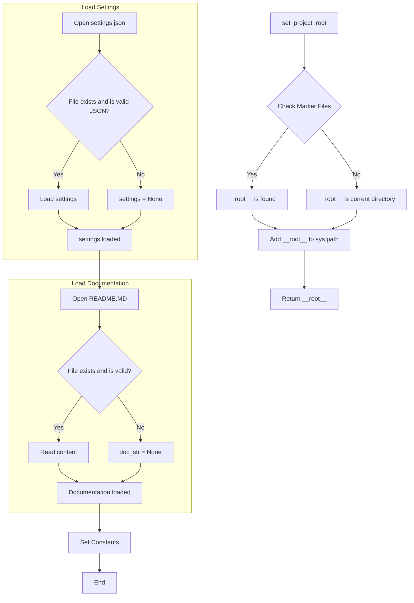

```MD
# <input code>

```python
## \file hypotez/src/endpoints/hypo69/small_talk_bot/header.py
# -*- coding: utf-8 -*-
#! venv/Scripts/python.exe
#! venv/bin/python/python3.12

"""
.. module: src.endpoints.hypo69.small_talk_bot 
	:platform: Windows, Unix
	:synopsis:

"""
MODE = 'dev'

import sys
import json
from packaging.version import Version

from pathlib import Path
def set_project_root(marker_files=('pyproject.toml', 'requirements.txt', '.git')) -> Path:
    """
    Finds the root directory of the project starting from the current file's directory,
    searching upwards and stopping at the first directory containing any of the marker files.

    Args:
        marker_files (tuple): Filenames or directory names to identify the project root.
    
    Returns:
        Path: Path to the root directory if found, otherwise the directory where the script is located.
    """
    __root__:Path
    current_path:Path = Path(__file__).resolve().parent
    __root__ = current_path
    for parent in [current_path] + list(current_path.parents):
        if any((parent / marker).exists() for marker in marker_files):
            __root__ = parent
            break
    if __root__ not in sys.path:
        sys.path.insert(0, str(__root__))
    return __root__


# Get the root directory of the project
__root__ = set_project_root()
"""__root__ (Path): Path to the root directory of the project"""

from src import gs

settings:dict = None
try:
    with open(gs.path.root / 'src' /  'settings.json', 'r') as settings_file:
        settings = json.load(settings_file)
except (FileNotFoundError, json.JSONDecodeError):
    ...

doc_str:str = None
try:
    with open(gs.path.root / 'src' /  'README.MD', 'r') as settings_file:
        doc_str = settings_file.read()
except (FileNotFoundError, json.JSONDecodeError):
    ...


__project_name__ = settings.get("project_name", 'hypotez') if settings  else 'hypotez'
__version__: str = settings.get("version", '')  if settings  else ''
__doc__: str = doc_str if doc_str else ''
__details__: str = ''
__author__: str = settings.get("author", '')  if settings  else ''
__copyright__: str = settings.get("copyrihgnt", '')  if settings  else ''
__cofee__: str = settings.get("cofee", "Treat the developer to a cup of coffee for boosting enthusiasm in development: https://boosty.to/hypo69")  if settings  else "Treat the developer to a cup of coffee for boosting enthusiasm in development: https://boosty.to/hypo69"
```

# <algorithm>

1. **`set_project_root` function:**
   - Takes a tuple of marker file names.
   - Gets the current file's directory.
   - Iterates through parent directories starting from the current file's directory.
   - Checks if any of the marker files exist in the current parent directory.
   - If found, sets `__root__` to the parent directory and exits the loop.
   - If not found after checking all parent directories, `__root__` remains the current directory.
   - Adds the root directory to `sys.path` if it's not already present.
   - Returns the root directory (`__root__`).

   *Example:*
   If `__file__` points to `/path/to/project/endpoints/hypo69/small_talk_bot/header.py`, the function will check `/path/to/project/endpoints/hypo69/small_talk_bot/`, `/path/to/project/endpoints/hypo69/`, `/path/to/project/endpoints/`, `/path/to/project/` and so on until a directory with `pyproject.toml`, `requirements.txt` or `.git` is found.

2. **Initialization:**
   - Calls `set_project_root` to get the project root.
   - Loads settings from `settings.json` in the project root. Uses a `try-except` block to handle `FileNotFoundError` and `json.JSONDecodeError`.
   - Loads documentation string from `README.MD`. Handles errors similarly to `settings.json`.


3. **Setting Constants:**
   - Sets values of `__project_name__`, `__version__`, `__doc__`, `__details__`, `__author__`, `__copyright__`, `__cofee__` using values from the `settings` if available, or default values otherwise.


*Data Flow*: The function `set_project_root` is called once to get the root directory. This directory is then used in the path to access `settings.json` and `README.MD`. The data from these files (or defaults) is then used to populate the constant variables.


# <mermaid>



# <explanation>

- **Imports**:
    - `sys`: Provides access to system-specific parameters and functions, including the `sys.path` variable. Used for adding the project root to the Python path.
    - `json`: For working with JSON data (loading `settings.json`).
    - `packaging.version`: Used for handling versions (not directly used in the code provided, but may be used later).
    - `pathlib`: For creating and manipulating file paths in an object-oriented manner. The `Path` class is used to represent and construct file paths and directories.
    - `src.gs`: Imports a module named `gs` which is assumed to be part of the larger project's structure.  The import of this module is critical for getting the project root path.  It likely contains methods or attributes for working with paths within the project.


- **`set_project_root` function**:
    - Takes a tuple of marker file names as input, to specify what directories to use to determine the project root.
    - Recursively searches up the directory tree starting from the current file location to find the directory containing the files in the `marker_files` tuple.
    - If the root is found, the function ensures that the root directory is added to `sys.path`, allowing other modules within the project to be imported correctly.
    - This is a crucial function in a project structure to ensure that modules are imported from the correct location, especially if the project is installed in a non-standard directory location.


- **Variables**:
    - `MODE`: Holds a string representing the application mode (e.g., "dev", "prod").
    - `settings`, `doc_str`: Contain data read from `settings.json` and `README.MD` (or defaults if not found).
    - `__root__`: The absolute path to the project root directory. This is crucial for navigating paths relative to the project root.  All relative paths, especially those referencing files in other packages within the project, should resolve correctly with this path.


- **Error Handling**: The `try...except` blocks ensure that the script doesn't crash if `settings.json` or `README.MD` are missing or not valid JSON.


- **Constants**: `__project_name__`, `__version__`, `__doc__`, `__author__`, `__copyright__`, `__cofee__` are initialized. They are strings that store metadata about the project (project name, version, documentation, author, copyright, and a link for coffee).  These are likely used for displaying information in the project's output, or as metadata used elsewhere in the project.


- **Possible improvements**:
    - The error handling could be more specific. For example, instead of catching a generic `json.JSONDecodeError`, it might be better to catch a specific exception based on the type of JSON parsing error that occurred.
    - Using a dedicated configuration management system (e.g., `configparser`, `toml`) instead of relying on a single JSON file would provide better organization for complex settings and could make the code easier to maintain.
    - Consider using `importlib.resources` instead of manual file opening for better resource handling, especially if `settings.json` and `README.MD` are meant to be part of the project's distribution.


**Relationships with other parts of the project**:
The script relies on a `src.gs` module to get the project root directory.  This indicates a design pattern where functions and modules within the `src` folder are utilized for handling file paths, settings, and potentially other project-related tasks. This `gs` module is likely responsible for managing paths in a more robust way than simply using `Path` class alone.  Other modules in the project likely rely on this path setup to find and import files or other modules within the project's tree.